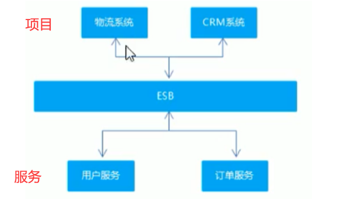
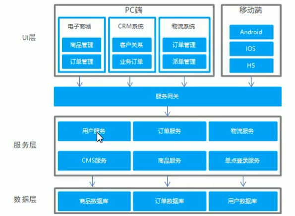
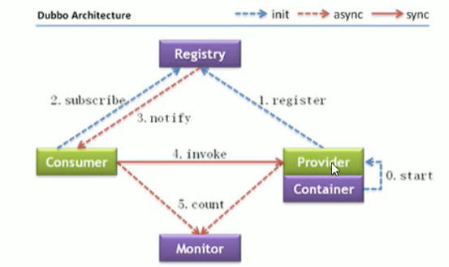
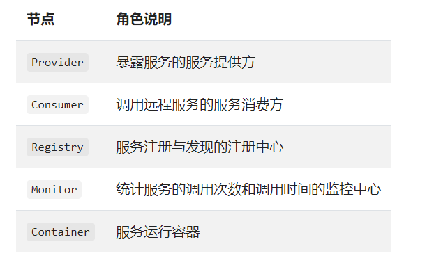

# 分布式RPC框架Apache Dubbo

## 一、软件架构的演进过程

单体架构——>垂直架构——>SOA架构——>微服务架构

### 1.1 SOA架构

Service-Oriented Architecture，即面向服务的架构。它将重复功能或模块抽取成组件（服务）的形式，对外提供服务，在项目与服务之间使用ESB（企业服务总线）作为通信的桥梁。

### 1.2 微服务架构

"微服务"指的是 将服务抽取的粒度比较细

## 二、Apache Dubbo概述

### 2.1 Dubbo简介

Apache Dubbo是一款高性能的Java RPC框架（前身是阿里巴巴公司的），可以和Spring框架无缝集成。

**什么是RPC？**

remote procedure call，即远程过程调用。比如有两台服务器A和B，A服务器上部署一个应用，B服务器上部署一个应用，A服务器上的应用想调用B服务器上的应用提供的方法。由于两个应用不在一个内存空间，不能直接调用，所以需要网络来表达调用的语义和传达调用的数据。

SOA架构中的ESB和微服务架构的服务网关 就是 RPC。

Dubbo提供了三大核心能力：面向接口的远程方法调用，智能容错和负载均衡，以及服务自动注册和发现。

### 2.2 Dubbo架构

Dubbo架构图，如下：

角色说明：

## 三、服务注册中心Zookeeper

Zookeeper可作为Dubbo架构的服务注册中心