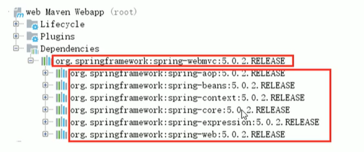
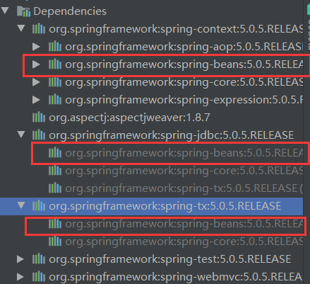
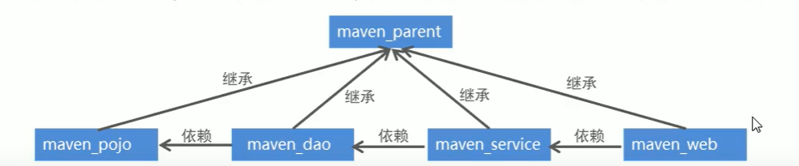
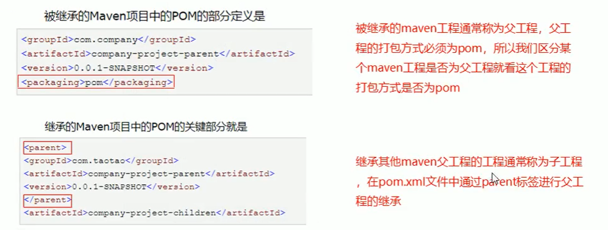

# Maven

## 一、maven的依赖范围

| 依赖范围      | 对于编译classpath有效 | 对于测试classpath有效 | 对于运行时classpath有效 | 例子                        |
| ------------- | --------------------- | --------------------- | ----------------------- | --------------------------- |
| compile(默认) | Y                     | Y                     | Y                       | spring-core                 |
| test          | -                     | Y                     | -                       | Junit                       |
| provided      | Y                     | Y                     | -                       | servlet-api                 |
| runtime       | -                     | Y                     | Y                       | JDBC驱动                    |
| system        | Y                     | Y                     | -                       | 本地的，maven仓库之外的类库 |

ps：

1. 为什么servlet-api的\<scope>设置成provided？

   答：我们在编写servlet时，HttpServletRequest和HttpServletResponse 等对象的是由servlet-api提供的，不导入坐标的话无法使用。但运行的时候，tomcat中也有这些对象。为了避免冲突，所以将其\<scope>设置成provided，即编译时用servlet-api中的，运行时用tomcat中的。

   


## 二、maven的依赖传递



如图，我们只直接地导入了spring-webmvc这一个坐标，而因为它依赖了其他坐标，所以结果是都导入了。


## 三、maven的版本锁定

依赖冲突的产生：（甚至可能是不同的版本）




解决方式：==  版本锁定 ==

如下是pom.xml中坐标部分：

```xml
<properties>
    <project.build.sourceEncoding>UTF-8</project.build.sourceEncoding>
    <maven.compiler.source>1.8</maven.compiler.source>
    <maven.compiler.target>1.8</maven.compiler.target>
    <spring.version>5.0.5.RELEASE</spring.version>
    <springmvc.version>5.0.5.RELEASE</springmvc.version>
    <mybatis.version>3.4.5</mybatis.version>
  </properties>
  <!--
	  	锁定jar版本
	  	${}表示引用
	-->
  <dependencyManagement>
    <dependencies>
      <!-- Mybatis -->
      <dependency>
        <groupId>org.mybatis</groupId>
        <artifactId>mybatis</artifactId>
        <version>${mybatis.version}</version>
      </dependency>
      <!-- springMVC -->
      <dependency>
        <groupId>org.springframework</groupId>
        <artifactId>spring-webmvc</artifactId>
        <version>${springmvc.version}</version>
      </dependency>
      <!-- spring -->
      <dependency>
        <groupId>org.springframework</groupId>
        <artifactId>spring-context</artifactId>
        <version>${spring.version}</version>
      </dependency>
      <dependency>
        <groupId>org.springframework</groupId>
        <artifactId>spring-core</artifactId>
        <version>${spring.version}</version>
      </dependency>
      <dependency>
        <groupId>org.springframework</groupId>
        <artifactId>spring-aop</artifactId>
        <version>${spring.version}</version>
      </dependency>
      <dependency>
        <groupId>org.springframework</groupId>
        <artifactId>spring-web</artifactId>
        <version>${spring.version}</version>
      </dependency>
      <dependency>
        <groupId>org.springframework</groupId>
        <artifactId>spring-expression</artifactId>
        <version>${spring.version}</version>
      </dependency>
      <dependency>
        <groupId>org.springframework</groupId>
        <artifactId>spring-beans</artifactId>
        <version>${spring.version}</version>
      </dependency>
      <dependency>
        <groupId>org.springframework</groupId>
        <artifactId>spring-aspects</artifactId>
        <version>${spring.version}</version>
      </dependency>
      <dependency>
        <groupId>org.springframework</groupId>
        <artifactId>spring-context-support</artifactId>
        <version>${spring.version}</version>
      </dependency>
      <dependency>
        <groupId>org.springframework</groupId>
        <artifactId>spring-test</artifactId>
        <version>${spring.version}</version>
      </dependency>
      <dependency>
        <groupId>org.springframework</groupId>
        <artifactId>spring-jdbc</artifactId>
        <version>${spring.version}</version>
      </dependency>
      <dependency>
        <groupId>org.springframework</groupId>
        <artifactId>spring-tx</artifactId>
        <version>${spring.version}</version>
      </dependency>
    </dependencies>
  </dependencyManagement>
  <dependencies>
    <!-- 因为以下依赖不存在冲突，所以不需要锁定版本 -->
    <!-- Mybatis和mybatis与spring的整合 -->
    <dependency>
      <groupId>org.mybatis</groupId>
      <artifactId>mybatis</artifactId>
    </dependency>
    <dependency>
      <groupId>org.mybatis</groupId>
      <artifactId>mybatis-spring</artifactId>
      <version>1.3.1</version>
    </dependency>
    <!-- MySql驱动 -->
    <dependency>
      <groupId>mysql</groupId>
      <artifactId>mysql-connector-java</artifactId>
      <version>5.1.32</version>
    </dependency>
    <!-- druid数据库连接池 -->
    <dependency>
      <groupId>com.alibaba</groupId>
      <artifactId>druid</artifactId>
      <version>1.0.9</version>
    </dependency>
    <!-- springMVC核心-->
    <dependency>
      <groupId>org.springframework</groupId>
      <artifactId>spring-webmvc</artifactId>
    </dependency>
    <!-- spring相关 -->
    <dependency>
      <groupId>org.springframework</groupId>
      <artifactId>spring-context</artifactId>
    </dependency>
    <dependency>
      <groupId>org.springframework</groupId>
      <artifactId>spring-core</artifactId>
    </dependency>
    <dependency>
      <groupId>org.springframework</groupId>
      <artifactId>spring-aop</artifactId>
    </dependency>
    <dependency>
      <groupId>org.springframework</groupId>
      <artifactId>spring-web</artifactId>
    </dependency>
    <dependency>
      <groupId>org.springframework</groupId>
      <artifactId>spring-expression</artifactId>
    </dependency>
    <dependency>
      <groupId>org.springframework</groupId>
      <artifactId>spring-beans</artifactId>
    </dependency>
    <dependency>
      <groupId>org.springframework</groupId>
      <artifactId>spring-aspects</artifactId>
    </dependency>
    <dependency>
      <groupId>org.springframework</groupId>
      <artifactId>spring-context-support</artifactId>
    </dependency>
    <dependency>
      <groupId>org.springframework</groupId>
      <artifactId>spring-test</artifactId>
    </dependency>
    <dependency>
      <groupId>org.springframework</groupId>
      <artifactId>spring-jdbc</artifactId>
    </dependency>
    <dependency>
      <groupId>org.springframework</groupId>
      <artifactId>spring-tx</artifactId>
    </dependency>
    <!-- junit测试 -->
    <dependency>
      <groupId>junit</groupId>
      <artifactId>junit</artifactId>
      <version>4.12</version>
    </dependency>
    <dependency>
      <groupId>javax.servlet</groupId>
      <artifactId>servlet-api</artifactId>
      <version>2.5</version>
      <scope>provided</scope>
    </dependency>
    <dependency>
      <groupId>javax.servlet</groupId>
      <artifactId>jsp-api</artifactId>
      <version>2.0</version>
      <scope>provided</scope>
    </dependency>
    <!-- jstl -->
    <dependency>
      <groupId>javax.servlet</groupId>
      <artifactId>jstl</artifactId>
      <version>1.2</version>
    </dependency>
  </dependencies>
```


## 四、分模块构建maven工程

### 前言：

方式：

- 按 业务模块 拆分
- 按 层 拆分

工程之间存在 继承 和 依赖 的关系：




### maven工程的继承：

子工程继承父工程后，就可以使用在父工程中引入的依赖，以消除重复的代码。

