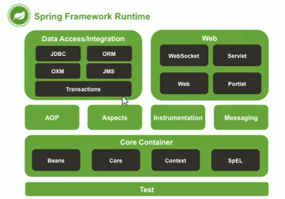
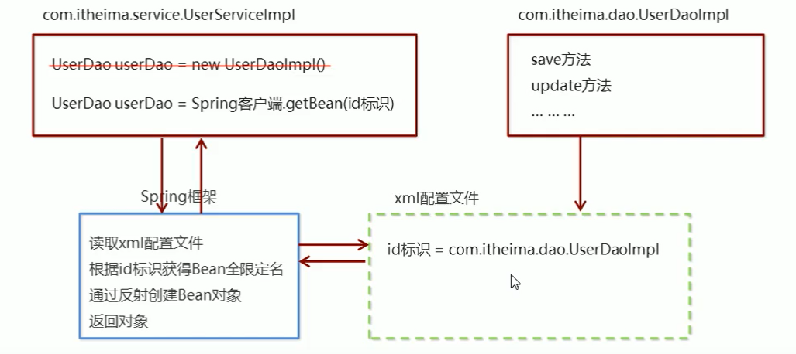
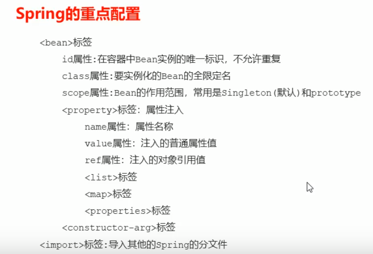
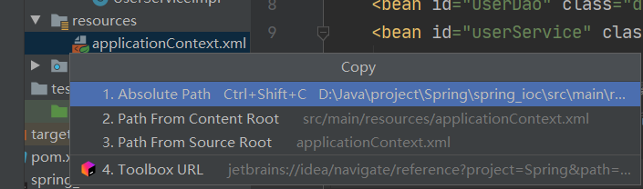

# 1. Spring简介

## 1.1 Spring是什么

​	Spring是分层的javaSE/EE应用的全栈轻量级开源框架，以**IOC**（Inverse Of Control：控制反转）和**AOP**（Aspect Oriented Programming：面向切面编程）为内核。


## 1.2 Spring的优势

- 方便解耦，简化开发
- AOP编程的支持
- 声明式事务的支持（之前我们用的是 编程式的事务）
- 方便程序的测试
- 方便集成各种优秀的框架
- 降低JavaEE AOP的使用难度（代替我了我们之前自己封装的JDBCUtil）
- Java源码的学习范例（设计模式等）


> 为什么要用AOP和IOC？
>
> https://zhuanlan.zhihu.com/p/349386138


## 1.3 Spring的体系结构





# 2. Spring快速入门

## 2.1 Spring开发步骤





**相应的步骤：**

1. 导入Spring开发的基本包坐标
2. 编写Dao接口和实现类
3. 创建Spring核心配置文件
4. 在上述文件中配置UserDaoImpl
5. 使用Spring的API获得Bean实例


> 可以看出，只需要改动xml配置文件，而不需要修改创建对象的代码，从而实现了解耦。


**代码实现步骤（Spring IOC快速入门）**

1. 导入依赖

   ```xml
       <!--快速入门的依赖-->
       <dependencies>
           <dependency>
               <groupId>org.springframework</groupId>
               <artifactId>spring-context</artifactId>
               <version>5.3.2</version>
           </dependency>
       </dependencies>
   ```

   

2. 编写Dao

   ```java
   public class UserDaoImpl implements UserDao {
       public void save() {
           System.out.println("saving...");
       }
   }
   ```

   

3. 编写，配置xml

   ```xml
   <!--bean标签-->
   <bean id="userDao" class="dao.Impl.UserDaoImpl"/>
   ```

   

4. 使用Spring的API

   
  
   ```java
   public class UserDaoDemo {
       public static void main(String[] args) {
           // 通过加载xml配置文件，来初始化Spring的核心容器（ApplicationContext）
           ApplicationContext app = new ClassPathXmlApplicationContext("applicationContext.xml");
           // 通过Spring容器（中的id）获取该类的实例
           UserDao user = (UserDao) app.getBean("userDao");
           // 调用实例中的方法
           user.save();
       }
   }
   ```


## 3.1 Bean标签的基本配置

id属性：唯一标识

**class属性：全限定名（类全名）**。且注意，因为反射调用的new Instance()，所以该类必须有一个**<u>无参构造方法</u>**。


## 3.2 Bean标签范围

scope：对象实例化个数 / 作用范围

| 取值范围                               | 说明                                                         |
| -------------------------------------- | ------------------------------------------------------------ |
| <font color='red'>**singleton**</font> | 单例的（默认值）                                             |
| <font color='red'>**prototype**</font> | 多例的                                                       |
| request                                | WEB项目中，Spring创建一个Bean对象，将对象放入到request域中。 |
| session                                | WEB项目中，放入到session域中。                               |

**何时创建与销毁对象？**

singleton：

- 创建：当创建Spring容器ApplicationContext时，Spring容器创建
- 销毁：当摧毁容器时

prototype：（与singleton不同）

- 创建：当ApplicationContext的对象调用getBean时，Spring容器创建
- 销毁：（容器不管了）当对象长时间不用时，就被Java的垃圾回收器回收了。


> 综上，singleton和prototype作为scope标签的属性有 3 点不同——实例化对象的个数，创建时间和销毁时间。


## 3.3 Bean生命周期的配置

- init-method：指定类中具有初始化作用的方法名称
- destroy-method：指定类中具有销毁作用的方法名称

## 3.4 Bean实例化的三种方式

- **无参构造**方法实例化
- 工厂**静态**方法实例化
- 工厂**实例**方法实例化

## 3.5 Bean的依赖注入

一、前言：

	如果有个需求是，想用Spring实现创建service层，并在service中调用dao的方法。但在实现时，代码就出现了关于“创建”的“依赖关系”。
	
	而这种业务层和持久层之间的依赖关系，在使用Spring后，就让Spring来维护了。简单来说，就是坐等Spring把持久层对象传入业务层，而不用我们自己再去创建了。
	
	但IOC解耦只是降低他们的依赖关系，但不会消除。如，业务层仍会调用持久层的方法。

二、概念：

	**依赖注入**（Dependency Injection）：它是Spring框架核心IOC的具体实现。

三、依赖注入方式：

- 构造方法
- <font color='red'>**set**方法(常用)</font>    ，即私有属性+公有setter

四、作用 / 理解：
    从Spring容器的角度来看，Spring容器负责 <font color='red'>将被依赖对象赋值给调用者的成员变量</font>，这就相当于 <font color='red'>为调用者注入了它依赖的实例</font>。这就是<font color='red'> Spring的依赖注入</font>。


##  3.6 引入其他配置文件（分模块开发）

在Spring主配置文件中通过import标签（在Beans标签中）进行加载其他模块

```xml
<import resource="applicationContext-xxx.xml"/>
```


## 4.Spring配置的小结




# 4.Spring装配Bean 注解开发（推荐）

> 解决了xml配置文件装配Bean过于臃肿的问题

## 4.1 常用注解

- @Component：用于描述Spring中的Bean，但它是一个泛化的概念，仅仅表示一个组件（Bean），并且可以标注在任何层次。
- @Repository：用于将数据访问层（DAO层）的类表示为Spring中的Bean。（可被@Component代替）
- @Service：用于将业务层（Service层）的类表示为Spring中的Bean。（可被@Component代替）
- @Controller：用于将控制层（SpringMVC中的Controller层）。（可被@Component代替）
- @Resource：用于对Bean中的属性变量、属性的setter方法以及构造方法进行标注。@Resource中有两个重要属性——name和type。<font color='red'>**Spring将name属性解析为Bean实例名称**</font>，type属性解析为Bean实例类型。指定哪个就按哪个进行装配，如果都不能匹配就抛异常。

## 4.2 示例

- UserDao接口

```java
public interface UserDao {
    void save();
}
```


- UserDaoImpl

```java
@Repository("userDao")
public class UserDaoImpl implements UserDao {
    public void save() {
        System.out.println("UserDao is saving");
    }
}
```


- UserService接口

```java
public interface UserService {
    void save();
}
```


- UserServiceImpl

```java
@Service("userService")
public class UserServiceImpl implements UserService {

    // 替代xml中的注入属性 <property name="userDao" ref="userDao"/>
    /*
        Spring注解注入userDao的两种写法：
            1）直接写 @Resource
            2）@AutoWired @Qualifier("userDao")
     */
    
    @Resource
    private UserDao userDao;

    // 业务方法
    public void save() {
        userDao.save();
        System.out.println("UserService is saving");
    }
}
```


- UserController

```java
@Controller("userController")
public class UserController {
    
    @Resource
    private UserService userService;

    public void save() {
        userService.save();
        System.out.println("userController is saving");
    }
}
```


- 在父包下创建xml文件，命名为beanAnnotion.xml


# 5. Spring相关的API

## 4.1ApplicationContext的实现类

<font color='red'>1）ClassPathXmlApplicationContext</font>

从类的根路径下加载配置文件

<font color='red'>2）FileSystemXmlApplicationContext</font>

从文件系统路径（磁盘）下加载配置文件


tip：两者都可在IDEA中复制得来：




## 4.2getBean()方法的使用

getBean()方法的参数有两种——<font color='red'>String类型的id 和 Class类型的类</font>


```java
// 方式一：
UserService service = (UserService)app.getBean("userService");
// 方式二：
UserService service = app.getBean(UserService.class)
```


# 6.利用Spring进行test测试

> 步骤：

1）导入两个坐标——spring-test和junit

2）指定Spring为驱动（@RunWith）

3）指定xml文件（@ContextConfiguration）

4）注入被测试的类

5）写测试方法（@Test）


> 代码

```java
@RunWith(SpringJUnit4ClassRunner.class)
@ContextConfiguration("classpath:applicationContext.xml")
public class JdbcTemplateTest {

    @Autowired
    private JdbcTemplate jdbcTemplate;

    @Test
    public void updateTest() {
        jdbcTemplate.update("update test set username=? where id=?", "于六", 6);

    }
}
```

