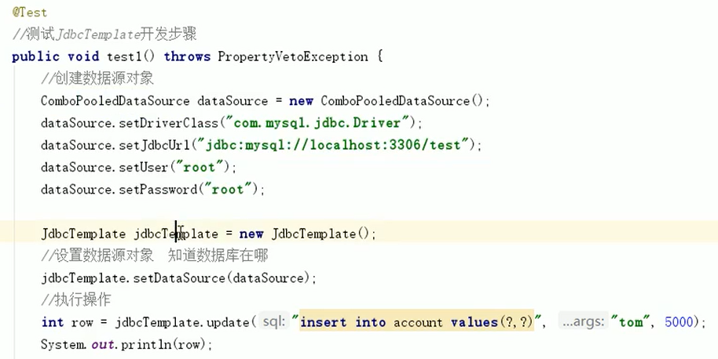

# Spring JDBC

## 一、Spring产生Jdbc Template对象

> 引言

如下图，JdbcTemplate的创建依赖于数据源对象，所以若想将JdbcTemplate的创建权交给Spring，可以也将数据源DataSource的创建权交给Spring，并在Spring容器内部将数据源DataSource注入到JdbcTemplate模板对象中。




> 步骤

1. 导入spring-jdbc和spring-tx两个坐标

2. 配置xml和properties文件**（模板）**

   ```xml
       <!-- Spring JDBC配置-->
   
       <!--加载properties-->
       <context:property-placeholder location="classpath:jdbc.properties"/>
   
       <!--第一个bean：数据源对象-->
       <bean id="dataSource" class="org.springframework.jdbc.datasource.DriverManagerDataSource">
           <property name="driverClassName" value="${jdbc.driver}"/>
           <property name="url" value="${jdbc.url}"/>
           <property name="username" value="${jdbc.username}"/>
           <property name="password" value="${jdbc.password}"/>
       </bean>
   
       <!--第二个bean：配置JDBC Template-->
       <bean id="jdbcTemplate" class="org.springframework.jdbc.core.JdbcTemplate">
           <!--默认使用数据源-->
           <property name="dataSource" ref="dataSource"/>
       </bean>
   ```

   ```properties
   jdbc.driver = com.mysql.cj.jdbc.Driver
   jdbc.url = jdbc:mysql:///jdbc
   jdbc.username = root
   jdbc.password = mysql1234
   ```

   

3. 建立测试类

   ```java
   @RunWith(SpringJUnit4ClassRunner.class)
   @ContextConfiguration("classpath:applicationContext.xml")
   public class JdbcTemplateTest {
   
       @Autowired
       private JdbcTemplate jdbcTemplate;
   
       @Test
       public void updateTest() {
   
           jdbcTemplate.update("update test set username=? where id=?", "于六", 6);
   
       }
   }
   ```

   