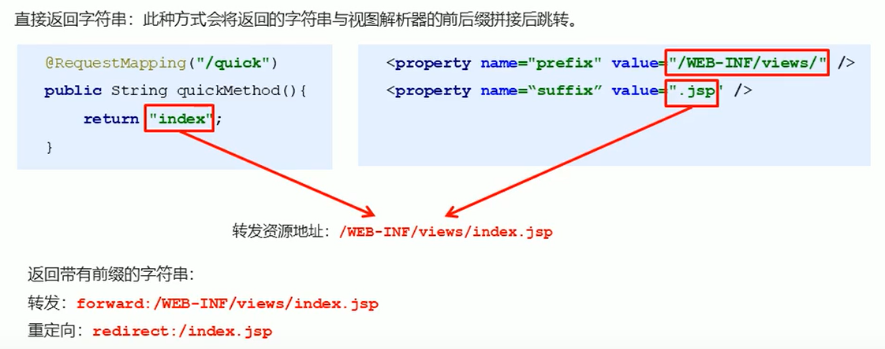

# Spring-MVC的数据响应

## 数据响应方式

1）页面跳转

- 直接返回字符串
- 通过ModelAndView对象返回

2）回写数据

- 直接返回字符串
- 返回对象或集合

### 

### 页面跳转

#### 1.1 直接返回字符串

#### 1.2 返回ModelAndView对象

### 回写数据

#### 2.1直接返回字符串

> 通过SpringMVC框架注入的response对象，使用reponse.getWriter.print("**")即可。此时不需要试图跳转，