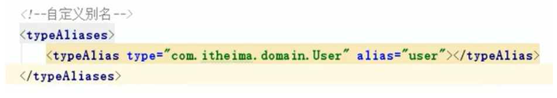

# 1. Mybatis简介

## 1.1 原始jdbc操作


## 1.2 原始jdbc的分析

问题：

1）数据库连接的创建、释放频繁，造成资源浪费，从而影响性能

2）sql的变动，会影响Java代码，耦合度高

3）查询时，需要手动将结果集中的数据封装到实体中。插入时，需要手动将实体中的数据设置到sql的占位符位置上

解决：

1）使用数据库连接池，初始化连接资源（例子：环保思想---共享单车）

2）将sql语句抽取到xml配置文件中

3）将实体的属性与表的字段进行映射（利用反射、内省等底层技术）


## 1.3 什么是Mybatis

- Mybatis是一个基于Java的持久层框架，它内部封装了jdbc，使开发者只需要关注sql语句本身，而不需要花费精力去处理加载驱动、创建连接、创建statement等繁杂的过程。

- 同时，采用了ORM思想解决了实体和数据库之间的映射问题


# 2. Mybatis快速入门

## 2.1 开发步骤

1. 添加有关Mybatis坐标（数据库驱动+Mybatis）
2. 创建user表
3. 创建User实体类
4. 编写映射文件UserMapper.xml（先写xml文件头的约束）--- 作用主要是写sql
5. 编写核心文件SqlMapConfig.xml（先写xml文件头的约束）
6. 编写测试类


# 3. Mybatis的增删改查

### 方式一：xml

映射文件：userMapper.xml

```xml
<?xml version="1.0" encoding="UTF-8"?>
<!DOCTYPE mapper PUBLIC "-//mybatis.org//DTD Mapper 3.0//EN" "http://mybatis.org/dtd/mybatis-3-mapper.dtd">

<!--命名空间+id标识sql-->
<mapper namespace="userMapper">

    <!-- 1. 查询-->
    <select id="findAll" resultType="domain.User">
        select * from user;
    </select>

    <!-- 2. 插入-->
    <insert id="save" parameterType="domain.User">
        insert into user values(#{id},#{username},#{age})
    </insert>

    <!--3. 修改-->
    <update id="update" parameterType="domain.User">
        update user set username = #{username}, age = #{age} where id=#{id};
    </update>

    <!--4. 删除-->
    <delete id="delete" parameterType="Integer">
        delete from user where id = #{id};
    </delete>
    
</mapper>
```

测试类：

```java
public class MybatisTest {

    @Test
    public void query() throws IOException {

        // 获得核心配置文件（配置文件中还有映射文件）
        InputStream resourceAsStream = Resources.getResourceAsStream("sqlMapConfig.xml");
        // 获得session工厂对象
        SqlSessionFactory sqlSessionFactory = new SqlSessionFactoryBuilder().build(resourceAsStream);
        // 获得session会话对象
        SqlSession sqlSession = sqlSessionFactory.openSession();
        // 执行操作  参数为：namespace+id
        List<User> userList = sqlSession.selectList("userMapper.findAll");
        // 打印
        System.out.println(userList);
        // 释放资源
        sqlSession.close();
    }

    @Test
    public void save() throws IOException {

        // 模拟User对象
        User user = new User();
        user.setId(7);
        user.setUsername("刘晶玮");
        user.setAge(21);

        // 获得核心配置文件（配置文件中还有映射文件）
        InputStream resourceAsStream = Resources.getResourceAsStream("sqlMapConfig.xml");
        // 获得session工厂对象
        SqlSessionFactory sqlSessionFactory = new SqlSessionFactoryBuilder().build(resourceAsStream);
        // 获得session会话对象
        SqlSession sqlSession = sqlSessionFactory.openSession();
        // 执行操作
        sqlSession.insert("userMapper.save", user);
        // 因为Mybatis默认是不提交事务的，所以要手动提交
        sqlSession.commit();
        // 释放资源
        sqlSession.close();
    }

    @Test
    public void update() throws IOException {

        // 模拟User对象
        User user = new User();
        user.setId(1);
        user.setUsername("黄一");
        user.setAge(11);

        // 获得核心配置文件（配置文件中还有映射文件）
        InputStream resourceAsStream = Resources.getResourceAsStream("sqlMapConfig.xml");
        // 获得session工厂对象
        SqlSessionFactory sqlSessionFactory = new SqlSessionFactoryBuilder().build(resourceAsStream);
        // 获得session会话对象
        SqlSession sqlSession = sqlSessionFactory.openSession();
        // 执行操作
        sqlSession.update("userMapper.update", user);
        // 因为Mybatis默认是不提交事务的，所以要手动提交
        sqlSession.commit();
        // 释放资源
        sqlSession.close();
    }

    @Test
    public void delete() throws IOException {

        // 获得核心配置文件（配置文件中还有映射文件）
        InputStream resourceAsStream = Resources.getResourceAsStream("sqlMapConfig.xml");
        // 根据配置文件获得SqlSessionFactory
        SqlSessionFactory sqlSessionFactory = new SqlSessionFactoryBuilder().build(resourceAsStream);
        // 根据工厂对象获得session会话对象，同时会默认开启一个事务，但不会提交
        SqlSession sqlSession = sqlSessionFactory.openSession();
        // 执行操作
        sqlSession.delete("userMapper.delete", 7);
        // 因为Mybatis默认是不提交事务的，所以要手动提交
        sqlSession.commit();
        // 释放资源
        sqlSession.close();
    }
}
```


### 方式二：注解

AnnoMapper

```java
public interface AnnoMapper {

    @Insert("insert into user values(#{id},#{username},#{age})")
    void save(User user);

    @Delete("delete from user where id = #{id};")
    void delete(User user);

    @Update("update user set username = #{username}, age = #{age} where id=#{id};")
    void update(User user);

    @Select("select * from user where id=#{id}")
    void query(int id);

    @Select("select * from user")
    void findAll();

}
```

sqlMapConfig中的< mappers >

```xml
    <mappers>
        <!--加载注解开发的映射关系
                扫描指定接口所在的包
        -->
        <package name="mapper"/>
    </mappers>
```

测试类

```java
public class SimpleTest {

    private AnnoMapper mapper;

    @Before
    public void before() throws IOException {
        // 加载核心配置文件
        InputStream inputStream = Resources.getResourceAsStream("sqlMapConfig.xml");
        // 获得session工厂
        SqlSessionFactory factory = new SqlSessionFactoryBuilder().build(inputStream);
        // 获得session（自动提交事务）
        SqlSession session = factory.openSession(true);
        // 获得mapper
        this.mapper = session.getMapper(AnnoMapper.class);
    }

    @Test
    public void testSave() {

        User user = new User();
        user.setUsername("Tom");
        user.setAge(4);

        mapper.save(user);
    }
    
    // 其他的CRUD同理

}
```


# 4. Mybatis核心文件概述

## 4.1 常用配置的解析

首先，configuration是配置文件的根元素

### 1. environments标签：

> 配置数据源/数据库环境，并支持多环境配置

- transactionManager标签的type属性：

​		若是“JDBC”，则直接使用了JDBC的提交和回滚设置，它依赖于从数据源得到的连接来管理事务作用域。

- dataSource标签的type属性：

​		若是“POOLED”，则这种数据源的实现利用了“池”的概念将JDBC连接对象组织起来。与其相反的是“UNPOOLED”，数据源的实现只是每次被请求时打开和关闭连接。


```xml
    <!--数据源环境-->
    <environments default="development">
        <environment id="development">
            <transactionManager type="JDBC"/>
            <dataSource type="POOLED">
                <property name="driver" value="com.mysql.jdbc.Driver"/>
                <property name="url" value="jdbc:mysql:///jdbc?autoReconnect=true"/>
                <property name="username" value="root"/>
                <property name="password" value="mysql1234"/>
            </dataSource>
        </environment>
    </environments>
```


​	

### 2. mappers标签：

> 用于加载映射文件

- mapper标签的resource属性：

  使用相对于类路径的资源引用。

### 3. properties标签：

> 实际开发中，习惯将数据源的配置信息单独抽取成一个properties文件，而该标签可以用于 <font color='red'>加载额外配置的properties文件</font>


### 4. typeAliases标签：

> 为全限定名定义一个别名




