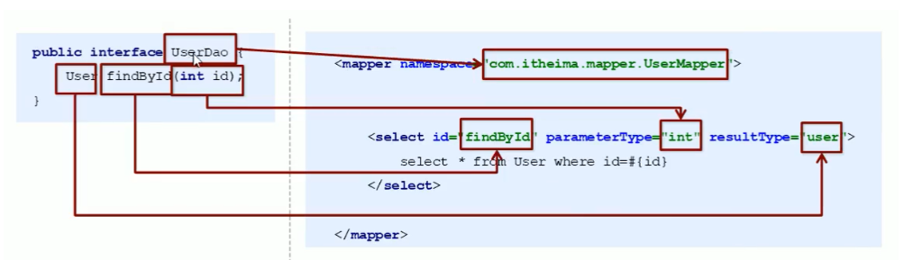

# 2. Mybatis的代理开发

## 一、介绍

> 采用Mybatis的代理开发方式实现DAO层的开发，是企业的主流

## 二、方法

> 程序员只需要编写Mapper接口（相当于DAO接口），由Mybatis框架根据定义创建接口的动态代理对象。

## 三、Mapper接口开发的规范

1. Mapper.xml中的namespace与mapper接口的全限定名相同
2. Mapper.xml中定义的每个id与mapper接口中的方法名相同
3. 两者的参数类型对应
4. 两个的返回类型对应

