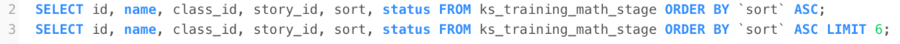
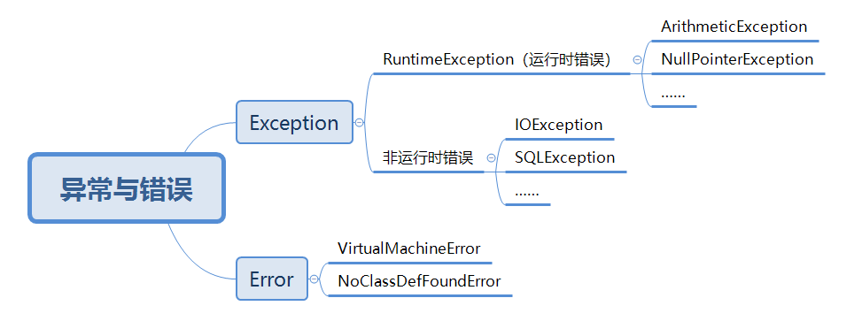

# MyFirstWheel笔记

## （1）PO、VO、DTO区别

### PO：

> persistent object：持久对象
>
> 可以理解为一个PO就是数据库中的一条记录，优点是可以把一条记录作为一个对象处理，并且可以方便转为其他对象

### DTO(类似于VO)：

> data transfer object：数据传输对象
>
> 用于展示层和服务层之间的数据传输对象

（与VO的区分还是不太明白，有点抽象）

## （2）MySql中order by和limit同时用

结果发现，当order by的字段(sort)字段有重复值时，mysql会随机取这些行。所以，为了保证每次排序一致，要额外增加一个排序的字段，用两个字段来尽量减少重复的概率。

## （3）Spring中的事务管理

> sprng支持 编程式事务管理 和 声明式事务管理 两种方式。
>
> 声明式事务管理是建立在aop之上的。其本质是对方前后进行拦截。表现在目标方法开始之前加入一个事务，执行完毕后根据情况进行提交或者回滚事务。
>
> 而声明式事务管理也有两种常用的方式——基于tx和aop标签的xml配置文件、基于@Transactional注解。

（对《异常与错误》部分的补充）

## （4）@RequestParam和@Param的区别

- 前者应用于Controller层，用于匹配前后端的参数
- 后者应用于Dao层，用于匹配mapper接口和xml的参数

