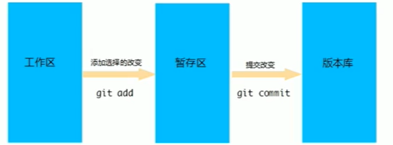
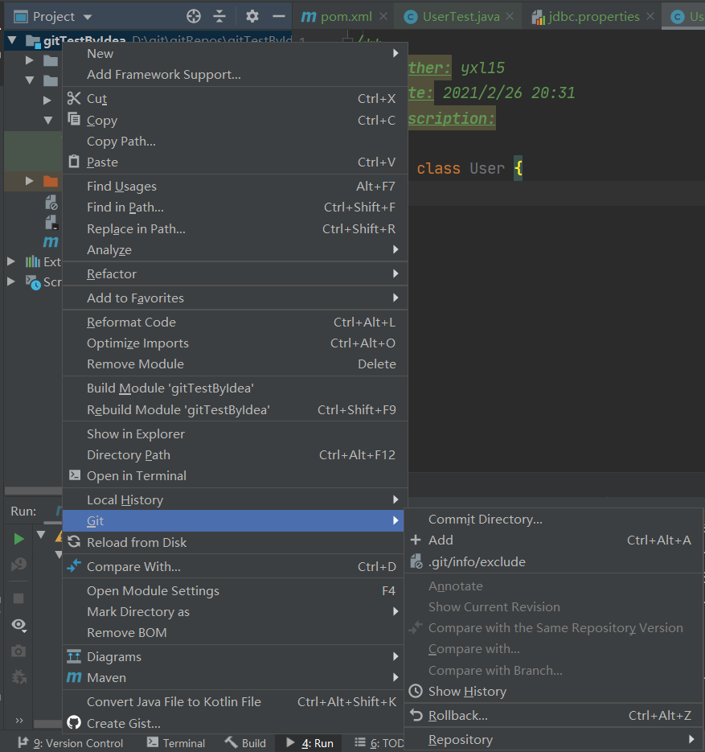
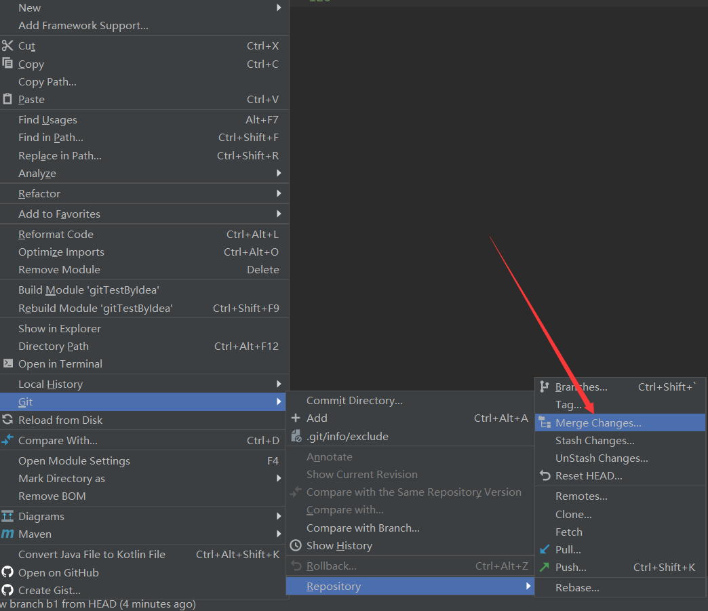
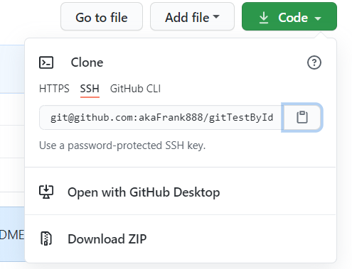

# Git的相关知识

## 一、Git概述

概念：

> Git是分布式版本控制系统，没有中央服务器，每个人的电脑就是一个完整的版本库。库分为两种——本地仓库（commit上传）和远程仓库（push推送）。


工作流程：


## 二、git常用命令

### --->对本地仓库操作


#### （1）环境配置

当安装完git后首先要做的事情就是设置用户名称和email地址。以后每次git提交都会使用该用户信息。（注意：该信息与注册GitHub的用户名和邮箱没有关系，且该邮箱不被校验可以乱填）

查看用户信息：

```
git config --list
git config --user.name
```

设置用户信息：

```
git config --global user.name "akaFrank"
git config --global user.email "hello@qq.com"
```


上面的命令设置的信息会保存在 ~/.gitconfig文件中（c盘用户下）


#### （2）获取本地Git仓库

方式：

- 在本地初始化一个git仓库
- 从远程仓库克隆


##### 方式一步骤：

在空目录下执行命令 git init


##### 方式二步骤：

在gitRepos文件夹中（与其他仓库文件并列），点右键git bash，输入 git clone + url

#### （3）查看文件状态

在 工作目录（工作区） 下执行 git status 命令 或 git status -s（更简洁）


#### （4）将未跟踪的文件加入暂存区

输入 git add hello.txt

> 若想将暂存区的文件取消暂存，则输入 git reset hello.txt


#### （5）删除文件

输入 git rm hello.txt ，（默认提交到暂存区），然后再输入 git commit -m "delete hello.txt"提交到本地仓库。（可以输入 git status-t 来跟踪状态）

> 直接右键删除（区分）：
>
> ​			右键删除后，不会默认提交到暂存区，所以需要再输入 git add hello.txt，后再commit


#### （6）将暂存区的文件修改提交到本地仓库

输入 git commit -m "日志信息"


#### （7）将文件添加至忽略列表

创建一个名为.gitignore的文件，列出要忽略的文件模式，再用git status -s查看文件状态。

常用于一些自动生成的文件，比如日志文件或编译后创建的class文件。而这些不需要纳入git管理，也不希望总出现在未跟踪文件里表中。

#### （8）查看日志记录

输入git log（若想退出，则输入q）


---


### --->对远程仓库操作

#### （1）查看该本地仓库的远程仓库

输入 git remote 或 git remote -v  ， 此刻分为两种情况：

- 如果本地仓库是克隆来的，那至少能看到origin
- 如果本地仓库不存在对应的远程仓库，则不显示


#### （2）添加远程仓库

输入 git remote add < shortname > < url > 添加一个新的远程仓库，同时指定了一个引用的简写


#### （3）移除远程仓库（只是从本地移除远程仓库的记录，而不会真正影响远程仓库）

输入 git remote rm < shortname >


#### (4) 从远程仓库拉取与推送

##### 拉取：

##### 方式一：fetch+merge（不常用不简单）

```
// 初始化本地仓库
git init
// 与远程仓库建立连接
git remote add origin [url]
// fetch拉取（也可以默认的 git fetch）
git fetch origin master
// merge合并
git merge origin master
```

ps：因为fetch方法不会自动merge。如果不merge，文件只会保存进本地仓库中，即.git文件夹中，而不会显示在工作目录中。


##### 方式二：pull（常用）

```
git init
git remote add origin [url]
git pull origin master
```

注意：如果本地仓库中（工作目录）存在在远程仓库不存在的文件，此时pull（merge）的话是会报错的。因为防止该文件被覆盖（可以通过加参数来强行pull）


#### （5）推送到远程仓库

输入 git push origin master


## 三、几个关键概念


**工作区（工作目录）：**包含.git文件夹的目录就是工作目录，主要用于存放开发的代码。例如repo1，gitTest。

**版本库：**即为.git文件。其中存储了许多配置信息、日志信息和文件版本信息。（本地仓库）

**暂存区：**.git文件夹中有很多文件，其中有一个index文件就是暂存区，也叫做stage，是一个临时保存修改文件的地方。




**Git工作区文件的两种状态：**

- untracked 未跟踪（未被纳入版本控制）
- tracked 已跟踪（被纳入版本控制）
  - unmodified 未修改状态
  - modified 已修改状态
  - staged 已暂存状态


## 四、git分支（重要！！！）

> 使用分支意味着你可以把你的工作从开发主线上分离开来，以免影响开发主线。master是默认分支。


### 1. 查看分支

```
// 列出所有本地分支
git branch
// 列出所有远程分支
git branch -r
// 列出所有本地分支和恶远程分支
git branch -a
```


### 2. 创建分支

输入 git branch [分支名称]，如 git branch b1

<font color='red'>注意：如果是在master分支下创建一个新的分支b1，则b1分支是基于master分支的，所以b1的文件与master相同。</font>

<font color='red'>应用：如果master分支中要修补问题，解决方案可以是：在master分支中创建一个新的分支fix，然后在fix中测试通过之后，切换到master分支再合并这个fix分支，最后将master分支push到远程。最后的最后，你就可以切换到你原来开发的分支了</font>

### 3. 切换分支

输入 git checkout [分支名称]，如 git checkout b1


### 4.将本地分支推送到远程仓库（的分支）

输入 git push origin [分支名称]，如 git push origin b1


### 5. 合并分支

在合并后分支的目录下，输入 git merge [目标分支] 

（ps：可能胡产生冲突）


### 6. 删除分支（删除本地的）

切换到master分支后，输入 git branch -d [分支名称]，如 git branch -d b2

（ps：若要删除的分支进行了一些开发动作而没有push到远程，则不会删除。若非要删除，把-d改成-D）


若想删除远程仓库的分支，则输入 git push origin -d [分支名称]


## 五、IDEA中使用git

### （1）初始化步骤

1）利用IDEA创建本地仓库


2）在文件夹中创建 .gitignore 文件

3）添加到暂存区（在项目处右键，若是类处的话，则只是将该文件加入暂存区）（也可以省略该步骤而直接commit）




4）commit


5）推送至远程仓库（项目处右键）


也可以commit+push一键完成


6）从远程仓库拉下来


### （2）从远程仓库克隆到本地

1）关掉当前project


2）通过git打开project


### （3）版本对比

右键java文件


### （4）创建与切换分支

1）右击项目


2）自动切换到b1分支


3）如何查看自己在哪个分支？

在文件夹中git bash查看


### （5）合并分支




## 六、使用SSH协议传输数据

### （1）引言

当我们在使用远程仓库的时候（例如克隆、拉取和推送）就会涉及到数据的网络传输，git支持多种数据传输协议

- HTTPS协议
- SSH协议


### （2）SSH协议

SSH是Secure Shell的缩写，利用它可以有效防止远程管理过程中信息泄露问题。


### （3）配置SSH协议

1）gitBash输入：   ssh-keygen -t rsa

2）生成了公钥和私钥


3）复制公钥文件内容至github服务器

4）测试克隆




## 七、git遇到的bug


### （1）push的时候遇到的bug：

1. “GitHub无法访问、443 Operation timed out” 的解决办法

[点击此处！](https://juejin.cn/post/6844904193170341896)


2. “OpenSSL SSL_read: Connection was reset, errno 10054 ”的解决办法

打开git，输入脚本，解除ssl验证

```
git config --global http.sslVerify "false"
```

