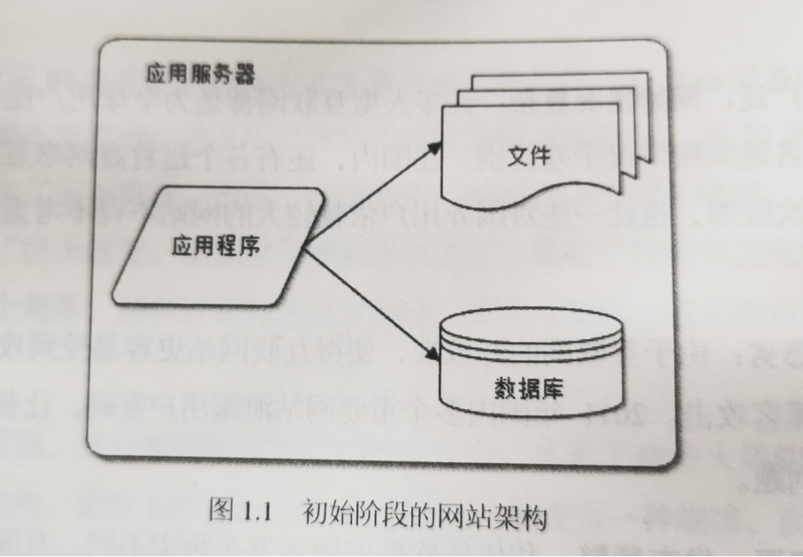
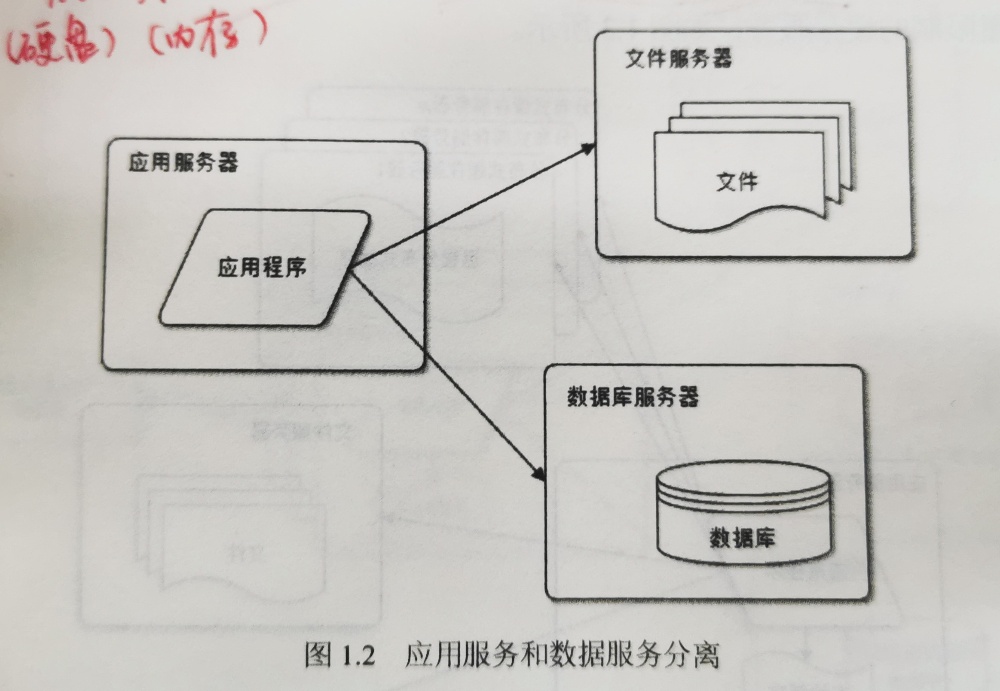
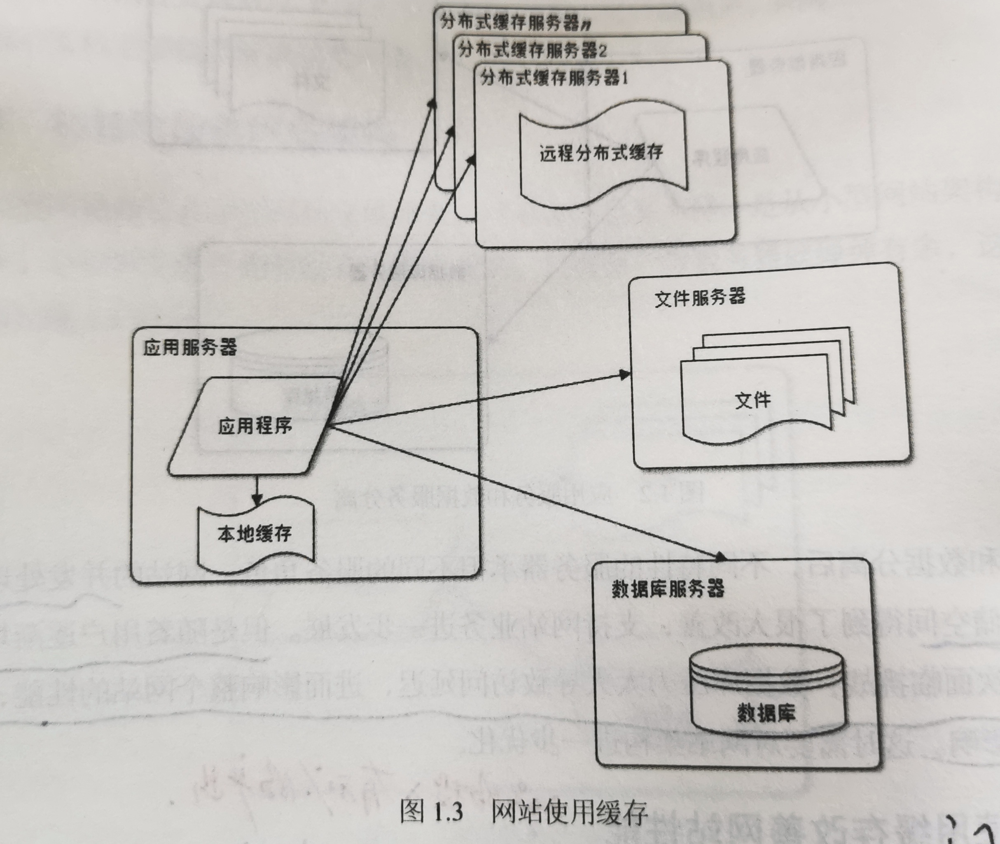
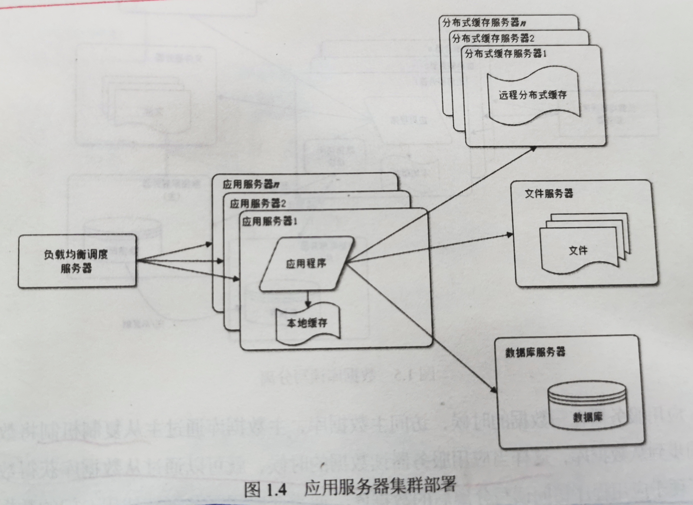
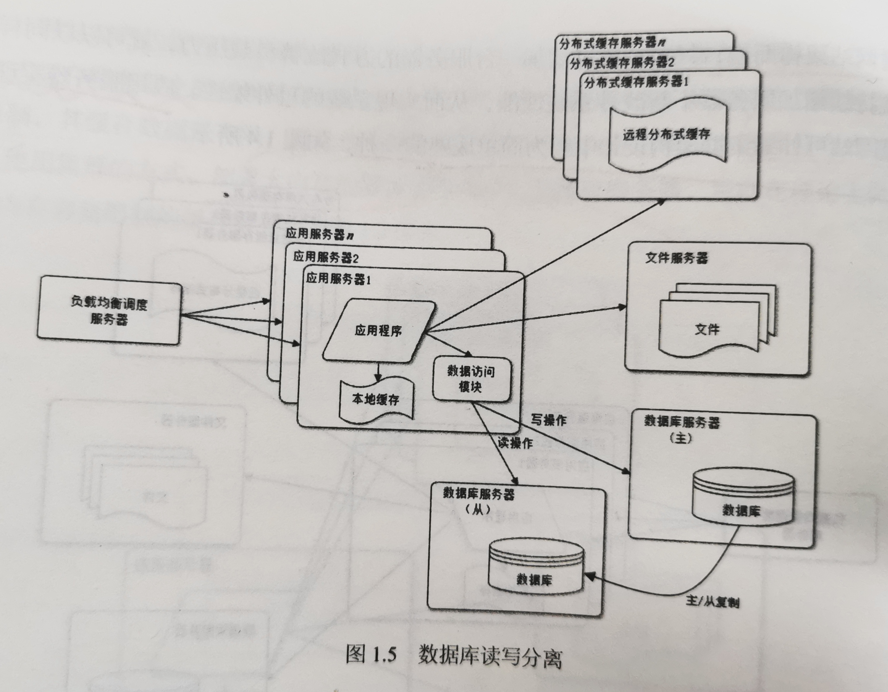

# 大型网站架构演化

## 1.1 大型网站应用系统的特点

### 1）高并发，大流量

面临<u>高并发用户</u>，<u>大流量访问</u>。大量的PV数和IP访问数（用户）。

### 2）高可用

系统7*24小时不间断服务

### 3）海量数据

### 4）用户分布广泛，网络情况复杂

### 5）安全环境恶劣

### 6）需求快速变更，发布频繁

### 7）渐进式发展

几乎所有的大型互联网网站都是从一个小网站开始，渐进发展起来的。

## 1.2 大型网站架构演化的发展历程

### 1.2.1 初始阶段的网站架构

小型网站最开始时没有太多人访问，只需要一台服务器就绰绰有余，且**应用程序、数据库和文件**等资源都在同一台服务器上。通常<u>服务器的操作系统</u>是**Linux**，应用程序使用**PHP**开发，然后部署在**Apache**上，数据库使用**MySQL**，汇集各种免费的开源软件和一台廉价服务器就可以开始 *网站的发展之路* 了。

随着网站业务的发展，一台服务器逐渐不能满足需求（并发处理和数据存储能力）：越来越多的用户访问导致性能越来越差，越来越多的数据导致存储空间不足。这就需要将**业务和数据分离**。

### 1.2.2 应用服务和数据服务分离

应用和数据分离后，整个网站使用三台服务器：**应用服务器**、**文件服务器**和**数据库服务器**。但这三台服务器对硬件资源的要求各不相同：

- 应用服务器：更快更强的CPU。需要处理大量的业务逻辑。
- 文件服务器：更大的硬盘。需要存储大量用户上传的文件。
- 数据库服务器：更快的硬盘和更大的内存。需要快速硬盘检索和数据缓存。

但随着用户逐渐增多，网站又一次面临挑战：数据库压力太大导致访问延迟，进而影响整个网站的性能，用户的体验受到影响。这就需要**缓存**。

### 1.2.3 使用缓存改善网站性能

> 引言：网站访问特点和现实世界的财富分配一样遵循二八定律（20%的投入有80%的产出）：80%的业务访问集中在20%的数据上。例：淘宝卖家浏览的商品集中在少部分成交数多，评价好的商品；百度搜索关键词集中在少部分热门词汇……
>
> 既然大部分业务访问集中在一小部分数据上，那么就考虑将这一小部分数据缓存在内存中，以减轻数据库的访问压力。

网站的缓存分为两种：

- 缓存在应用服务器上的本地缓存（访问速度快，但因与应用程序争用内存而受内存受限制）
- 缓存在专门的分布式缓存服务器上的远程缓存（远程分布式缓存可以用集群的方式，部署大内存的服务器作为专门的缓存服务器）

但是单一应用服务器能够处理的请求连接有限，在网站访问的高峰期，应用服务器成为整个网站的瓶颈。这就需要**应用服务器集群**。

### 1.2.4 使用应用服务器集群改善网站的并发处理能力

使用集群是网站解决高并发、海量数据问题的常用手段。

> 当一台服务器的处理能力、存储空间不足时，不要企图去换更强大的服务器，更恰当的做法是增加一台服务器去分担原有服务器的访问和存储压力。

虽然网站在使用缓存后，绝大部分数据的读操作都可以不通过访问数据库就能完成，但仍有一部分读操作（缓存访问不命中、缓存过期）和全部的写操作还需要访问数据库。而在网站的用户达到一定规模后，数据库因为负载压力过高而成为网站的瓶颈。这就需要**数据库读写分离**。

### 1.2.5 数据库读写分离

绝大部分数据库都提供<u>**主从热备**</u>功能。通过配置两台数据库的主从关系，可以将一台数据库服务器的数据更新同步到另一台服务器上。网站利用数据库这一功能，实现数据库读写分离，从而改善数据库负载压力。

为了便于应用程序访问读写分离后的数据库，通常在应用服务器端，使用专门的*<u>数据访问模块</u>*，使数据库读写分离对 应用透明。

随着网站业务不断发展，用户规模越来越大。由于中国复杂的网络环境，不同地区的用户访问网站时，速度差别也极大。为了提供更好的用户体验，网站需要加速网站的访问速度。这就需要**反向代理和CDN加速网站的响应**。

### 1.2.6 使用CDN和反向代理加速网站的响应

> 两者的基本原理都是缓存。

- CDN：部署在网络提供商的机房，使用户在请求网站服务时，可以从距离最近的网络提供商机房获取数据。
- 反向代理：部署在网站的中心机房。当用户请求到达中心机房后，首先访问的服务器是反向代理服务器，如果反向代理服务器中缓存这用户请求的资源，就直接返回给用户。

通过这种方式，一方面加快用户的访问速度，另一方面也减轻了后端服务器的负载压力。

由单一应用服务器优化为应用服务器集群，我们可以获得启发——分布式数据库和分布式文件系统。

### 1.2.7 使用分布式数据库系统和分布式文件系统

> 其中，通常按业务将数据库进行拆分到不同的物理服务器中。

### 1.2.8 使用NoSQL和搜索引擎

### 1.2.9 业务拆分

### 1.2.10 分布式服务

## 1.3 大型网站架构演化的价值观

> 大型网站都是从小型网站发展而来。网站的价值在于能够为用户提供什么价值，在于网站能做什么，而不是怎么做的。所以，在网站还很小的时候就去追求网站的架构是舍本逐末，得不偿失的。小型网站最需要做的就是为用户提供好的服务来创造价值，得到用户的认可，活下去，野蛮生长！

### 1.3.1 驱动大型网站技术发展的主要力量是网站的业务发展

创新的业务发展模式对网站架构逐步提出更高要求，才是的创新的网站架构得以发展成熟。是业务成就了技术，是事业成就了人，而不是相反。所以，网站架构是应该对成就自己技术成绩的网站事业心存感激，并努力提高技术去<u>回馈</u>业务，才能不断进步。（充满着人文与时代气息wow）

## 1.4 网站架构的设计误区

> 误区一：为了技术而技术

网站技术是为业务而存在的，除此毫无意义。在技术选型和架构设计中，脱离网站业务发展的实际，一味追求时髦的新技术，可能会将网站技术发展引入崎岖小道，架构之路越走越难。

> 误区二：企图用技术解决所有问题

有些问题其实不在于它的技术架构，而在于它的业务架构。（例：2012年初12306故障）

## 1.5 结语

时至今日，大型网站的架构已经非常成熟，各种技术方案也逐渐产品化。许多小型网站已经慢慢不需要再经历大型网站经历过的架构演化之路就能逐步发展壮大了，因为现在越来越多的网站从建立之初就是搭建在**<u>大型网站提供的云计算服务</u>**基础之上，所需要的一切技术资源：计算、存储、网络都可以按需购买，就不需要自己一点点去拼凑了。