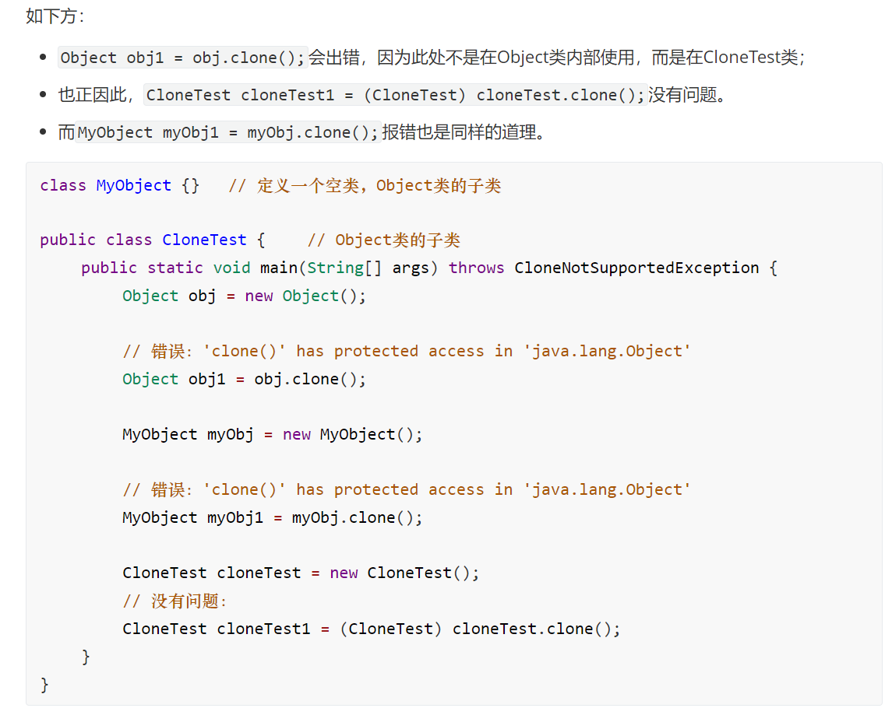

# 五、原型模式

- Prototype Pattern

## 应用场景：

> 当系统中需要大量创建**相同或者相似**的对象时，就可以通过“原型模式”的设计模式。


## 核心思想：

​		通过复制指定的“原型实例”，创建跟该对象一样的新对象。而原型类只需要实现Cloneable接口并重写clone方法即可。而Java中的复制又分为 浅复制和深复制。

- 浅复制：对象中的<font color='red'>基本数据类型</font>的值会被重新复制和创建。而引用数据类型不会被复制。

- 深复制：不管是<font color='red'>基本数据类型</font>还是<font color='red'>引用数据类型</font>都是被重新赋值和创建。

  简言之，深复制彻底复制了对象的数据，而浅复制并不彻底，它忽略了引用数据类型。

  

## 实现：

原型模式 浅复制的原型对象：

```java
public class SimpleComputer implements Cloneable{

    // 对象中的基本数据类型
    private String cpu;
    private String memory;
    private String disk;

    public SimpleComputer(String cpu, String memory, String disk) {
        this.cpu = cpu;
        this.memory = memory;
        this.disk = disk;
    }


    // 重写clone方法
    protected SimpleComputer clone() {
        SimpleComputer simpleComputer = null;

        try {
            simpleComputer = (SimpleComputer) super.clone();
        } catch (CloneNotSupportedException e) {
            e.printStackTrace();
        }

        return simpleComputer;
    }
    
    // getter和toString
    
}
```


原型模式 深复制的原型对象：

```java
public class ComplexComputer implements Cloneable{

    // 基本数据类型和引用数据类型
    private String cpu;
    private String memory;

    private Disk disk;
    private Map<Integer,String> screen;

    public ComplexComputer(String cpu, String memory, Disk disk, Map<Integer, String> screen) {
        this.cpu = cpu;
        this.memory = memory;
        this.disk = disk;
        this.screen = screen;
    }

    // 重写方法（虽然原方法返回的是Object，但也可以写成具体的类）
    @SuppressWarnings("unchecked")
    protected ComplexComputer clone() {

        ComplexComputer complexComputer = null;

        // 先复制基本数据类型
        try {
            complexComputer = (ComplexComputer) super.clone();
            complexComputer.disk = this.disk.clone();
            // HashMap类中实现了Cloneable接口，所以先强转成HashMap才能调用clone，最后再转成原类型Map
            complexComputer.screen = (Map<Integer,String>)((HashMap<Integer,String>)this.screen).clone();

        } catch (CloneNotSupportedException e) {
            e.printStackTrace();
        }

        return complexComputer;
    }
}
```


深复制中的引用数据类型Disk：

```java
public class Disk implements Cloneable{

    private String ssd;
    private String hhd;

    public Disk(String ssd, String hhd) {
        this.ssd = ssd;
        this.hhd = hhd;
    }

    // 重写方法
    protected Disk clone() {
        Disk disk = null;

        try {
            disk = (Disk) super.clone();
        } catch (CloneNotSupportedException e) {
            e.printStackTrace();
        }

        return disk;
    }
}
```


测试类：

```java
public class Test {

    public static void main(String[] args) {

        // 浅复制
        SimpleComputer protoType = new SimpleComputer("inter", "8G", "1TB");
        SimpleComputer clone1 =  protoType.clone();
        SimpleComputer clone2 =  protoType.clone();
        System.out.println(clone1);
        System.out.println(clone2);

        System.out.println("---------------------------------------");

        // 深复制
        Map<Integer, String> map = new HashMap<>();
        map.put(1, "screen1");
        Disk disk = new Disk("ssd1", "hhd1");

        ComplexComputer complexComputer = new ComplexComputer("inter", "4G", disk, map);
        ComplexComputer cloneComputer1 = complexComputer.clone();

        // 修改引用数据类型，观察是否影响其他复制后的对象
        //cloneComputer1.getScreen().remove(1);

        ComplexComputer cloneComputer2 = complexComputer.clone();
        System.out.println(cloneComputer1);
        System.out.println(cloneComputer2);

    }
}
```


输出结果：

```
SimpleComputer{cpu='inter', memory='8G', disk='1TB'}
SimpleComputer{cpu='inter', memory='8G', disk='1TB'}
---------------------------------------
ComplexComputer{cpu='inter', memory='4G', disk=Disk{ssd='ssd1', hhd='hhd1'}, screen={1=screen1}}
ComplexComputer{cpu='inter', memory='4G', disk=Disk{ssd='ssd1', hhd='hhd1'}, screen={1=screen1}}
```


## 注意：

1）在原型模式中，String被视为**常量**（基本数据类型），我们可以用反证法证明。<font color='blue'>首先明确，当复制出来的某一个类修改了其引用数据类型的成员变量后，会导致所有浅复制出来的对象都发生变化</font>。如果String是引用数据类型，浅复制得到的新对象不存在因改动其中一个对象的String数据，而导致其他对象的String数据受影响，因为String有<font color='red'>不可变特性</font>。所以在此，String被视为常量。

2）Cloneable是一个<font color='red'>标记接口</font>，即接口中没有任何内容，只是一个特殊的标记。

3）深复制涉及到的引用数据类型有：对象、集合、数组等。

4）clone()方法public或protect都行。

5）关于clone方法：


