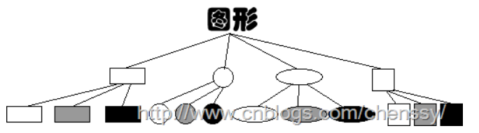
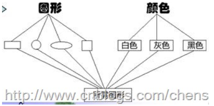

# 十、桥接模式


## 概念

> 将抽象部分与它的实现部分分离开，使它们都可以独立变化。
>
> 例如在实际程序中，抽象部分是图形用户界面GUI，而实现部分是底层的代码API，GUI层调用API层来对用户的各种操作做出响应。


## 举例理解概念

有一支画笔，可以画各种形状——正方形、长方形和圆形。但我们还需要给这些形状上色——白色、灰色和黑色。这样就出现了9种图形。这里便出现了两种解决方案：

- 方案一：为每种形状提供各种颜色（为每种颜色提供不同的形状）   ———   继承




- 方案二：抽象出两个维度，在需要时再对颜色和形状进行组合。       ———   组合




 

## 代码实现：

> 思路：因为最后组合的形式可以是   shape.setColor()   ，所以要将color对象“组合”进shape中（作为属性）


其中一个维度：Color

```java
public interface Color {

    void paint();

}
```

实现类：

```java
public class Green implements Color {
    @Override
    public void paint() {
        System.out.println("涂上绿色");
    }
}
```

```java
public class Red implements Color {
    @Override
    public void paint() {
        System.out.println("涂上红色");
    }
}
```


另一个维度：Shape

```java
public abstract class Shape {

    protected Color color;

    public void setColor(Color color) {
        this.color = color;
    }

    public abstract void draw();

}
```

实现类：

```java
public class Circle extends Shape {
    @Override
    public void draw() {
        System.out.println("画一个圆形");
        color.paint();
    }
}
```

```java
public class Rectangle extends Shape {
    @Override
    public void draw() {
        System.out.println("画一个正方形");
    }
}
```


测试类：

```java
public class Test {

    public static void main(String[] args) {

        Color red = new Red();
        Shape circle = new Circle();
        circle.setColor(red);
        circle.draw();

    }
}
```

