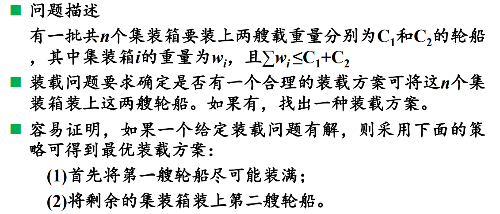
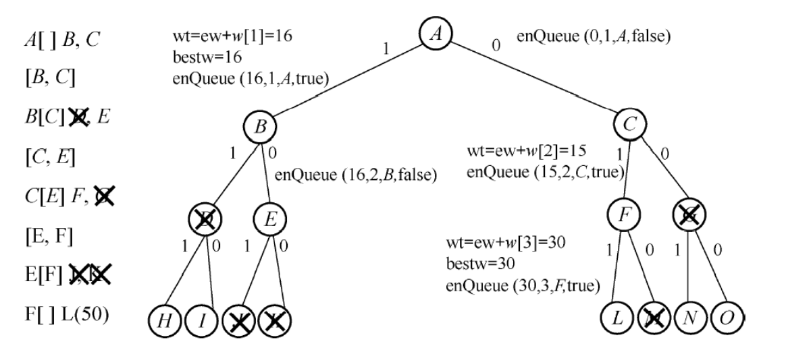

# 分支限界法

## 介绍

> ​	分支限界法类似于回溯法，也是在问题的解空间上搜索问题解的算法。但两者的求解目标不同——回溯法的求解目标是**找出解空间中满足约束条件的所有解**，而分支限界法的求解目标则是**找出满足约束条件的一个解**。
>
> ​	因为求解目标不同，导致两者对解空间的搜索方式也不同。回溯法以**深度优先**的方式搜索解空间，而分支限界法则以**广度优先**的方式搜索解空间。


## 方法

- 队列式分支限界法
- 优先队列式分支限界法


## 例题




#### 法一：队列式




#### 代码！

```java
package week9;

import com.sun.jmx.remote.internal.ArrayQueue;

import java.util.Arrays;

/**
 * @author yxl15
 * @date 2021/4/29 14:52
 * @description
 *
 *      分支限界法解 装载问题
 */
public class FreightQuestion {


    // 维护变量
    /**
     * 当前最优载重量
     */
    private static int bestWeight;
    /**
     * 活结点队列
     */
    private static ArrayQueue<QueueNode> queue;
    /**
     * 当前最优扩展结点
     */
    private static QueueNode bestNode;
    /**
     *  最优装载情况
     */
    private static int[] bestX;
    /**
     * 当前扩展结点所对应的载重量
     */
    private static int nodeWeight;
    /**
     * 剩余集装箱的重量
     */
    private static int r;

    /**
     * 集装箱个数
     */
    private static int n;

    private static void queueTest(int nn, int c1, int c2, int[] w) {

        // 初始化
        n = nn;
        int[] x = new int[n + 1];
        bestWeight = 0;
        queue = new ArrayQueue<>(n << 2);
        // 同层节点尾部标志
        queue.add(null);
        bestX = x;
        nodeWeight = 0;
        // 初始化剩余集装箱的重量r（不算入第一个集装箱）
        for (int i = 2; i <= n; i++) {
            r += w[i];
        }

        // 当前扩展结点
        QueueNode node = null;
        // 当前扩展结点所处的层
        int i = 1;
        // 当前扩展结点对应的载重量
        int curWeight = 0;


        search(c1, w, x, i, curWeight, node);

    }

    private static void search(int c1, int[] w, int[] x, int i, int curWeight, QueueNode node) {
        while (true) {
            // 一、检查左儿子结点
            int weight = curWeight + w[i];
            // 约束函数
            if (weight <= c1) {
                if (weight > bestWeight) {
                    bestWeight = weight;
                }
                enQueue(weight, i, node, true);
            }

            // 二、检查右儿子结点
            if (curWeight + r > bestWeight) {
                enQueue(curWeight, i, node, false);
            }

            // 三、取下一个扩展结点
            node = queue.remove(0);
            if (node == null) {
                if (queue.isEmpty()) {
                    break;
                }
                queue.add(null);
                node = queue.remove(0);
                // 进入下一层
                i++;
                r -= w[i];
            }
            curWeight = node.weight;
        }

        // 循环结束，构造当前最优解
        for (int j = n - 1; j > 0; j--) {
            bestX[j] = (bestNode.isLeftNode) ? 1 : 0;
            bestNode = bestNode.parent;
        }
    }

    public static void enQueue(int weight, int i, QueueNode parent, boolean isLeftNode) {
        /*
            判断是否为叶子节点：
                （1）是：则直接输出
                （2）不是：入队列
         */
        if (i == n ) {
            // 判断是否是最优解
            if (weight == bestWeight) {
                bestNode = parent;
                bestX[i] = (isLeftNode) ? 1 : 0;
            }
            return;
        }

        // 非叶子节点
        QueueNode node = new QueueNode(parent, isLeftNode, weight);
        queue.add(node);

    }


    public static void main(String[] args) {

/*        int n = 3;
        int c1 = 30;
        int c2 = 30;
        int[] w = {0, 16, 15, 15};*/

        int n = 5;
        int c1 = 120;
        int c2 = 80;
        int[] w = {0, 60, 40, 10, 30, 50};
        queueTest(n, c1, c2, w);

        System.out.println(Arrays.toString(bestX));
        System.out.println(bestWeight);

    }


    public static int getBestWeight() {
        return bestWeight;
    }

    public static ArrayQueue<QueueNode> getQueue() {
        return queue;
    }

    public static QueueNode getBestNode() {
        return bestNode;
    }

    public static int[] getBestX() {
        return bestX;
    }

    public static int getNodeWeight() {
        return nodeWeight;
    }

    public static int getR() {
        return r;
    }
}

```

