# 动态规划


## 零、闫式动态规划

### * 思考方式

##### 以 0-1背包 为例：

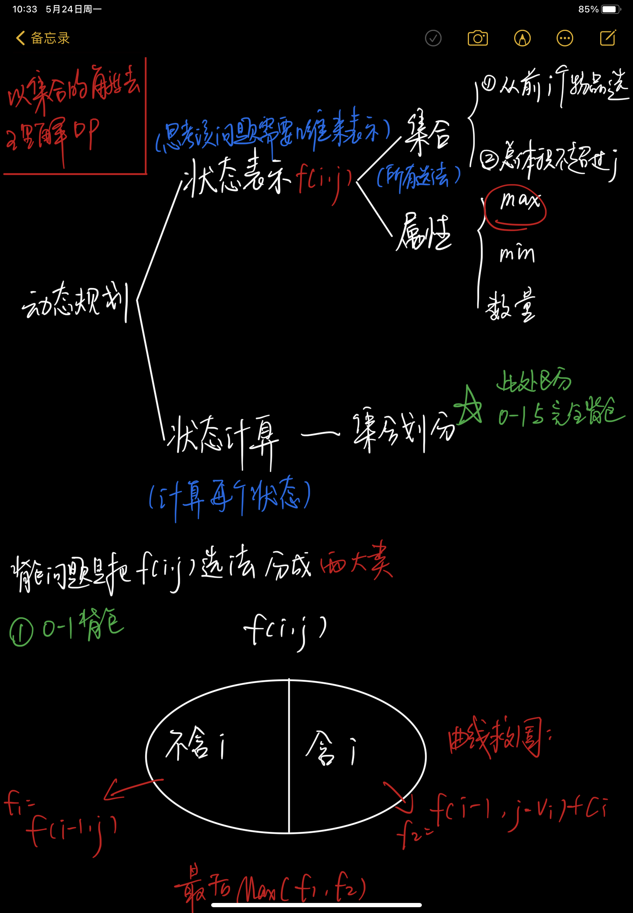

##### 以 完全背包 为例：

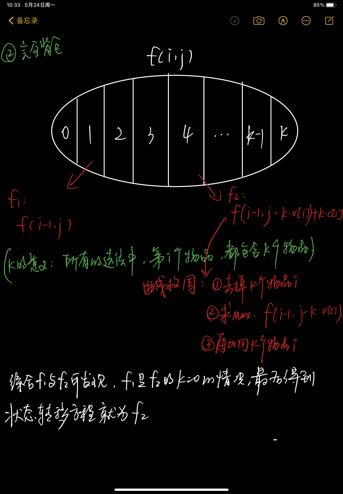

## 一、0-1背包问题

### 1.1 问题

> “0-1背包”问题——容量为v，价值为c


### 1.2 二维解法

> 用 **F\[i][j]** 表示面对前**i**种物品，背包容量为**j**时的**最大价值**

##### 1.2.1 步骤

1. 当i=1时，如果背包可以放下第一个物品，则放入并更新最大价值
2. 基于第一行的结果和背包容量，可以 **不选、只选或选第二件**，最后取最大值
3. 基于前一行的结果和背包容量，取最大值（重复上一步）
4. 循环结束后，F\[N][V]即为结果

##### 1.2.2 结果

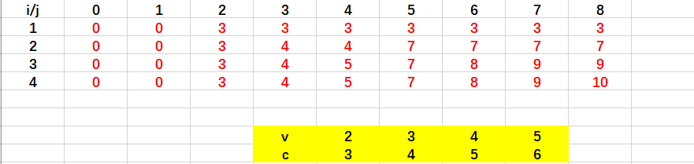

##### 1.2.3状态转移方程

> F\[i][j] = max ( F\[i-1][j] ,  F\[i-1][j - v\[i] ] + c\[i] )


##### 1.2.4 二维数组递推的方法：

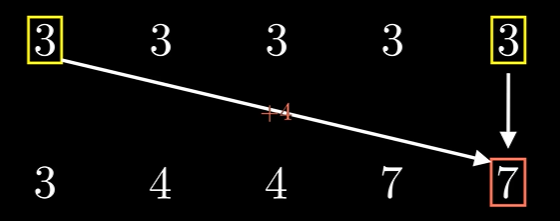

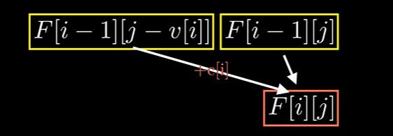


##### 1.2.5 代码

```java
// 两层循环 ———— 一层列举物品，另一层列举容量(V是背包最大容量)
for(int i = 1; i <= n; i++){
    for(int j = 0; j <= V ; j++){
        f[i][j] = f[i - 1][j];
        if(j >= v[i]){
            f[i][j] = Math.max(f[i][j], f[i-1][j-v[i]] + c[i]);
        }
    }
}

// 01背包问题求具体方案
// 从二维数组的最右下角开始找
int vol = V;
for(int i=n; i>0 ; i--){
    if(f[i][vol] == f[i-1][vol-v[i]] + w[i]){
        sout(i+" ");
        vol -= v[i];
    }
}
```


### 1.3 一维解法

> 因为二维数组会增加空间复杂度，所以我们通过降维，使用一维数组的方式来解题。
>
> 但仍需要两层循环，一层列举物品，一层列举容量。

##### 1.3.1步骤和结果

> <font color='red'>每一个位置上的结果  都是由  上一次更新后的本位置的值 和 前v\[i] 的位置决定。</font>
>
> 但不能利用正序来遍历容量，因为存在更新两次的情况（完全背包问题）。所以要用逆序来遍历。

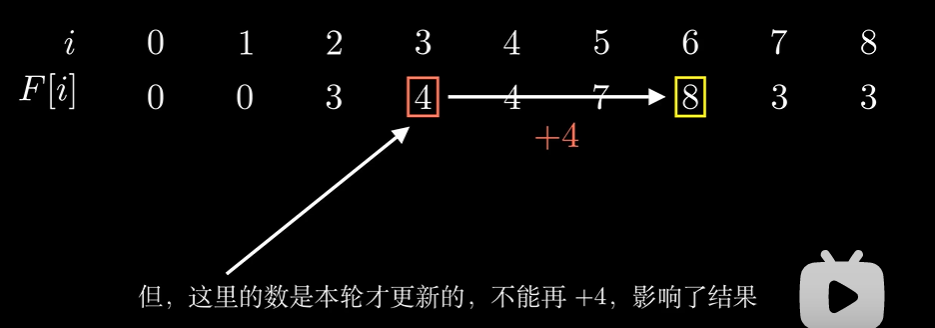


（1）i == 1时：

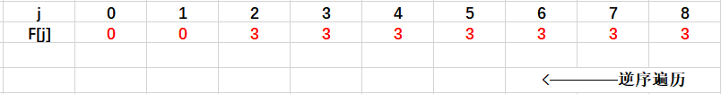

（2）i == 2时：

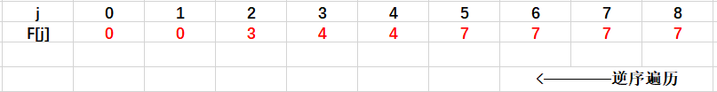

（3）i == 3时：

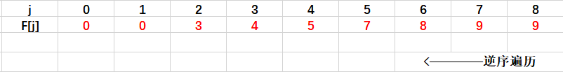

（4）i == 4时：

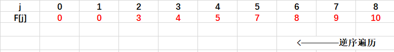


##### 1.3.2 代码

```java
for(int i = 1; i <= n; i++){
    for(int j = v; j >= v[i] ; j--){
        f[j] = Math.max(f[j], f[j - v[i] + w[i]]);
    }
}
```


[参考动画](https://www.bilibili.com/video/BV1Eb411r7dJ?from=search&seid=10766553556308302914)


## 二、 完全背包问题

### 1.1 问题

> “完全背包”问题——容量为v，价值为w   **（每种物品无限件可用）**

### 1.2 朴素做法（三维做法）

##### 1.2.1 代码

```java
// 方法一、三维做法    （时间复杂度大）
// 注意：
//	(1) 其中k是从0开始遍历的，即包含了k=0时为不选第i个物品
//  (2) i从0开始遍历，j从1开始遍历

// V是背包最大容量
for(int i=0; i<=n; i++){
    for(int j=0; j<=V; j++){
        for(int k=0; k*v[i] <= j; k++){
            f[i][j] = max(f[i][j], f[i-1][j - k*v[i]] + c[i]*k)
        }
    }
}

```


### 1.3 二维做法

其实，我们可以省略k这个第三层循环。

**我们先列举下更新次序的内部关系：**

> f[i , j ] = max( f[i-1, j] , f[i-1, j-v]+w , f[i-1, j-2\*v]+2\*w , f[i-1, j-3\*v]+3\*w , .....)
> f[i , j-v]= max(              f[i-1, j-v]      , f[i-1, j-2\*v] + w    , f[i-1,j-2\*v]+2*w , .....)
> 由上两式，可得出如下递推关系： 
>                         f\[i][j]=max( f\[i-1][j], f[i, j-v]+w ) 

**有了上面的关系，就可以省略k循环了，代码如下：**

```java
// 方法二、二维做法


for(int i=1; i<=n; i++){
    for(int j=0; j<=V; j++){
        f[i][j] = f[i-1][j];
        if(j>=v[i]){
            f[i][j] = max(f[i][j], f[i][j-v[i]]+w[i]);
        }
    }
}
```

**可发现，其与01背包问题，只有一句（一个下标不同）**

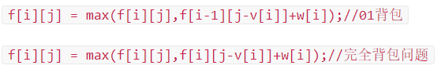

### 1.4 一维做法（同01背包问题）

```java
 for(int i = 1 ; i<=n ;i++)
    for(int j = v[i] ; j<=m ;j++)//注意了，这里的j是从小到大枚举，和01背包不一样
    {
            f[j] = max(f[j],f[j-v[i]]+w[i]);
    }
```


## 三、多重背包问题

### 1.1问题

> 每件物品的个数不是无限个，而是有s[i]个


### 1.2 三维做法

​	在完全背包的基础上，在第三层循环中，为k添加一个限制条件：k<=s[i]。

#### 1.2.1 时间复杂度

O(n) = n * V * s


### 1.3 二进制优化做法

​	不能用”完全背包“的优化思路来优化”多重背包“问题。因为每种物品的个数都不一样，所以是不能推出递归关系的。

​	我们可以学习一个新的优化方式  -------  **二进制优化。**


#### 1.3.1 二进制优化

​	假设第 i 种商品有11个，若要求所有商品的最优解。在正常的思路下，则要枚举12次。

​	但我们现在利用**”二进制“**的思想，把这11个商品打包成含商品个数为1个、2个、4个、4个的四个”新的商品“，以实现将多重背包问题转换成**01背包问题**。最终，枚举每个商品，我们只需要枚举4次就可以找到这11个商品的最优解。

​	那怎么划分一个十进制数？比如，11。

> 11 = 0111(B) + (11 - 0111(B)) 

​	

#### 1.3.2 时间复杂度

O(n) = n * V * log s 。


#### 1.3.3 代码

```java
// n：物品种数 
// a：单个物品的体积
// b：单个物品的价值
// k：第i种物品中组别里面的个数（1、2、4、8...）
// V：背包体积

// 转成01背包的遍历索引count
int count = 0;

for(int i = 1; i <= n; i++ ){
	int k = 1;
    while(k <= s){
		count++;
        v[count] = a * k;
        w[count] = b * k;
        s -= k;
        k *= 2;
    }
    // 取得剩下的常数c
    if(s > 0){
        count++;
        v[count] = a * s;
        w[count] = b * s;
    }
}

n = count;

// 01背包问题
for(int i = 1; i <= n; i++){
    for(int j = V; j >= v[i]; j--){
        f[j] = max(f[j], f[j - v[i]] + w[i]);
    }
}
```


## 四、分组背包问题

### 1.1 问题

> 有n组物品，每组物品有s[i]个，同组物品最多只能选一个。

### 1.2 状态转移方程

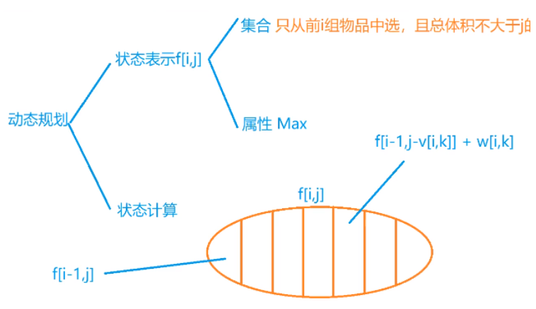

### 1.3 代码

```java
for(int i=0; i<n; i++){
    for(int j=V; j>=0; j--){
        // 遍历每组中的各个物品
        for(int k=0; k<s[i]; k++){
            if(v[i][k]<=j){
                f[j] = max(f[j], f[j-v[i][k]] + w[i][k]);
            }
        }
    }
}
```

