# 动态规划


## 一、基本思想（对比分治法）

- 相同点：
  - 求解原问题时，将其分解成子问题。先求子问题的最优解，**并在此基础上**求原问题的最优解。
- 不同点：
  - 子问题并不是独立的，而是相互重叠的。求解出子问题时，一旦得到一个子问题的最优解，并不是把这个子问题得最优解丢掉，而是保存到一个二维表中在未来一旦要用到这个子问题的 解，并不需要重新计算这个子问题，只需要回到表格当中 ，以常数时间获取这个子问题的最优解。
- 总结：
  - 因此动态规划法 具有较高的运算效率，对相当多问题都能得到多项式时间解。


## 二、动态规划的基本步骤和性质

### （一）基本步骤

<font color='red'>**1. 找出最优解的性质，并刻画其结构特征**</font>

<font color='red'>**2. 递归地定义最优值**</font>

<font color='red'>**3. 以 自底向上 的方式计算出最优值**</font>

<font color='red'>**4. 根据计算最优值时得到的信息，构造最优解**</font>


### （二）性质

#### <font color='blue'>最优子结构性质</font>

> 原问题的最优解包含其子问题的最优解。

​		这种性质称为最优子结构性质。在分析某问题的最优子结构性质时，通常用反证法（问题的最优解 导出的其子问题的解不是最优的，然后再设法说明在这个假设 下可构造出比原问题最优解更好的解，从而导致矛盾）。

​		该性质是判断是否可用动态规划算法求解的重要特征。


## 三、例题

### 2.1 矩阵连乘问题

#### （1）问题

> ​		矩阵连乘问题描述：给定n个矩阵｛A1, A2, …, An｝，Ai 的 维数为pi-1×pi ，Ai 与Ai+1是可乘的，i=1,2 ,…,n-1。如何确定 计算矩阵连乘积的计算次序，使得依此次序计算矩阵连乘积需要的数乘次数最少。


#### （2）示例

A1、A2和A3矩阵的连乘，如下图：

（所以p[0:3]是10, 100, 5, 50）

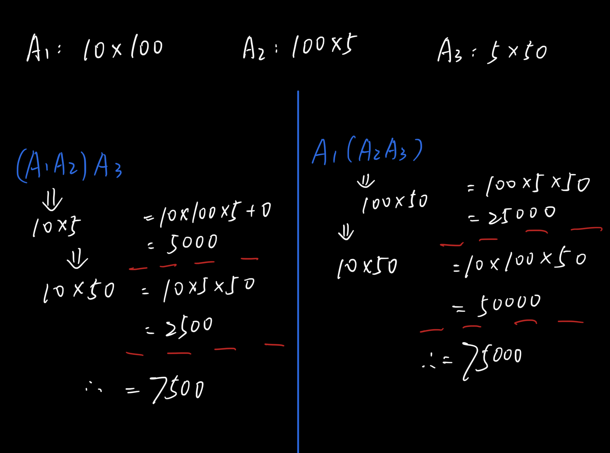


#### （3）相关知识

-  A是一个**p\*q**的矩阵，矩阵B是一个**q\*r**的矩阵, 两个矩阵相 乘，得到一个**p*r**的矩阵。

- 矩阵乘法满足**结合律**，所以计算矩阵的连乘可以有许多不同的计算次序，而矩阵乘法计算次序可以用加括号的方式来确定。
- 两个矩阵相乘所需要的 **数乘次数** 为**p\*q\*r**


#### （4）依步骤求解

##### 1. 找出最优解的性质，并刻画其结构特征

**1.1 将矩阵连乘Ai Ai+1... Aj 记为A[i:j]。其中，满足以下条件：**

- i<=j
- Ai 与 Ai+1 是可乘的，i=1,2,...,n-1
- Ai的维数是**pi-1 \* pi**

**1.2 引入k将原矩阵链断开，则拆开为（Ai Ai+1... Ak），（Ak+1 Ak+2... Aj ）**

**1.3 计算量的最优值：**

> <font color='red'>A[i:j]的计算量 = A[i:k]的计算量 + A[k+1:j]的计算量 + A[i:k]和A[k+1:j]相乘的最优计算量</font>

而需要证明上式中，**若A[i:j]的计算量表示最优值，则A[i:k]的计算量与A[k+1:j]的计算量也是最优值**。（反证法：在A[i:j]的计算量表示最优值的前提下，若A[i:k]不是最优的，则若用A'表示最优的，其他项不变，则存在A'[i:j]为最优值。与前提违背，得证。）

---

##### 2. 递归地定义最优值

设计算A [i: j]，1＜=i＜=j＜=n，所需的 **最少数乘次数** 为**m\[i][j]**。

（1）当 i==j 时，A[i: j]=Ai 为单一矩阵无需计算，因此，m[i, i]=0  **（递归出口）**

（2）当 i < j 时，利用**最优子结构性质**来计算m[i,j]。

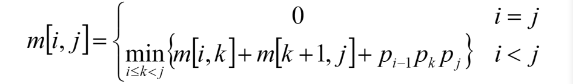

k的确定位置有 j-i 种可能。


#### （5）代码

> 变量：
>
> ​			int\[]\[] s 为最优断开位置的数组
>
> ​			int\[] p   为矩阵维度的数组（当n=5时，p.length=6 ）
>
> ​			int\[]\[] m 为最小数乘的答案
>
> ​			int r        为区间长度（range）


```java
package week11;

/**
 * @author yxl15
 * @date 2021/5/17 19:46
 * @description
 *
 *      动态规划——————矩阵连乘
 */
public class MatrixChainMultiplication {

    /**
     * @Author yxl
     * @Date 19:58 2021/5/17
     * @param m : 最小连乘次数的结果矩阵
     * @param s : 最优断开位置
     * @param p : 已知的参数
     * @return : void
     * @Description

    **/
    public static void dp(int[][] m, int[][] s, int[] p) {

        int n = p.length - 1;

        // 一、初始化
        // m[i][i] = 0 （矩阵自个儿连乘次数为0）（m的对角线==0）（range==1时的情况）
        for (int i = 0; i < m.length; i++) {
            m[i][i] = 0;
        }

        // 其他为max
        for (int i = 1; i <= n; i++) {
            for (int j = i + 1; j <= n; j++) {
                m[i][j] = Integer.MAX_VALUE;
            }
        }

        // 二、遍历连乘矩阵的个数/范围
        for (int r = 2; r <= n; r++) {
            for (int i = 1; i <= n; i++) {
                int j = i + r - 1;
                // 不写会空指针
                if (j > n) {
                    break;
                }
                // 遍历切割位置--在后面切割   k为[i,j)
                for (int k = i; k < j; k++) {
                    int min = m[i][j];
                    // 递归公式
                    int temp = m[i][k] + m[k + 1][j] + p[i - 1] * p[k] * p[j];
                    // 比较
                    if (temp < min) {
                        m[i][j] = temp;
                        s[i][j] = k;
                    }
                }
            }
        }

    }

    /**
     * @param s : 最优断开位置的数组
     * @return : void
     * @Author yxl
     * @Date 19:50 2021/5/17
     * @Description 通过递归输出
     **/
    public static void traceBack(int[][] s, int i, int j) {

        // 递归出口
        if (i == j) {
            return;
        }

        // 递归左边
        traceBack(s, i, s[i][j]);
        // 递归右边
        traceBack(s,s[i][j] + 1, j);

        System.out.println(
                "A[" + i + ":" + s[i][j] + "]" +
                "*" +
                "A[" + (s[i][j] + 1) + ":" + j + "]");
    }


    public static void main(String[] args) {

        int[] p = {5, 200, 2, 100, 30, 200};
        int n = p.length - 1;
        // 竖轴是i[1:n] ，横轴是j[1:n] ，所以m的大小是(n+1)*(n+1)
        int[][] m = new int[n + 1][n + 1];
        int[][] s = new int[n + 1][n + 1];

        dp(m, s, p);

        traceBack(s, 1, n);
    }
}

```


---


### 2.2 最长公共子序列问题

#### （1）问题

> ​		最长公共子序列（Longest Common Subsequence，LCS）问题描述：给定两个序列X={x1, x2, …, xm}和Y={y1, y2, …, yn}，找出X和Y 的最长公共子序列Z={z1, z2, …, zk} 。


#### （2）示例

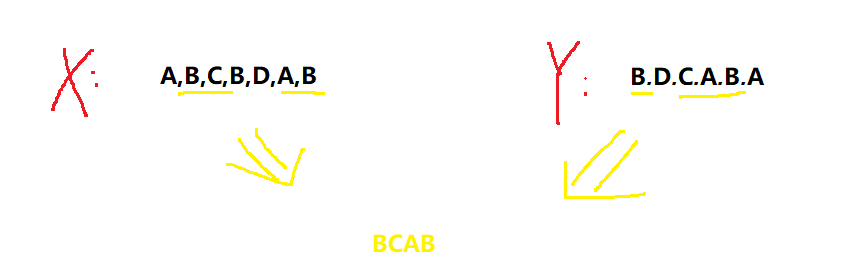

#### （3）相关知识

- 什么是子序列？   一个给定序列的子序列是在该序列中删去若干元素后得到的序列
- 序列具有顺序性，区别于集合

#### （4）依步骤求解

##### 1. 找出最优解的性质，并刻画其结构特征

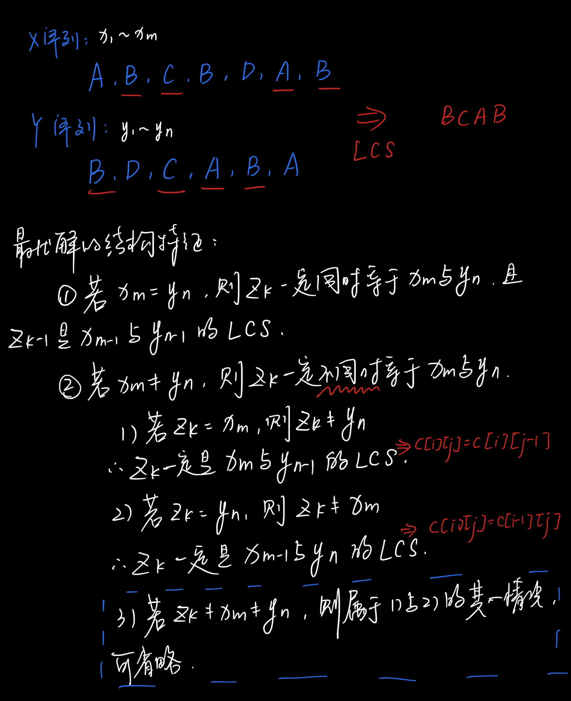

##### 2. 子问题的递归结构

- 当 i=0 或 j=0时，LCS的结果是空序列
- 其他情况下，可由最优子结构性质建立递归关系如下：（c\[i][j]是最优值）

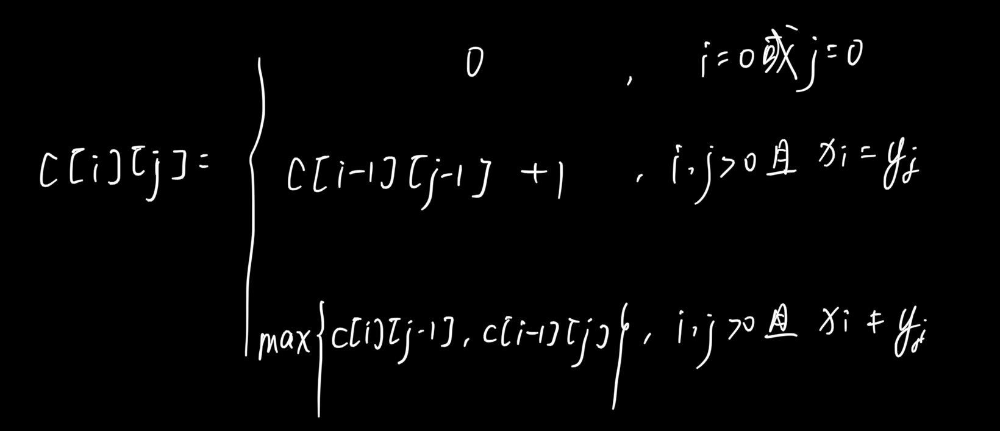

#### （5）代码

```java
```

#### （6）过程


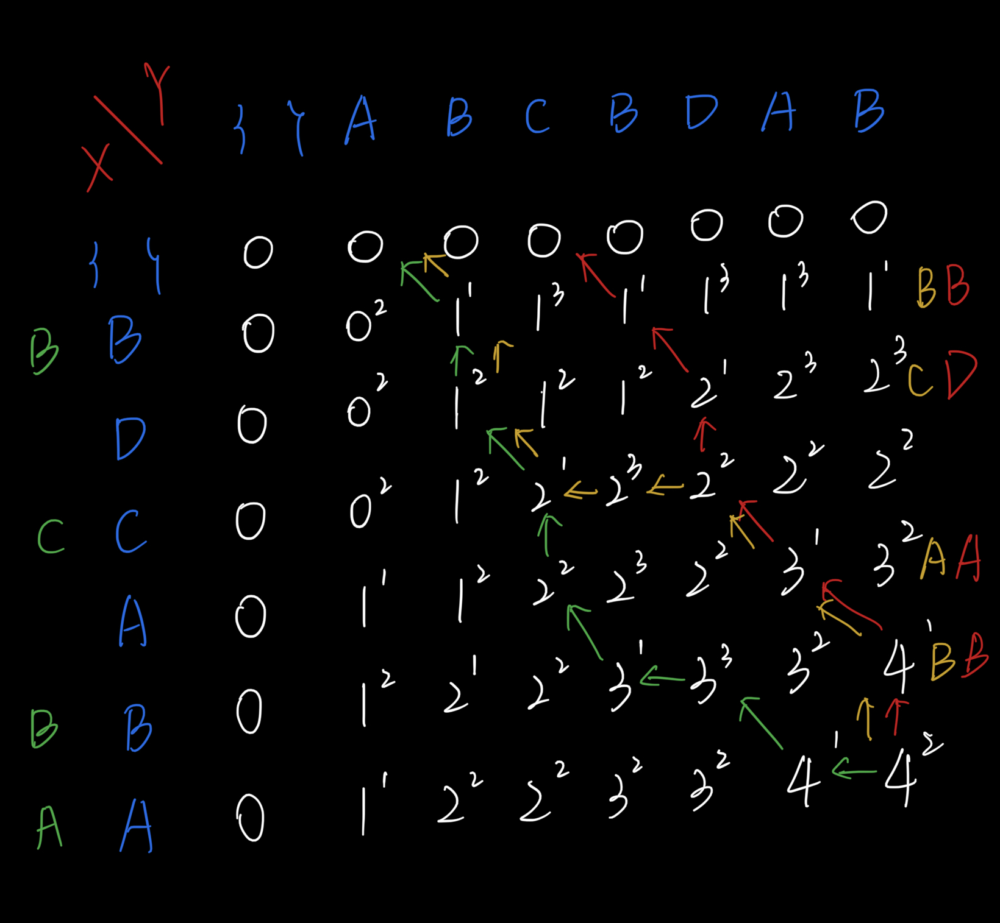


### 2.3 最优二叉树搜索问题

#### （1）问题

> 对于有序集S及其存在概率分布（a0, b1, a1, ……, bn, an），在所有表示有序集S的二叉搜索树中找出一棵具有**最小平均路径长**的**二叉搜索树**。


#### （2）相关知识

- 二叉搜索树：每个结点都不比它左子树的任意 元素小，而且不比它的右子树的任意元素大

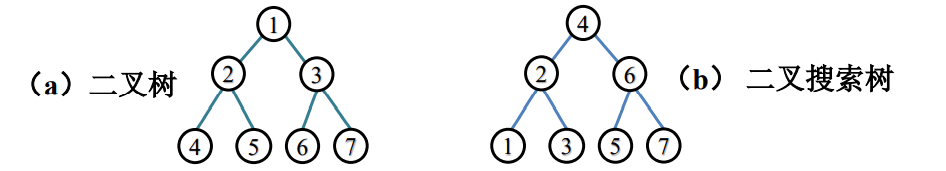


- 要找**平均比较次数**最小的二叉搜索树

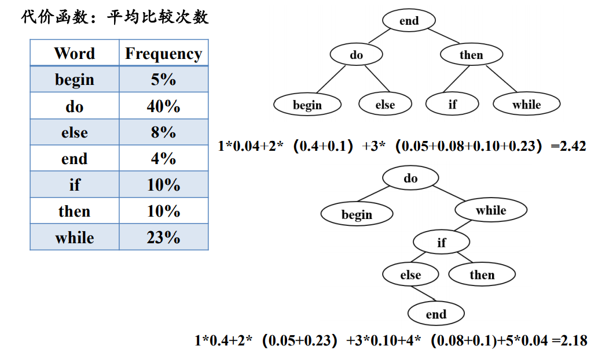


#### （3）入手准备

##### 1. 确定二叉搜索树的结构

- 二叉搜索树的叶结点是**形如(xi, xi+1)的开区间**，当搜索元素x时，返回的结果有以下两种情形
  - 在二叉搜索树的**内结点**找到**x=xi**
  - 在二叉搜索树的**叶结点**确定**x∈(xi, xi+1)**

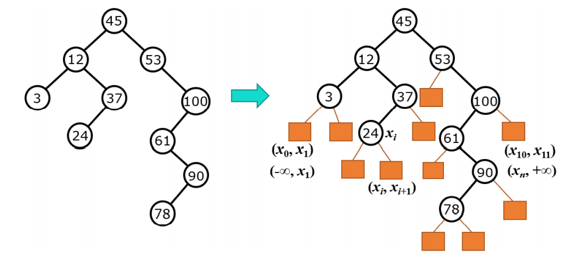

- 设在第一种情形中找到 x=xi的概率为bj, 第二种情形中确定x∈(xi, xi+1)的概率为ai。最终得到有序集S的**存取概率分布：(a0, b1, a1,..., bn, an)**。
-  在表示S的二叉搜索树T中，设存储元素xi 的结点层次为ci ；存储叶结点 (xi ，xi+1)的结点层次为dj ，P表示二叉搜索树T的平均路长，而我们要求**Pmin**。

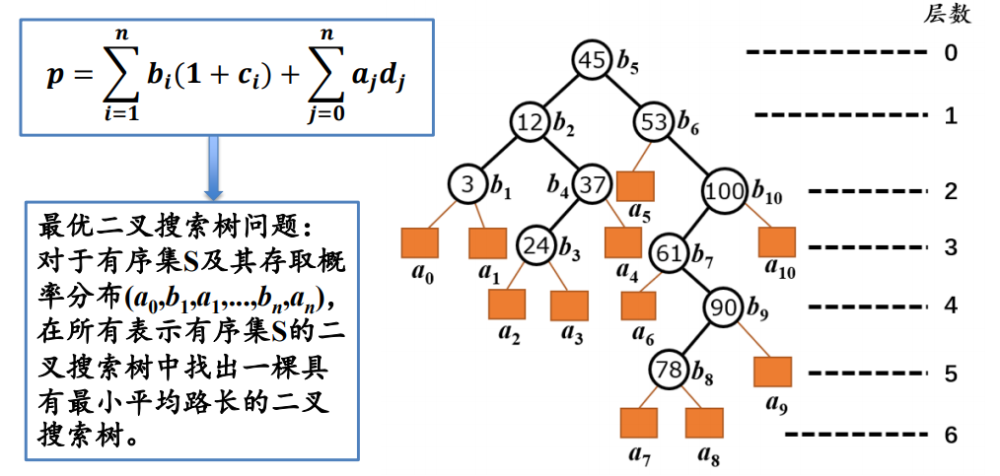


#### （4）依步骤求解

##### 1. 找出最优解的性质，并刻画其结构特征

- 二叉搜索树T的一棵含有结点xi , ..., xj 和叶结点(xi-1, xi ),...,(xj , xj+1) 的子树可以看作是有序集{xi ,..., xj }关于全集合{xi-1 ,..., xj+1}的一棵 二叉搜索树，如下图所示：

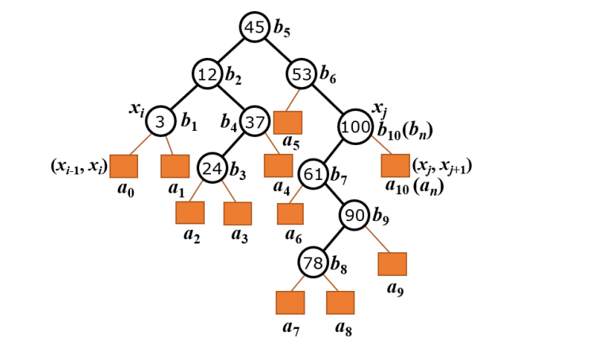

- 设Tij是有序集合{xi , ..., xj }关于存取概率 的一棵最优二叉搜索 树，其路长为pij。Tij的根结点存储元素xm，其左右子树Tl 和Tr的路长分别 为pl 和pr。由于Tl 和Tr中结点深度是他们在Tij中的结点深度减1，故我们有：

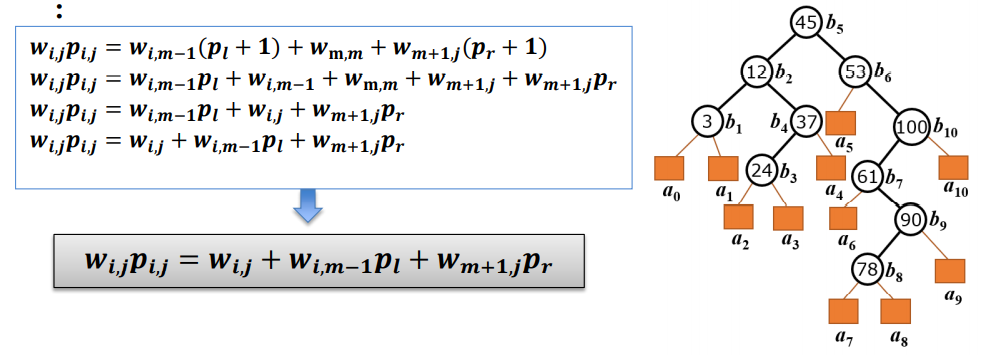

（最优子结构性质的证明省略...）

##### 2. 子问题的递归结构

最优二叉搜索树Tij的路长为Pij，由最优二叉搜索树问题的最 优子结构性质可建立计算Pij的递归式如下：

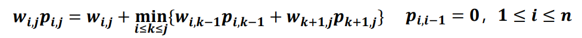


#### （5）代码

#### （6）过程

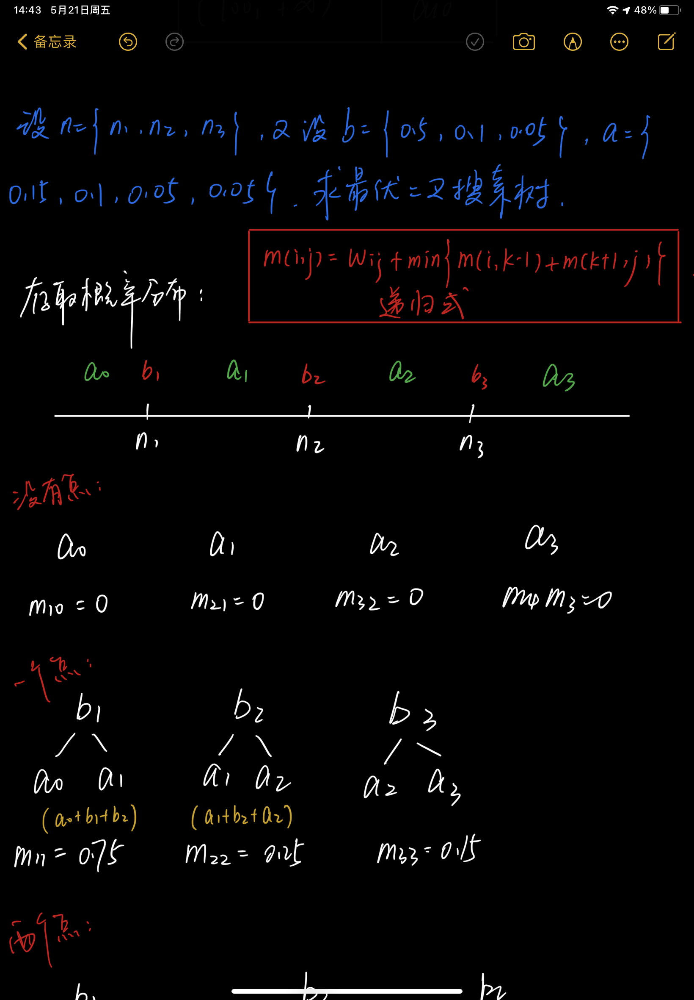

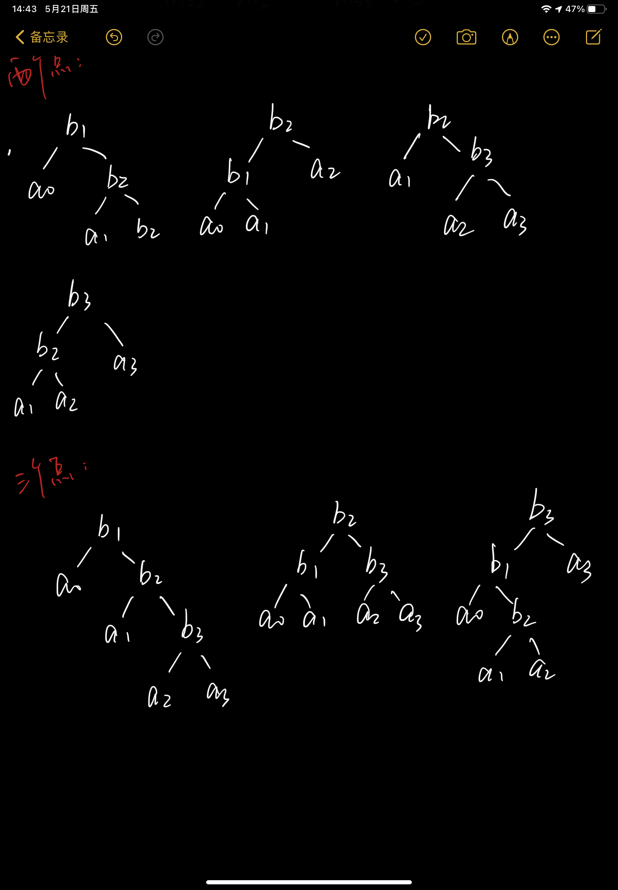


### 2.4 电路布线问题

### （1）前言

​		在一块电路板的上、下2端分别有n个接线柱。根据电路设计，要求用导线(i,π(i))将上端接线柱与下端接线柱相连，**导线(i,π(i))**称为该电路板上的**第i条连线**。其中π(i)是{1,2,…,n}的一个排列。

​	图所示： i = ｛1，2，3，4，5，6，7，8，9 ，10｝ 

​					π(i) = ｛8，7，4，2，5，1，9，3，10，6 ｝

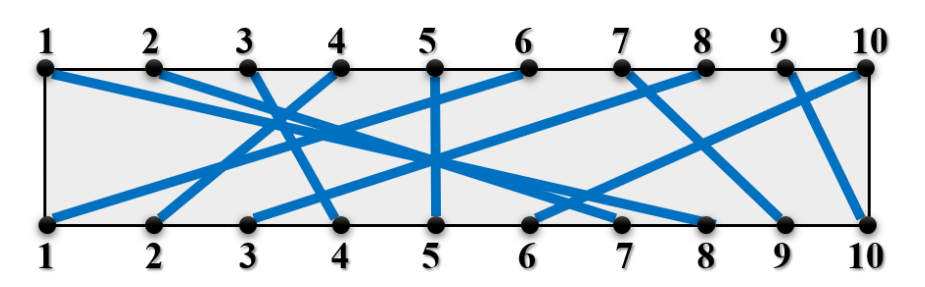

​		制作电路板时，要求将这n条连线分布到若干绝缘层上，注意当且仅当两条连线之间无交叉，连线才可以设在同一层。**对 于任何1≤i<j≤n, 第i条连线和第j条连线不相交的充分且必要的条件是π(i)<π(j)。**

​		电路板的第一层被称为优先层，在优先层中可以使用更细的 连线，因此其电阻也比其它层要小得多。 

​		 电路布线问题就是要确定怎样在第一层中尽可能多地布设导线，即确定导线集Nets={(i,π(i)),1≤i≤n} 的最大不相交子集。 

### （2）相关变量

​		**i** 上端接线柱，**π(i)**是对应的下端接线柱，**(i,π(i))**是导线

​		N(i,j)={t|(t,π(t))∈Nets, t≤i, π(t)≤j}

​		**N(i, j)**的最大不相交子集为**MNS(i, j)**，

​		**Size(i, j)**=|MNS(i, j)|。

### （3）依步骤求解

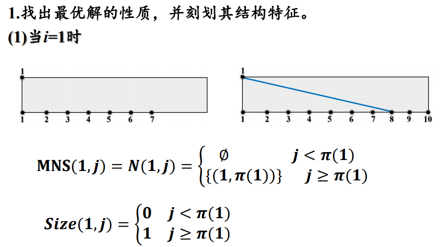

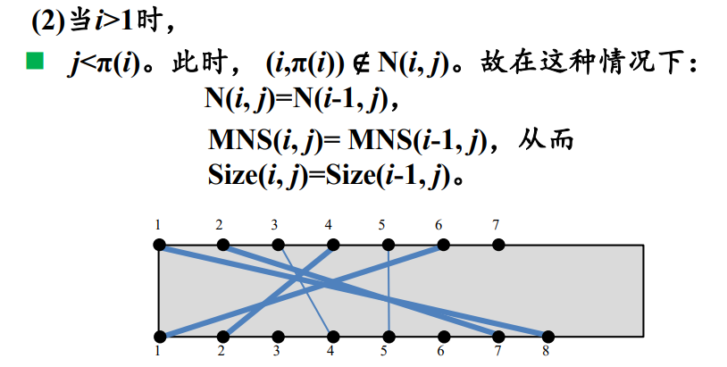

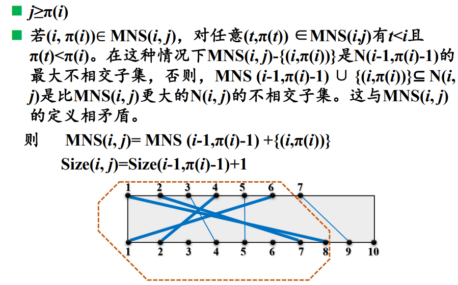

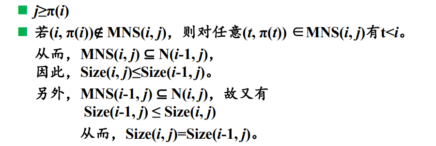

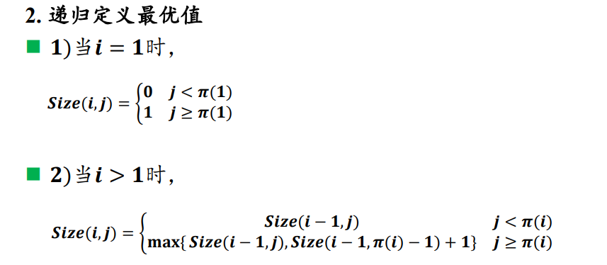


### （4）代码

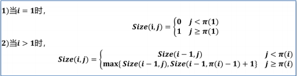

```java
```


### （5）过程

