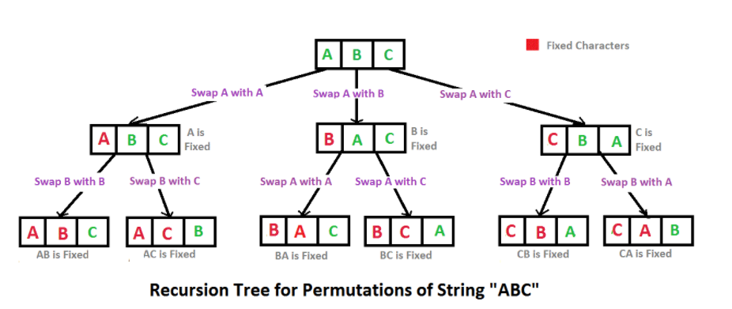
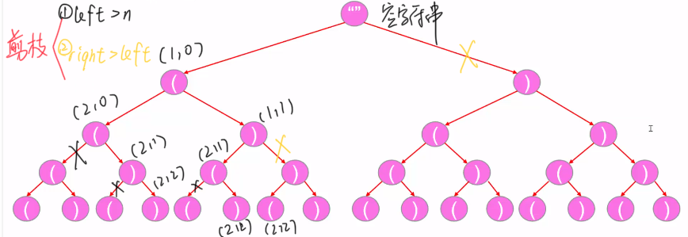
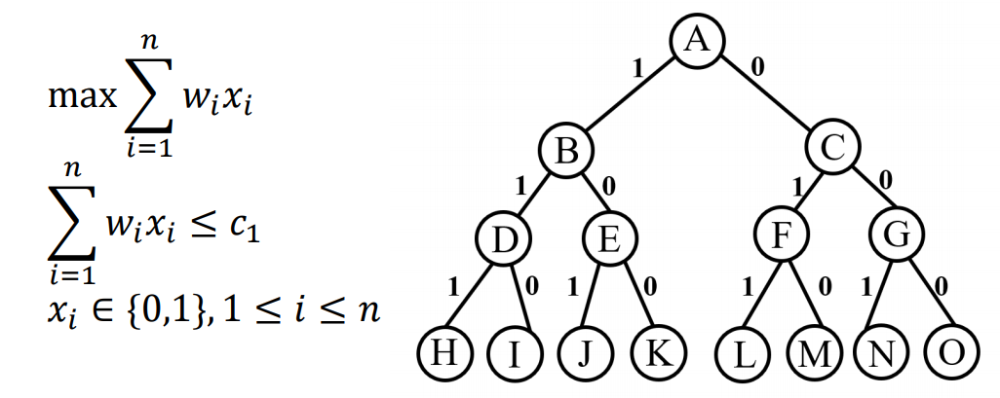
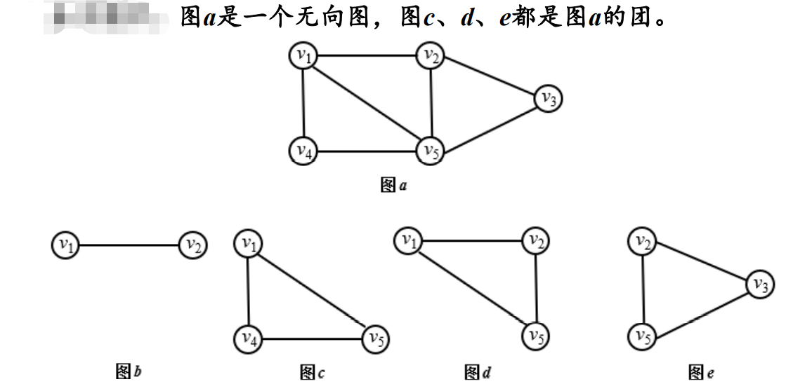
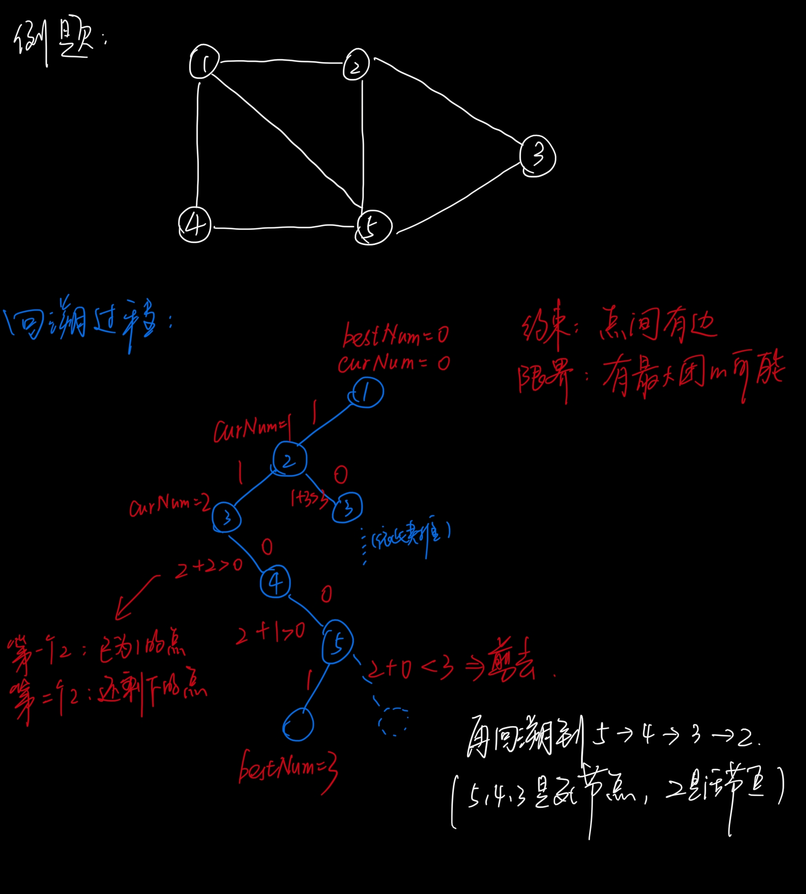
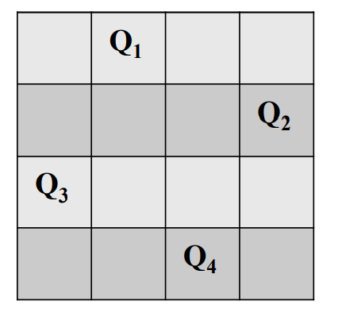
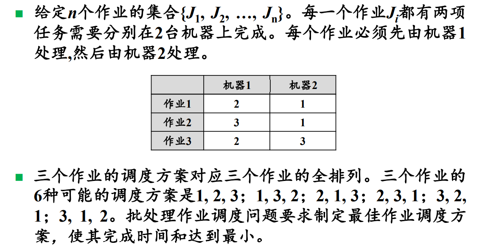
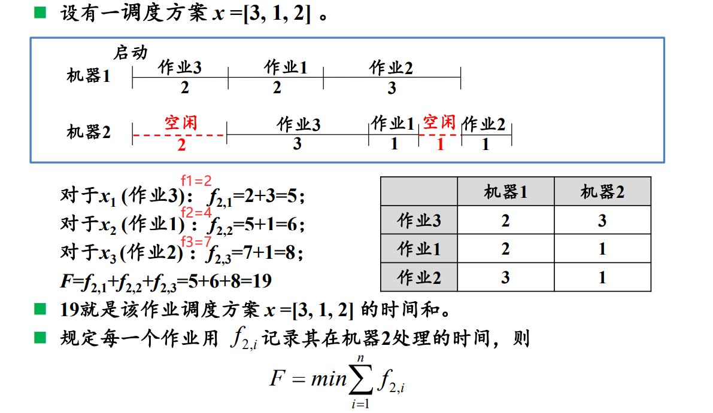
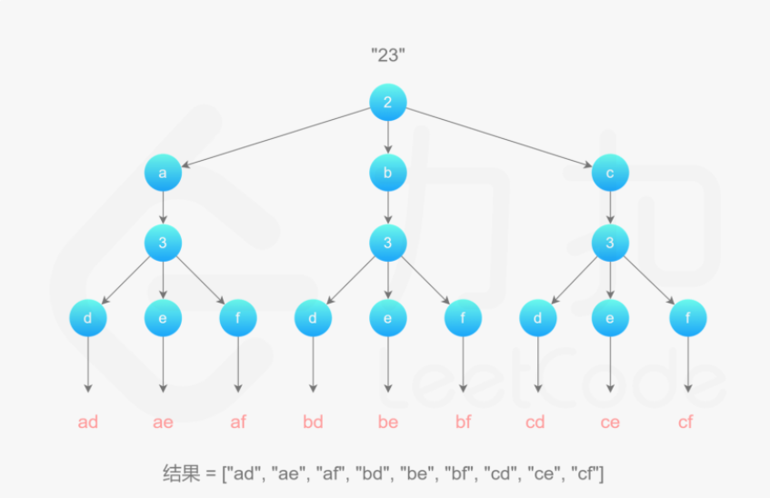

# 回溯


## A. 0-1背包与旅行商问题

> 回溯


### (一) 0-1背包问题

> 子集树，叶结点为2^n

#### 题目

> ​    	给定n种物品和一背包，物品i的重量是wi ，其价值为vi ，背包的容量为C。例如, 有3个物品，w={16, 15, 15}, v={45, 25, 25} , C=30。问应如何选择装入背包的物品，使得装入背包中物品的总价值最大?


#### 板子

```java
void dfs(int index){
    
    // 递归出口
    if(index > n){
        output(x);
        return;
    }
    
    // 解决子问题（设共有2种状态）
    for(int i=1;i>=0;i--){
        if(i==1){
            if(约束函数){
                // 更新变量
                dfs(index+1);
                // 回溯变量
            }
        }
        if(i==0){
            if(限界函数){
                dfs(index+1);
            }
        }
    }
}
```

注意：

- 关于约束函数和限界函数：不要用return（不然当i==1时被return的话，i\==0都没被执行）

#### 思路

1. 物品i在考虑是否装入背包时都只有两种选择——装入和不装入，即xi∈{0,1}
2. 最后问题就可用数学表示为 “找出x的n元的0-1向量”，使得


#### 解题步骤

1. 确定0-1背包问题的**解空间**
2. 用**解空间树结构**（完全二叉树）（子集树）表示该**解空间**
3. 以**深度优先方式**搜索解空间树，并搭配**剪枝函数**（**约束函数**或**限界函数**）避免无效的搜索
4. 左子树是1，右子树是0。所以在实现的时候，循环里的i是i--！


#### 代码

```java
package week6;

import java.util.*;

/**
 * @author yxl15
 * @date 2021/4/4 16:46
 * @description
 *
 *      0-1背包问题
 *
 */
public class BagQuestion {

    // 维护两个变量
    private int curWeight;
    private int curValue;

    private int[] bestWeight;
    private int bestValue;

    public void bagTest(int[] w, int[] v, int capacity) {

        int[] x = new int[w.length];
        bestWeight = new int[w.length];

        // 调用递归
        dsf(x, w, v, capacity, 0);

    }

    private void dsf(int[] x, int[] w, int[] v, int capacity, int index) {


        // 一、递归出口（到了叶子节点） ———— 判断是否要更新最优解
        if (index >= w.length) {
            // 1.更新最优价值
            bestValue = curValue;
            // 2. 更新最优重量
            System.arraycopy(x, 0, bestWeight, 0, x.length);

            return;
        }

        // 二、解决子问题
        for (int i = 1; i >=0; i--) {
            if (i == 1) {
                // 一、约束函数（剪枝函数）
                if (curWeight <= capacity) {
                    // i==1 时
                    x[index] = 1;
                    curWeight += w[index];
                    curValue += v[index];
                    // 递归调用
                    dsf(x, w, v, capacity, index + 1);
                    // 值的回溯 （因为curWeight和curValue是全局变量，所以它们是唯一的，就像是StringBuilder）
                    // 刚好是 依递归调用函数对称
                    x[index] = 0;
                    curWeight -= w[index];
                    curValue -= v[index];
                }
            }
            if (i == 0) {
                // 限界函数（如果不考虑重量，把剩下的全部装入背包后的value还小于bestValue，则“剪”）
                if (upBound(v, index) > bestValue) {
                    // 直接递归调用（往下走）
                    dsf(x, w, v, capacity, index + 1);
                }
            }
        }
    }

    /**
     * @Author yxl
     * @Date 15:46 2021/4/13
     * @param v :
     * @param index :
     * @return : int
     * @Description
                    求上界（限界函数）
    **/
    public int upBound(int[] v, int index) {
        int leftValue = 0;
        for (int i = index; i < v.length; i++) {
            leftValue += v[i];
        }
        return leftValue;

    }
    public int[] getBestWeight() {
        return bestWeight;
    }


    public static void main(String[] args) {

        BagQuestion t = new BagQuestion();
        int[] w = new int[]{16, 15, 15};
        int[] v = new int[]{45, 25, 25};
        int capacity = 30;

        t.bagTest(w, v, capacity);
        System.out.println(Arrays.toString(t.getBestWeight()));
    }
}

```


#### 注意

- 回溯算法有两种——（1）单纯的列出所有组合（2）列出所有组合后，选出最优
- 方法的循环体中的 **i** 不要和遍历物品的 **index** 混淆
- 遍历子集树需要 Ω(2^n)
- 约束函数 + 限界函数


### (二) 旅行商问题

> 排列树，叶结点为n!

#### 题目

> 某售货员要到若干城市去推销商品，已知各城市之间的路程，他要选定一条从某地出发，经过每个城市一遍，最后回到始发地，使总的路程最短。（即求 最短哈密顿回路 ）


#### 思路


##### 剪枝函数

- 限界函数：若从根节点到当前扩展节点处的部分线路的费用已经超过当前找到的最好的路线费用，则可以“剪去”。
- 约束函数：无


#### 代码

```java

import java.util.Arrays;
import java.util.Scanner;

/**
 * @author yxl15
 * @date 2021/4/9 14:36
 * @description
 *
 *      旅行商问题
 *
 */
public class TravelQuestion {

    // 维护一个 当前路径的城市到访顺序
    public static int[] curValueStatus;
    // 最短的路径的城市到访顺序
    public static int[] bestValueStatus;

    // 当前路径和最短路径
    public static int curValue = 0;
    public static int bestValue = Integer.MAX_VALUE;


    /**
     * @Author yxl
     * @Date 12:20 2021/4/10
     * @param adjacencyMatrix : 城市间的邻接矩阵
     * @param originSpot : 始发地（城市编号，从1开始）
     * @return : void
     * @Description

    **/
    public void travelTest(int[][] adjacencyMatrix, int originSpot) {

        // 一、初始化当前路径和最优路径
        curValueStatus = new int[adjacencyMatrix.length];
        for (int i = 0; i < adjacencyMatrix.length; i++) {
            curValueStatus[i] = -1;
        }
        // 起始点作为第一个点被访问
        int originSpotIndex = originSpot - 1;
        curValueStatus[originSpotIndex] = 0;
        bestValueStatus = new int[adjacencyMatrix.length];

        // 调用回溯函数（默认将起始点的上一个点设为起始点）
        dfs(adjacencyMatrix, originSpotIndex, originSpotIndex, 0);

    }

    /**
     * @Author yxl
     * @Date 12:20 2021/4/10 
     * @param adjacencyMatrix : 城市间的邻接矩阵
     * @param originSpotIndex : 始发地的索引（从0开始）
     * @param lastSpotIndex : 上一个城市的索引
     * @param index : 线路上的城市
     * @return : void
     * @Description
            
    **/
    private void dfs(int[][] adjacencyMatrix, int originSpotIndex, int lastSpotIndex, int index) {

        // 限界函数
        // 从根节点到当前扩展节点处的部分线路的费用已经超过当前找到的最好的路线费用，则可以“剪去”。
        if (curValue > bestValue) {
            return;
        }

        // 递归出口
        if (index >= adjacencyMatrix.length - 1) {
            // 在终点与起始点有连线的情况下，判断并更新 加上该连线后的curValue和bestValue
            if (adjacencyMatrix[lastSpotIndex][originSpotIndex] != -1 && curValue + adjacencyMatrix[lastSpotIndex][originSpotIndex] < bestValue) {
                // 更新两个best
                bestValue = curValue + adjacencyMatrix[lastSpotIndex][originSpotIndex];
                System.arraycopy(curValueStatus, 0, bestValueStatus, 0, curValueStatus.length);
            }
            return;
        }

        // 解决子问题
        // 遍历所有点，找还没走过的
        for (int i = 0; i < adjacencyMatrix.length; i++) {
            // 因为起始点已经走过
            if (i == originSpotIndex) {
                continue;
            }
            // 城市之间有通路，且并未访问过
            if (adjacencyMatrix[i][lastSpotIndex] != -1 && curValueStatus[i] == -1) {

                // 线路的index先+1（区别于选择城市的i）
                index++;
                // 标记为第几个被访问（index从0开始）
                curValueStatus[i] = index;
                // 更新当前路径值
                curValue += adjacencyMatrix[i][lastSpotIndex];

                // 递归
                dfs(adjacencyMatrix, originSpotIndex, i, index);

                // 回溯改变过的值
                curValueStatus[i] = -1;
                index--;
                curValue -= adjacencyMatrix[i][lastSpotIndex];
            }
        }
    }


    public static void main(String[] args) {

        // 邻接矩阵：将城市路线图抽象成二维矩阵
        int[][] adjacencyMatrix = new int[][]{
                {-1, 30, 6, 4},
                {30, -1, 5, 10},
                {6, 5, -1, 20},
                {4, 10, 20, -1}
        };

        System.out.println("请输入始发地：（填入数字1---4）");

        // 输入始发地
        Scanner scanner = new Scanner(System.in);
        int originSpot = scanner.nextInt();

        // 调用函数
        TravelQuestion travel = new TravelQuestion();
        travel.travelTest(adjacencyMatrix, originSpot);

        System.out.println("最短路线为：" + Arrays.toString(bestValueStatus));
        System.out.println("最短路径为：" + bestValue);
    }

}

```


注意：

- 最短路径的变量初始化要设成最大值（Integer.MAX_VALUE）

#### 注意

- 排列树通常有n!个叶结点，因此遍历排列树需要Ω(n!)时间


---


### （三）总结

- 两题都是通过排列组合（**回溯**）寻找最优解（**更新维护的全局变量**）

- 两题都有一个**面向客户端调用的方法**，参数恰好为全部的**已知条件**
- dfs()方法体的结构均为：
  - 剪枝函数（约束函数 / 限界函数）
  - 递归出口
  - 解决子问题
    - for循环 + if + 对称的回溯 + 递归函数


---


## B. 全排列问题

> 回溯


#### 分析




#### 代码

```java
package week2;

import java.util.Arrays;

/**
 * @Auther: yxl15
 * @Date: 2021/3/11 14:32
 * @Description:
 */
public class Test {


    /**
     * @Author yxl
     * @Date 14:15 2021/4/21
     * @param a : 数组
     * @param n : 标记数组位置
     * @return : void
     * @Description

    **/
    public static void fullPermutation(int[] a, int n) {

        int length = a.length;
        // 递归出口 ———— 当n指向最后一个数时，输出数组，并结束
        if (n == length - 1) {
            System.out.println(Arrays.toString(a));
            return;
        }

        // 将m个元素分别放到第零个位置（包括本身），再对剩下m-1个元素进行全排序
        for (int i = n; i < length; i++) {
            swap(a, n, i);
            fullPermutation(a, n + 1);
            swap(a, n, i);
        }

    }

    public static void swap(int[] a, int i, int j) {
        int temp = a[i];
        a[i] = a[j];
        a[j] = temp;
    }
    public static void main(String[] args) {
        int[] a = {1, 2, 3};
        fullPermutation(a, 0);
        System.out.println(Arrays.toString(a));
    }
}

```


## C. 括号生成

> 回溯 + 树形结构遍历 + 剪枝


#### 问题

数字 `n` 代表生成括号的对数，请你设计一个函数，用于能够生成所有可能的并且 **有效的** 括号组合。


#### 示例

```
输入：n = 3
输出：["((()))","(()())","(())()","()(())","()()()"]

输入：n = 1
输出：["()"]
```


#### 思路

> 将 回溯算法 抽象成树形结构的遍历问题，便于理解和思考


（1）剪枝算法：




#### 代码

（1）剪枝：

```java
    public List<String> generateParenthesis(int n) {

        // 定义结果对象
        List<String> list = new ArrayList<>();

        getParenthesis(list, n, 0, 0, new StringBuilder());

        return list;
    }

    private void getParenthesis(List<String> list, int n, int left, int right, StringBuilder sb) {

        // 剪枝在前
        if (left > n || right > left) {
            return;
        }
        // 递归出口在后     （当括号数达到2n即可返回，n为对数）
        if (sb.toString().length() == 2 * n) {
            list.add(sb.toString());
            return;
        }

        // 解决子问题
        getParenthesis(list, n, left + 1, right, sb.append("("));
        sb.deleteCharAt(sb.toString().length() - 1);

        getParenthesis(list, n, left, right + 1, sb.append(")"));
        sb.deleteCharAt(sb.toString().length() - 1);

    }
```


#### 注意

##### 1. 理解递归调用

该题在“解决子问题”部分是直接调用递归函数的，可以感觉比较“直接”。


##### 2. 理解剪枝

剪枝的由来是：

​		不考虑左右括号是否配对，当n=2时，即有4个括号，16种情况。

​		然后再进行“剪枝” —— 增设条件，从而直接return掉。


##### 3. 区分回溯中的String和StringBuilder

- String对象是不可改变的，所以在修改String时，其实是有在内存中创建了一个新的字符串对象。
- StringBuilder对象是动态对象，所以在修改String时，实际上是对StringBuilder那唯一的一个对象进行修改。

所以，在回溯时，StringBuilder不会因为“该轮递归调用执行完毕要返回上一层”而变成上一层的StringBuilder，所以我们会经常看到 在递归方法后再加一句sb.deleteCharAt()，目的是删除 “因刚才的那一层调用对StringBuilder对象的改变”。

> 白话理解为什么用StringBuilder的时候，在递归调用函数后紧跟deleteCharAt()方法：
>
> ​		在sb后面加了一个字符，让它进入下一层递归后，被“递归出口”给拦住了，最终跳出了刚进的这层递归。那你不得最后删了这个字符嘛。


## D. 装载问题

> 0-1背包问题（回溯解法）的思想

#### 问题

> ​		有一批共n个集装箱要装上两艘载重分别为C1和C2的轮船，其中集装箱i的重量为wi，且Σwi<=C1+C2，，要求确定一个合理的装载方案，可将这n个集装箱装上这两艘轮船。


#### 思路

> ​	①因为Σwi<=C1+C2，所以该装载问题肯定有解。
>
> ​	②可通过如下装载策略得到最优的装载方案：
>
> ​			（1）首先将第一艘轮船尽可能装满（核心）
>
> ​			（2）再将剩余的集装箱装上第二艘轮船
>
> 
>
> ​		而将第一艘轮船尽可能装满  等价于  选取全体集装箱的一个子集，使该子集中的集装箱重量之和最接近C1。可抽象成以下特殊的 0-1背包问题 。




#### 例子


#### 代码

```java

import java.util.Arrays;

/**
 * @author yxl15
 * @date 2021/4/10 17:00
 * @description
 *
 *      装载问题
 *
 */
public class FreightQuestion {
    
    // 维护变量
    private int curWeight;
    private int[] bestWeight;
    private int bestWeightValue;


    /**
     * @Author yxl
     * @Date 20:24 2021/4/11
     * @param n : 集装箱个数
     * @param c1 : 船1容量
     * @param c2 : 船2容量
     * @param w : 集装箱重量数组
     * @return : void
     * @Description
                客户端调用的的方法
    **/
    public void freightTest(int n, int c1, int c2, int[] w) {

        int[] x = new int[n];
        Arrays.fill(x, -1);

        // 初始化全局变量
        bestWeight = new int[n];

        // 调用递归
        dfs(x, n, c1, w, 0);

        // 判断c2
        int totalValue = 0;
        for (int i = 0; i < n; i++) {
            totalValue += w[i];
        }
        if (totalValue - bestWeightValue <= c2) {
            System.out.println("船2装载成功!");
        }

    }

    /**
     * @Author yxl
     * @Date 19:10 2021/4/11
     * @param x : 决策数组
     * @param n : 集装箱个数
     * @param c1 : 船1容量
     * @param w : 集装箱质量数组
     * @param index : 用于遍历集装箱
     * @return : void
     * @Description

    **/
    private void dfs(int[] x, int n, int c1, int[] w, int index) {

        // 限界函数
        if (curWeight > c1) {
            return;
        }

        // 递归出口（到了叶子节点）
        if (index >= n) {
            if (curWeight > bestWeightValue) {
                bestWeightValue = curWeight;
                System.arraycopy(x, 0, bestWeight, 0, n);
            }
            return;
        }

        // 解决子问题
        for (int i = 0; i < 2; i++) {
            x[index] = i;
            if (i == 0) {
                dfs(x, n, c1, w, index + 1);
            } else {
                curWeight += w[index];
                dfs(x, n, c1, w, index + 1);
                curWeight -= w[index];
            }
        }
    }

    public static void main(String[] args) {

        int n = 3;
        int c1 = 50;
        int c2 = 50;
        int[] w = {10, 40, 40};

        FreightQuestion freightQuestion = new FreightQuestion();
        freightQuestion.freightTest(n, c1, c2, w);

        System.out.println(Arrays.toString(freightQuestion.bestWeight));
    }

}

```


## E. 最大团问题

> 回溯

#### 题目

 给定一个无向图G=(V，E)。V={1, 2, 3, 4, 5}, E={(1, 2), (2, 3), (1, 4), (1, 5),  (2, 5), (3, 5), (4, 5)}。求该图的**最大团**。


#### 概念

#### 1. 完全图

> 任意一对顶点，都有边相连

#### 2. 完全子图

> 如果U⊆V,且对任意u, v∈U有(u, v)∈E,则称U是G的完全子图

#### 3. 团（最大的完全子图）

> 图G的完全子图U是G的团，当且仅当U不包含在G的更大的完全子图

#### 4. 最大团

> 含定点数最多的团


配例子：




#### 步骤

##### （1）问题空间（输入）

> G = (V,E)       以邻接矩阵的形式

##### （2）解空间（输出）

> 图G的顶点集子集选取问题，所以结果还是一个取值为0，1的 x 向量。即**子集树**问题。

##### （3）考虑剪枝函数

##### 一、约束函数

>  -->满足“团”的定义
>
>  -->进入右子树前判断（xi = 1）
>
>  -->顶点 i 到已选入的顶点集中每个点是否都有边相连

##### 二、限界函数

- 求min
  - 若当前 < best，才继续运行递归           （旅行商问题）
- 求max
  - 通过**计算上界**，若可能再出现，才继续运行递归          （0-1背包，最大团）

>  -->是否还有足够多的可选择的顶点使得算法有可能在左子树找到更大的团
>
>  -->计算上界：
>
>  ​				若 当前定点数 + [总顶点数-(index+1)] >= best，则继续运行递归。


#### 代码

```java
package week6;

import java.util.ArrayList;
import java.util.Arrays;
import java.util.List;

/**
 * @author yxl15
 * @date 2021/4/13 15:33
 * @description
 *
 *      最大团问题
 *
 */
public class MaxCliqueQuestion {

    private int curNum;
    private int bestNum;
    private int[] bestX;
/*    private List<int[]> list;*/

    private void maxClique(int[][] graph) {

        int[] x = new int[graph.length];

        // 初始化全局变量
        curNum = 0;
        bestX = new int[graph.length];
/*        list = new ArrayList<>();*/

        // 调用递归
        dfs(x, graph, 0);

    }

    private void dfs(int[] x, int[][] graph, int index) {

        // 递归出口  到达叶子节点
        if (index >= x.length) {
            System.arraycopy(x, 0, bestX, 0, x.length);
            bestNum = curNum;

            System.out.println(Arrays.toString(bestX));

/*            list.add(bestX);*/
            return;
        }

        // 解决子问题
        for (int i = 1; i >= 0; i--) {
            // （1）左子树
            if (i == 1) {
                // 约束函数 ———— 判断该节点是否与任意已在团内的点有连线
                boolean isConn = true;
                for (int j = 0; j < index; j++) {
                    // if的break条件：（1）是目前团内的点（2）但点之间没有连线
                    if (x[j] == 1 && graph[index][j] == 0) {
                        isConn = false;
                        break;
                    }
                }
                if (isConn) {
                    // 进入左子树，进行回溯算法
                    x[index] = 1;
                    curNum++;
                    dfs(x, graph, index + 1);
                    x[index] = 0;
                    curNum--;
                }
            }

            // （2）右子树
            if (i == 0) {
                // 限界函数 ———— 计算上界并判断
                // （因为可能存在多个相同顶点数组成的团，所以取>=，而不是>。如果答案唯一的话，可以>）
                if (curNum + x.length - (index + 1) >= bestNum) {
                    // 进入右子树，进行回溯算法
                    // x[index] = 0;     此句可以省略，因为经过i==1后，已经回溯到x[index] == 0 了
                    dfs(x, graph, index + 1);
                }
            }
        }
    }

    public int[] getBestX() {
        return bestX;
    }

/*    public List<int[]> getList() {
        return list;
    }*/

    public static void main(String[] args) {

        int[][] graph = new int[][]{
                {0, 1, 0, 1, 1},
                {1, 0, 1, 0, 1},
                {0, 1, 0, 0, 1},
                {1, 0, 0, 0, 1},
                {1, 1, 1, 1, 0}
        };

        MaxCliqueQuestion question = new MaxCliqueQuestion();
        question.maxClique(graph);

/*        for (int[] ints : question.getList()) {
            System.out.println(Arrays.toString(ints));
        }*/
    }
}

```


#### 分析部分回溯过程




#### 注意

- 不是++index也不是index++，是**index+1** ！！！

> 因为index在结束递归出来时，也会回溯。如果是自增的话，就改变了index的值了。

- 写递归出口时，可直接对bestNum和bestX赋值

> 因为限界函数已经使得该x为best了

- 关于约束函数和限界函数：不要用return（不然当i==1时被return的话，i\==0都没被执行）


#### 存疑

1. 若将结果们保存进list中，最后一起输出list，发现list中的结果被改变了。


## F. n皇后问题

#### 问题

> 在n✖n的棋盘上放置彼此不受攻击的n个皇后。
>
> （任何2个皇后不放在同一行或同一列或同一斜线(正/反对角线)上

#### 示例




#### 步骤

##### 1. 思考问题空间

##### 2. 定义问题的解空间

> 思考：
>
> ​		（1）输出答案的形式是什么?
>
> ​						因为第i个皇后，必定在第i行，所以最后只输出各皇后的列坐标即可。
>
> ​						又因为可能的的结果不唯一，所以答案是一个二维数组。例如：
>
> ​								{{2,4,1,3},{3,1,2,4}}
>
> ​		（2）确定是回溯思想后，解空间是子集树还是排列树？
>
> ​		

##### 3. 考虑剪枝函数

   - 约束函数（左子树）：
     - 不同行不同列不同斜线：
       - 不同行：==i≠j==
       - 不同列：==xi≠xj==
       - 不同斜线：==|i-j|≠|xi-yj|==
   - 限界函数（右子树）：无


#### 代码

```java
package week6;

import java.util.ArrayList;
import java.util.Arrays;
import java.util.List;

/**
 * @author yxl15
 * @date 2021/4/14 19:34
 * @description
 *
 *          n皇后问题
 *
 */

public class QueenQuestion {

    // private List<int[]> list;
    private int sum;

    private void queen(int n) {

        // 初始化
        int[] x = new int[n];
        // list = new ArrayList<>();
        sum = 0;

        // 调用递归
        dfs(x, n, 0);
    }

    private void dfs(int[] x, int n, int index) {

        // 递归出口
        if (index >= n) {

            System.out.println(Arrays.toString(x));

            // list.add(x);
            sum++;
            return;
        }

        // 解决子问题
        for (int col = 0; col < n; col++) {
            if (isPlace(col, x, index)) {
                x[index] = col;
                dfs(x, n, index + 1);
            }
        }

    }

    private boolean isPlace(int col, int[] x, int index) {
        // 检查index之前的元素
        // ！ 要为false写if ！  （因为当index=0时，默认是返回true）
        for (int i = 0; i < index; i++) {
            if (col == x[i] || Math.abs(i - index) == Math.abs(col - x[i])) {
                return false;
            }
        }
        return true;
    }


    public static void main(String[] args) {

        int n = 4;
        QueenQuestion queenQuestion = new QueenQuestion();
        queenQuestion.queen(n);

        System.out.println("=================================");

/*        System.out.println("输出list：");
        for (int[] ints : queenQuestion.getList()) {
            System.out.println(Arrays.toString(ints));
        }*/

    }
}

```


#### 存疑

1. 若将结果们保存进list中，最后一起输出list，发现list中的结果被改变了。


## G. 图的m着色问题

#### 问题

> ​		给定图G=(V,E)和m种颜色。如果这个图不是m可着色，则给出否定回答；如果这个图是m可着色，则找出所有不同的着色情况。（m是颜色数，从1……m）

附：求一个图的色数是**图的m可着色优化问题**（即一个图最少需要m种颜色才能使图中每条边连接的两个点着不同的颜色）


#### 步骤

##### 1. 问题空间

> 无向图的邻接矩阵

##### 2. 解空间

> 输出取值为1—m的x向量

##### 3. 剪枝函数

- 约束函数


#### 代码

```java
package week6;

import java.util.Arrays;

/**
 * @author yxl15
 * @date 2021/4/15 15:03
 * @description
 *
 *      m着色问题
 *
 */
public class ColorQuestion {

    // 可行的着色方案数
    private int sum = 0;

    private void mColor(int[][] graph, int m, int n) {

        int[] x = new int[n];

        dfs(graph, m, n, x, 0);
    }

    private void dfs(int[][] graph, int m, int n, int[] x, int index) {

        // 递归出口
        if (index >= n) {
            System.out.println(Arrays.toString(x));
            sum++;
            return;
        }

        // 解决子问题
        // 共m种颜色
        for (int i = 1; i <= m; i++) {
            // 约束函数
            if (isColor(graph, index, x, i)) {
                x[index] = i;
                dfs(graph, m, n, x, index + 1);
                x[index] = 0;
            }
        }

    }

    private boolean isColor(int[][] graph, int index, int[] x,int color) {
        for (int i = 0; i < index; i++) {
            if (graph[index][i] == 1 && x[i] == color) {
                return false;
            }
        }
        return true;
    }

    public int getSum() {
        return sum;
    }

    public static void main(String[] args) {

        int[][] graph = new int[][]{
                {0, 1, 0, 0, 1, 1},
                {1, 0, 1, 1, 1, 0},
                {0, 1, 0, 1, 0, 0},
                {0, 1, 1, 0, 1, 0},
                {1, 1, 0, 1, 0, 1},
                {1, 0, 0, 0, 1, 0}
        };


        int m = 3;

        ColorQuestion question = new ColorQuestion();
        question.mColor(graph, m, graph.length);
        System.out.println(question.getSum());
    }
}

```


## H. 批处理作业调度

> 回溯

#### 问题




#### 分析



#### 注意

1. 明晰变量的含义：

   - f1：机器1从启动到完成某作业花费的时间
   - f2i：机器2从启动到完成第i个作业(是xi，而不是作业i)花费的时间

2. 如何确定f2i？

   **需要比较f1和f2(i-1)，取max。再加上该作业在机器2上的处理时间。**


#### 代码

```java

```


## I. 电话号码的字母组合

> DFS中的回溯

#### 什么是回溯？

> Backtracking（回溯）属于DFS
>
> - 普通DFS主要用在 **可达性问题**，即只需要执行到特定的位置然后返回，并结束。
> - 而Backtracking主要用在求解 **排列组合问题（表现为“所有*的组合”）**，即执行到特定位置返回后再继续执行求解过程。如，求解由{'a','b','c'}三个字符排列得到的字符串
>
> 回溯思想 一般用 **递归** 来实现


#### 题目

> 给定一个仅包含数字 2-9 的字符串，返回所有它能表示的字母组合。答案可以按 任意顺序 返回。
>
> 给出数字到字母的映射如下（与电话按键相同）。注意 1 不对应任何字母。


#### 示例

```
输入：digits = "23"
输出：["ad","ae","af","bd","be","bf","cd","ce","cf"]
```

```
输入：digits = ""
输出：[]
```


#### 代码

```java
public List<String> letterCombinations(String digits) {

        // 结果
        List<String> combinations = new ArrayList<>();

        // 因为 “提示” 中digits可能为空或长度为0
        if (digits.length() == 0 || digits == null) {
            return combinations;
        }

        // 映射表（匿名内部类+块）
        Map<Character, String> phoneMap = new HashMap<Character, String>(){
            {
                put('2', "abc");
                put('3', "def");
                put('4', "ghi");
                put('5', "jkl");
                put('6', "mno");
                put('7', "pqrs");
                put('8', "tuv");
                put('9', "wxyz");
            }
        };

        // 回溯算法
        BackTracking(combinations, phoneMap, 0, digits, new StringBuilder());

        return combinations;
    }

    /**
     * @return void
     * @Author yxl
     * @Date 9:21 2021/4/5
     * @Param [combinations, phoneMap, index, digits, stringBuilder]
     * @Description combinations:结果集（多个combination）
     * phoneMap:结果
     * index:用于遍历 digits 的索引
     * combination:用于连接字符串构成单种情况
     **/
    private void BackTracking(List<String> combinations, Map<Character, String> phoneMap, int index, String digits, StringBuilder combination) {
        // 递归出口
        if (index == digits.length()) {
            combinations.add(combination.toString());
            return;
        }

        // 子问题的解决
        char c = digits.charAt(index);
        String letters = phoneMap.get(c);
        int letterCount = letters.length();

        for (int i = 0; i < letterCount; i++) {
            combination.append(letters.charAt(i));
            BackTracking(combinations, phoneMap, index + 1, digits, combination);
            combination.deleteCharAt(index);
        }
    }
```


#### 图解




#### 悟

- “提示” 中digits.length==0，即暗示要处理空串的情况
- “优雅”的初始化hashMap——匿名内部类+块（两个大括号）
- 回溯算法的结构同递归，因为毕竟还是用递归去实现
  - 递归结构：  递归出口+解决子问题+调用递归