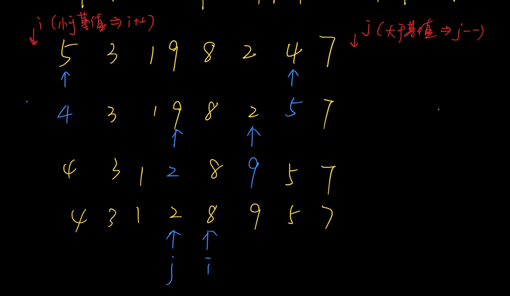
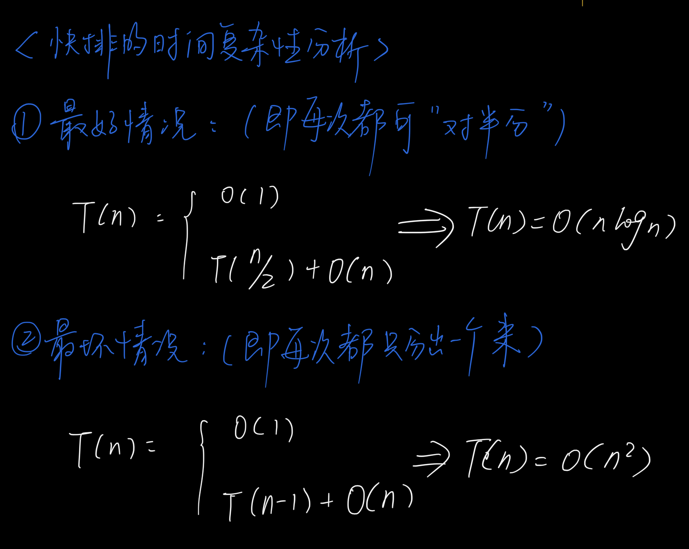
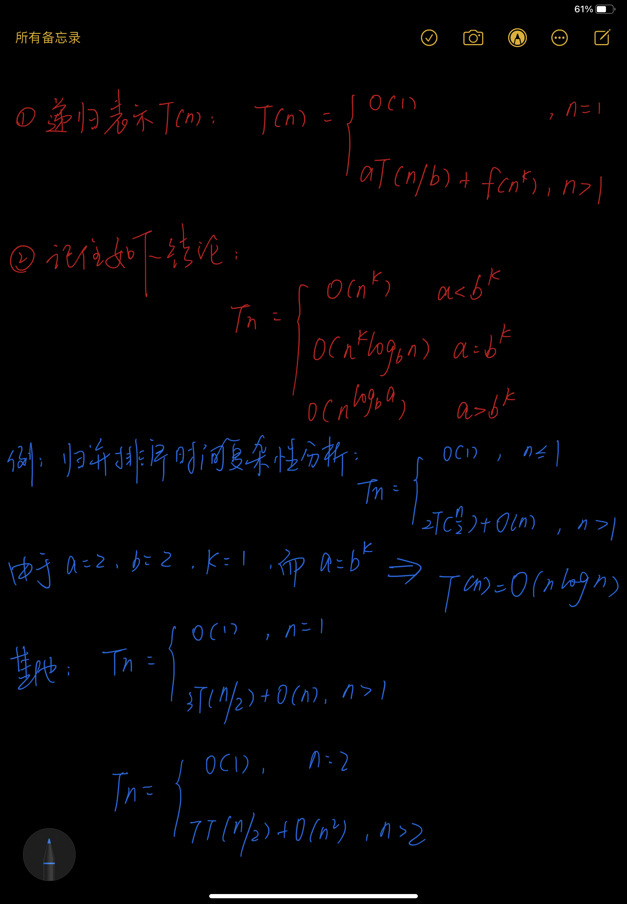
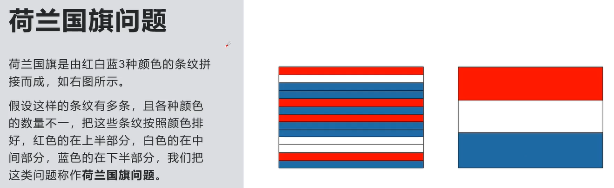

# 快速排序

## 一、模板

对 [l, r] 范围内的数列进行快排：

```java
public static void quickSort(int[] q, int l, int r) {
        // 递归结束条件 / 安全性校验
        if (l >= r) {
            return;
        }

        // 一、初始化基准值和双指针i,j
        int x = q[l];
        int i = l - 1, j = r + 1;
    
        // 二、调整区间（交换）
        while (i < j) {
            // 先遍历左边，再遍历右边，最后交换
            // 为什么选择 do while？   答：先移动后交换，照应双指针的初始化

            do i++; while (q[i] < x);
            do j--; while (q[j] > x);
            if (i<j) swap(q, i, j);

        }
        
        // 三、递归两边的区间（记住是j和j+1）
        quickSort(q, l, j );
        quickSort(q, j+1, r);
    }

    public static void swap(int[] q, int i, int j) {
        int temp = q[i];
        q[i] = q[j];
        q[j] = temp;
    }
```


## 二、教训：

```
教训：
    1. 在设计交换数组中的元素的方法时，如果参数设计为索引，就不要再调用方法时传数组的值！
    2. debug到while这一行的时候，如果报错，就证明while循环体内某次循环中有异常，所以才在debug时显示异常。以后遇到这种情况，继续往下debug就行，异常可能会消失。
    3. 深深地记住：递归两边区间的方法的参数是j和j+1，不是i—1和i（因为会出现相同递归的死循环而导致报错--栈内存溢出）

注意：
	1. 在遍历的第一轮，i指针就会停在了基准值处（i==0处），因为q[i]不满足>x。
	2. 在遍历的第一轮结束后，j指针会在i的左边。
```





## 三、时间复杂性分析



#### 由递归方程计算时间复杂度O(n)



## 四、例题

### 1.《数组中第k个大数》

### 题目描述：

给定一个长度为n的整数数列，以及一个整数k，请用快速选择算法求出数列从小到大排序后的第k个数。


### 示例：

```
输入: [2,4,1,5,3] 和 k = 3
输出: 3
```


### 思路：

```
恰好同题2思路相同，答案相反
```


### 2. 《数组中第k大的数》

#### 题目描述：

在未排序的数组中找到第 **k** 个最大的元素。请注意，你需要找的是数组排序后的第 k 个最大的元素，而不是第 k 个不同的元素。


#### 示例：

```
输入: [3,2,1,5,6,4] 和 k = 2
输出: 5
```

```
输入: [3,2,3,1,2,4,5,5,6] 和 k = 4
输出: 4
```


#### 思路：

> 本质：快排+选择
>
> 1）利用快速排序对序列进行第一次的交换，使得左边的数都小于右边的数。
>
> 2）然后进行判断：若k小于右边的数，则继续对右边的序列进行递归；若k大于右边的数，则改变关于k的参数后，再对左边的序列进行递归。


#### 代码：

```java
	public int findKthLargest(int[] nums, int k) {
        return quickSort(nums,0,nums.length-1,k);
    }


    // 定义基于快速排序的选择算法
    public int quickSort(int[] nums,int l,int r,int k){
        
        // 先写结束条件
        if(l==r) return nums[l];

        // 初始化两个指针和一个基准值
        int i = l-1;
        int j = r+1;
        int x = nums[l];

        // 进行第一轮比较和交换
        while(i<j){
            do i++; while(nums[i]<x);
            do j--; while(nums[j]>x);
            if(i<j){
                int temp = nums[i];
                nums[i] = nums[j];
                nums[j] = temp;
            }
        }

        // 对完成第一轮交换的序列，进行选择操作
        // 通过j指针停留的位置，获取前半部分的元素个数
        // 如果后半部分>=k，则对后半部分进行递归
        if(r-j>=k) return quickSort(nums,j+1,r,k);

        // 否则，改变关于k的参数再递归（易忘）
        return quickSort(nums,l,j,k-(r-j));
    }
```


#### 注意：

1）递归的结束条件是==后，直接返回该元素！

2）若右边的元素个数>k，记得先改变关于k的参数！！！


### 3.《颜色分类》——荷兰国旗问题

#### 题目描述：

给定一个包含红色、白色和蓝色，一共 n 个元素的数组，原地对它们进行排序，使得相同颜色的元素相邻，并按照红色、白色、蓝色顺序排列。

此题中，我们使用整数 0、 1 和 2 分别表示红色、白色和蓝色。


#### 示例：

```
输入：nums = [2,0,2,1,1,0]
输出：[0,0,1,1,2,2]
```

```
输入：nums = [2,0,1]
输出：[0,1,2]
```

```
输入：nums = [0]
输出：[0]
```

```
输入：nums = [1]
输出：[1]
```


#### 思路：

> 利用双指针+单循环解决这类典型的荷兰国旗问题

简单来说就是：遍历数组，把0放在左边（通过left指针并配合移动），把2放在右边（通过right指针并配合移动），最后1自然就在中间了。





#### 代码：

```java
    public void sortColors(int[] nums) {

        // 定义左指针和右指针
        int left = 0;
        int right = nums.length - 1;

        // 遍历数组
        for (int i = 0; i <= right; i++) {
            if (nums[i] == 0) {
                // 交换nums[i]和nums[left]，i向后移
                swap(nums, i, left);
            }else if (nums[i] == 2) {
                // 交换nums[i]和nums[right]，i不动（再重复一遍进行检查）
                swap(nums, i, right);
                i--;
            }
        }
    }

    public void swap(int[] nums, int i, int j) {
        int temp = nums[i];
        nums[i] = nums[j];
        nums[j] = temp;
    }
```


#### 注意：

1）当i遍历到数字2并与right交换后，i要保持不变而写成i--。因为可能交换后，nums[i]还为2。

​	  但为什么与left交换后，i可以直接移动呢？--->  因为左边已经完成遍历而排好了。

​	  那为什么不去掉left呢?                                  --->  因为利用的是这个思想——小的放左边，大的放右边。