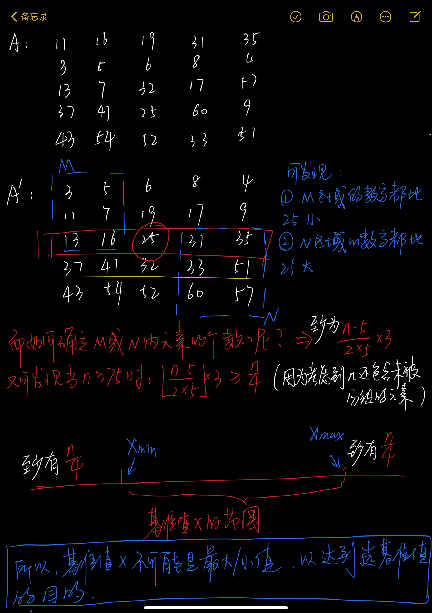

# 线性时间选择（快排的拓展）

## 题目

> 找出数组a中的第k小的元素（元素选择问题）

a[0:24] = {11,3,13,37,43,16,5,7,41,54,,19,6,32,25,52,31,8,17,60,33,35,4,57,9,51}


## 分析

总体解法是：一轮快排+选择。但在一轮快排中的基准值的选择极大影响了整体的时间复杂度（可能存在最坏情况O(n²)），所以我们要在最坏情况下进行线性时间选择（巧妙地选择一个基准值，使得最终算法复杂度为O(n)）。

而我们的大方向不变，选择数值大小居中的数作为基准值。


## 算法思路

1. 将n个元素分成n/5个组，每组5个元素（只可能有一个组不是5个元素，且我们不处理该组）
2. 再用任意一种排序算法，将每组中的元素排好序
3. 取出每组中的中位数，共n/5个
4. 递归调用 [步骤123] 的方法，取出这些中位数的中位数
5. 最终，以这个”中位数中的中位数“作为“基准值”





## 代码实现


## 复杂度分析


## 注意：

- 入手的第一步是：将其分组，使得分成n/5个组，每组大小为5，并选取75作为是否递归调用的分界点（若<75，则直接排序然后选第k个值就好了，不再进行其他的分析）
- 该题中，对长度小于75的数组进行排序，时间复杂度总不会超过一个常数C1
- 找中位数，是通过冒泡排序找的，所以时间复杂度是个常数。而找中位数的中位数，是T(n/5)
- 按照该算法所选的基准值x进行划分所得到的两个子数组，最多有3n/4个元素。所以无论对那个子数组递归调用，都至多用了T(3n/4)的时间


## 题目：

> ```
> 给定一个包含n个元素的一维线性序列 ，从这n个元素中找出第k小的元素。采用基于分治策略的线性时间选择算法解决该问题。
>           1)  写出算法实现代码并截屏程序运行结果。
>           2)  线性时间选择算法如何解决划分不平衡的问题？
>           3)  分析线性时间选择算法的计算效率。
> 
>            int[] a = {2, 9, 11, 3, 14, 7, 10, 8, 15, 4, 13, 1, 6, 5, 12};
>            int k = 8;
> ```


```java
public class TimeSelect {

    public static int select(int[] arr, int p, int r, int k) {

        // 递归出口
        if (r - p < 2) {
            bubbleSort(arr, p, r);
            return arr[p + k - 1];
        }

        // 共有 r-p+1 个元素，被分成 (r-p+1)/5 组 （不考虑未被分组的元素）
        int groupNum = (r - p + 1) / 5;
        /*
             通过遍历，对每组进行排序从而选出，并将其与arr[p+i]处的元素进行交换
         */
        for (int i = 0; i < groupNum; i++) {
            // 定义 每组的头处和尾处 的指针 s与t （即每组的第0个元素和第4个元素）
            int s = p + i * 5;
            int t = s + 4;

            bubbleSort(arr, s, t);
            // 最后把这些中位数放到数组的前面（方便递归调用select）
            swap(arr, p + i, s + 2);
        }

        // 找出这些中位数的中位数（基准值）
        int x = select(arr, p, p + groupNum, groupNum / 2 + 1);

        int j = partition(arr, p, r, x);

        if (k <= j) {
            return select(arr, p, j, k);
        }

        return select(arr, j + 1, r, k - (j - p + 1));

    }

    public static int partition(int[] a, int l, int r, int x) {

        // 递归出口
        if (l >= r) {
            return r;
        }

        // 初始化两个指针 和 基准值
        int i = l - 1;
        int j = r + 1;

        while (i < j) {
            do {
                i++;
            } while (a[i] < x);
            do {
                j--;
            } while (a[j] > x);
            if (i < j) {
                swap(a, i, j);
            }
        }
        return j;
    }

    public static void bubbleSort(int[] arr, int l, int r) {
        int temp;
        for (int i = l; i <= r; i++) {
            boolean isSwap = false;
            for (int j = l; j < r - i - 1; j++) {
                if (arr[j] > arr[j + 1]) {
                    temp = arr[j];
                    arr[j] = arr[j + 1];
                    arr[j + 1] = temp;

                    isSwap = true;
                }
            }
            if (!isSwap) {
                break;
            }
        }
    }

    public static void swap(int[] arr, int i, int j) {
        int temp = arr[i];
        arr[i] = arr[j];
        arr[j] = temp;
    }


    public static void main(String[] args) {
        int[] a = {2, 9, 11, 3, 14, 7, 10, 8, 15, 4, 13, 1, 6, 5, 12};
        int k = 3;

        long l = System.currentTimeMillis();
        int result = select(a, 0, a.length - 1, k);
        System.out.println(System.currentTimeMillis() - l);

    }
}
```

