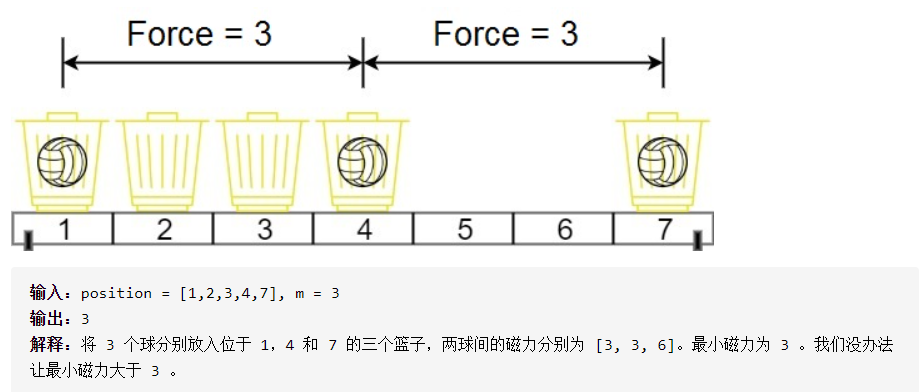

# 两球之间的磁力

> 二分+贪心

## 题目

在代号为 C-137 的地球上，Rick 发现如果他将两个球放在他新发明的篮子里，它们之间会形成特殊形式的磁力。Rick 有 n 个空的篮子，第 i 个篮子的位置在 position[i] ，Morty 想把 m 个球放到这些篮子里，使得任意两球间 最小磁力 最大。

已知两个球如果分别位于 x 和 y ，那么它们之间的磁力为 |x - y| 。

给你一个整数数组 position 和一个整数 m ，请你返回最大化的最小磁力。

## 示例：

## 思路

类似于 “上男厕怎么分配小便池才能不尴尬”

## 题目链接

https://leetcode-cn.com/problems/magnetic-force-between-two-balls/