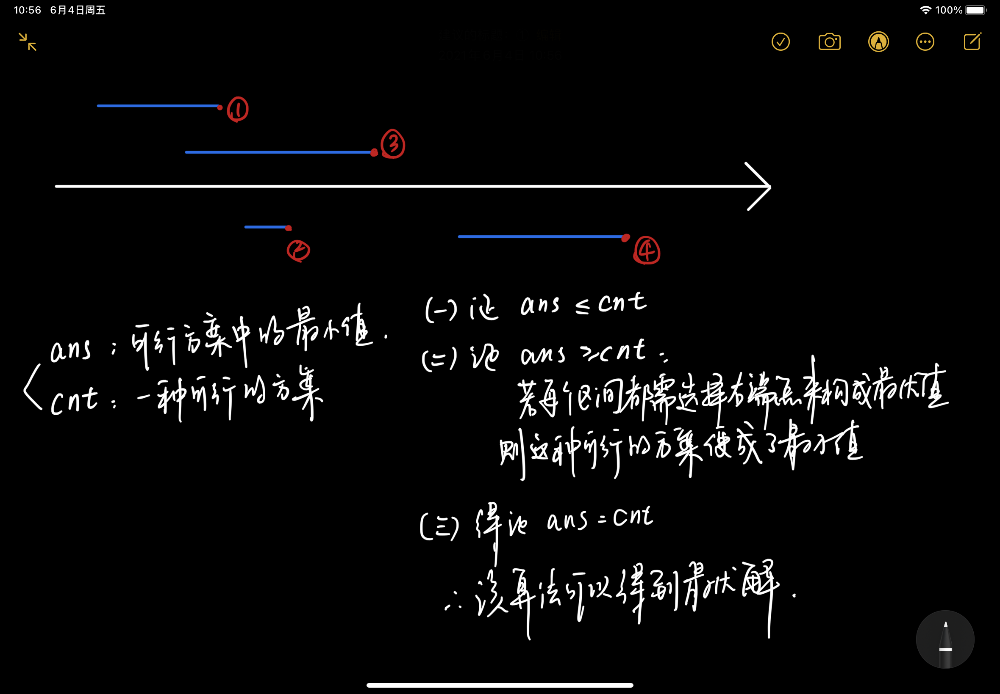
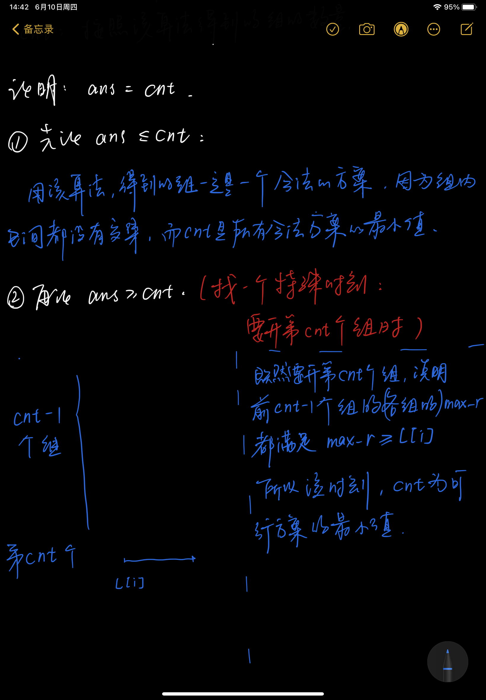

# 贪心

> 思想：
>
> ​	用局部最优求得整体最优。
>
> 步骤：
>
> ​	（1）举几个例子发现规律并建立猜想
>
> ​	（2*）证明
>
> ​	（3）实现


## 一、区间问题


### 1.1 区间选点

#### 1.1.1 题目

##### 题干

给定N个闭区间[ai, bi]，请在数轴上选择**尽量少**的点，使得每个区间内至少包含一个选出的点，输出选择的点的最小数量。

##### 数据范围

1 ≤ N ≤ 10⁵,
−10⁹ ≤ ai ≤ bi ≤ 10⁹

##### 样例

```
3
-1 1
2 4
3 5
```

##### 输出

```2
2
```


#### 1.1.2 步骤

- 将每个区间按**右端点**从小到大排序。
- 从前往后遍历每个区间
  - 若当前区间包含点，则跳过。
  - 若当前区间不包含点，则在右端点出设点。

#### 1.1.3 证明




#### 1.1.4 代码

```c++
#include <iostream>
#include <algorithm>

using namespace std;

const int N = 100010;

// 输入的区间个数--全局变量
int n;
struct Range
{
    int l,r;
    // 利用operator重载运算符<
    bool operator< (const Range &w)const
    {
        return this->r < w.r;
    }
}range[N];

int main()
{
    // （1）输入
    scanf("%d",&n);
    for(int i = 0; i < n ; i++) scanf("%d%d",&range[i].l, &range[i].r);
    
    // （2）按右端点排序
    sort(range, range+n);
    
    // （3）贪心算法
    // 定义 结果变量和右端点
    int res = 0, ed = -2e9;
    // 遍历
    for(int i = 0; i < n; i++)
    {
        // 先判断区间位置
        if(ed < range[i].l)
        {
            res++;
            ed = range[i].r;
        }
    }
    
    printf("%d\n", res);
    
    return 0;
    
}
```


### 1.2 最大不相交区间数量

> 代码和《区间选点》完全一样

#### 1.2.1 题目

给定 N 个闭区间 \[ai,bi]，请你在数轴上选择若干区间，使得选中的区间之间互不相交（包括端点）。

输出可选取区间的最大数量。


### 1.3 区间分组

#### 1.3.1 问题

给定 N 个闭区间 \[ai,bi][ai,bi]，请你将这些区间分成若干组，使得每组内部的区间两两之间（包括端点）没有交集，并使得组数尽可能小。

**样例**

> 3
> -1 1
> 2 4
> 3 5

（可以画个坐标轴，更清楚）

#### 1.3.2 解题步骤

（1）将所有区间按**左端点从小到大**排序。

（2）遍历所有区间 ---> 判断能否将其放到某个现有的组中（L[i] > max_r）

​			若不存在这样的组，就开一个新的组，再把它放进去

​			若存在这样的组，将它放进去，并更新当前组的max_r

#### 1.3.3 证明



#### 1.3.4 代码

```c++
#include <iostream>
#include <algorithm>
#include <queue>

using namespace std;

int n;
struct Range
{
    int l, r;
    bool operator< (const Range &w)const
    {
        // 按左端点进行排序
        return l < w.l;
    }
}range[N];

int main()
{
    scanf("%d", &n);
    for(int i = 0; i < n; i++)
    {
        int l, r;
        scanf("%d%d", &l, &r);
    }
    
    // 按左端点进行排序
    sort(range, range+n);
    
    // 构建小根堆
    priority_queue<int, vector<int>, greater<int>> heap;
    // 遍历每个区间
    for(int i = 0; i < n; i++)
    {
        if(heap.empty() || range[i].l <= heap.top())
        {
            heap.push(range[i].r);
        }
        else
        {
            heap.pop();
            heap.push(range[i].r);
        }
    }
    
    printf("%d\n", heap.size());
    
    return 0;
}
```


## 二、哈夫曼编码

### （1）前言

> ​	哈夫曼提出构造最有前缀码的贪心算法，由此产生的编码方案成为哈夫曼编码。

### （2）贪心策略

​	算法把每一个字符看作是一颗具有频率的树，首先找到**两颗具有最小频率的树**，将其合并成一颗新的树（新树的频率为这两棵树频率的和）。之后，以同样的贪心策略合并，执行**n-1**次合并运算后，产生最终要求的哈夫曼树。

### （3）堆

> 那么，如何选出具有最小频率的树呢？
>
> 可以利用 普通线性结构、顺序线性结构和堆（优先队列） 。

#### 3.1 什么是优先队列？

​	普通队列就是一种“先进先出”的数据结构，即普通队列的出队顺序和入队顺序是一样的。但优先队列，它的出队顺序和入队顺序无关。它的出队顺序是和优先级相关的。（比如医院里要做手术的病人）

#### 3.2 怎么实现优先队列？

​	优先队列可以用线性结构和堆（树）来实现，但堆（树）复杂度更低。若用线性结构实现，会发现结果要么是**入队操作的复杂度为O(1)出队操作的复杂度为O(n)**（因为**出队前要遍历队列，找优先级最高的先出**），要么就是**入队操作的复杂度为O(n)出队操作的复杂度为O(1)**（因为**添加新元素前要进行优先级的对比，再确定新元素的位置**）

​	而怎么实现入队和出队的效率都很高呢。我们就用堆（树），它的入队和出队的复杂度都是O(logn)

