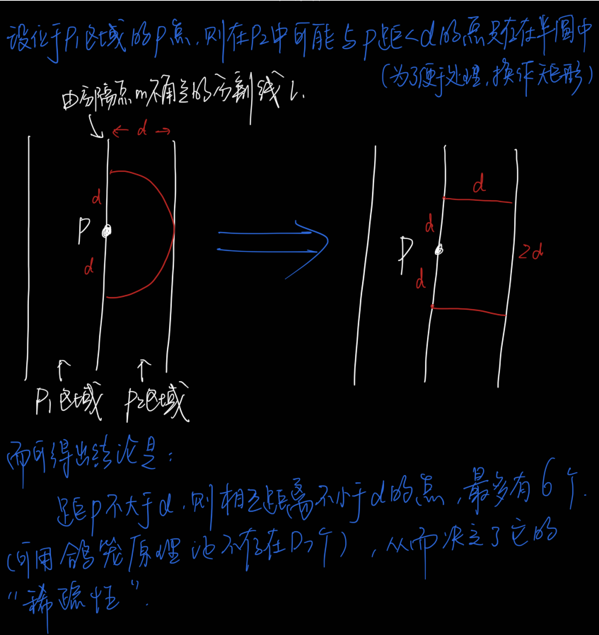

# 最近点对问题

## 一、实际问题

> 空中交通控制问题——若将飞机作为空间中移动的一个点来处理，则具有最大碰撞危险的两架飞机就是这个空间中最近的点对。

## 二、抽象问题

> 给定平面上n个点，找其中的一对点，使得在n个点组成的所有点对中，该点对间的距离最小。（假设有且仅有一对）

## 三、入手思路

好像只要将每一点与其他n-1个点的距离算出并找最小距离即可，但这需要O(n²)。而可通过证明该题的计算时间下界为Ω(nlogn)。而这个下界引导我们去找问题的O(nlogn)时间的算法。很自然我们想到**分治法**。

而用分治法，问题的答案可能存在三种情况——在分割线的左右区间或跨分割线。

## 四、一维的简化

讨论二位最近点对问题前，我们先用一维作为简单题型，并希望进而推广到二维。

#### 步骤

- 找中位数m作为**分割点**（平衡子问题思想），分割成两个子集。
- 递归处理，找出两边的最近点对，在两者取min，得d。
- 判断**跨分割点**的点对。

#### 过程

> 注意：
>
> ​	1）边界的开闭问题
>
> ​	2）每个长度为d的半闭区间至多包含一个点
>
> ​	3）选取m时，若选取m=(max(S)+min(S))/2，容易造成两子集的不平衡，而产生最坏情况T(n) = T(n-1) + O(n) ----> T(n) = O(n²)。解决方式是分治法中的“平衡子问题”（线性时间选择分割点）。

#### 复杂度分析

#### 伪代码

## 五、二维问题

#### 题目

#### 分析

> 关于跨分割线的点对，就要对比一维的情况：
>
> ​		在一维的情形中，距分割点距离为d的两个区间中最多各有1个点，因而只需要检查这两个点即可。
>
> ​		但在二维中，P1与P2中所有的点构成的点对都是最近点对的候选者。而最坏情况下有(n/2)*(n/2)个点对。
>
> ​		但因为P1和P2中的点具有“稀疏性质”，所以并不用检查所有这(n/2)*(n/2)个点对。（见下图）
>
> ​		所以，只需要检查 n/2 * 6 = 3n 个候选者。但这不能意味着就可在O(n)内完成检查，因为还要找是哪6个点。

> ​		为了解决这个问题，可以将p点和P2中S中的点投影到垂直线l上，进而可得出这P2中S的点与p的距离<d。
>
> ​		所以，可将P1和P2两者中所有的点按照y坐标排好序，并设X和Y分别是相应的已排好序的点列。
>
> ​		通过扫描X以及对于X中每个点 检查Y中与其距离在d之内的所有点（最多有6个）可以完成合并。当X中的扫描指针逐次向上移动时，Y中的扫描指针可在宽为2d的区间内移动。
>
> ​		设这种扫描方式找到的最近点对距离为dl。

最终 d = min(dm,dl)

#### 代码

（太多了，留在项目中了）

#### 复杂度分析

在分治法之前排序？