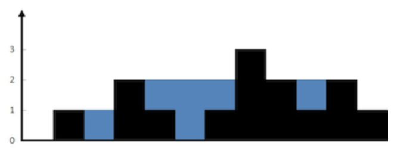
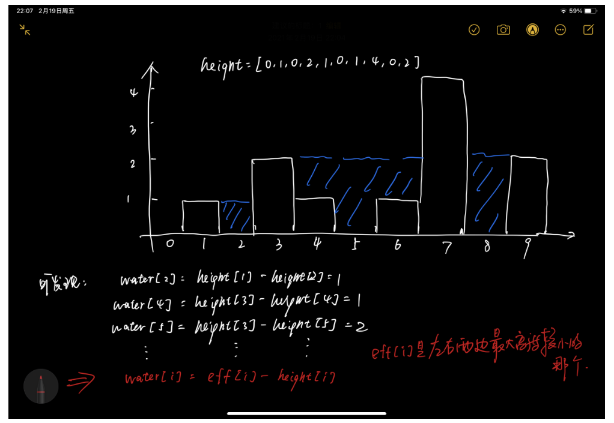

# 1. 接雨水问题

> 数组，双指针（异向）

## 问题

```
给定一个直方图(也称柱状图)，假设有人从上面源源不断地倒水，最后直方图能存多少水量?直方图的宽度为 1。


上面是由数组 [0,1,0,2,1,0,1,3,2,1,2,1] 表示的直方图，在这种情况下，可以接 6 个单位的水（蓝色部分表示水）。 

```




## 示例

```
输入: [0,1,0,2,1,0,1,3,2,1,2,1]
输出: 6
```


## 思路

> 双指针遍历数组，两变量存储最值。在遍历的过程中，不断更新最值。





## 代码

```java
public int trap(int[] height) {

        int length = height.length;
        if (length < 3) {
            return 0;
        }

        // 初始化两个指针和两个变量
        int left = 0;
        int right = length - 1;

        int leftMax = height[left];
        int rightMax = height[right];

        // 记录结果
        int res = 0;

        // 遍历
        while (left < right) {
            if (leftMax < rightMax) {
                // 左边的最大高度是较小的那个
                res += leftMax - height[left++];
                // 更新左边的最大高度
                leftMax = Math.max(height[left], leftMax);
            } else {
                // 右边的最大高度是较小的那个
                res += rightMax - height[right--];
                // 更新右边的最大高度
                rightMax = Math.max(height[right], rightMax);
            }
        }

        return res;
    }
}
```


## 悟

1. 一刷时，入手想的解法是：  用快慢指针。但会非常复杂，而且并没有找出每一竖段水柱的面积的求解规律。

2. left与right是指针，而leftMax与rightMax是值，所以定义与引用的时候，不要混了（很容易犯错又检查不出来）