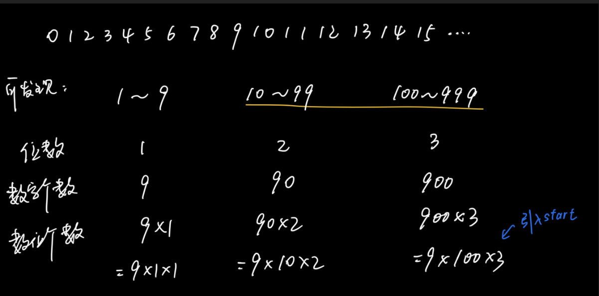

# 44. 数字序列中的某一位数字

## 题目：

```
数字以0123456789101112131415…的格式序列化到一个字符序列中。在这个序列中，第5位（从下标0开始计数）是5，第13位是1，第19位是4，等等。

请写一个函数，求任意第n位对应的数字。
```


## 示例：

```
输入：n = 3
输出：3

输入：n = 11
输出：0
```


## 思路：

#### 一、定义概念：

digit：位数（13的digit为2，109的digit为3）

start：每种位数的第一个数字（10，100，1000）

#### 二、实现步骤：

1）减去n之前所有其他位数的数位个数，即得出从start开始的第几个数位

2）再求出n所在的那个数字

3）最后得出那个数字的数位





## 代码：

```java
    public int findNthDigit(int n) {

        // 位数
        int digit = 1;

        // 该位数下的起始数
        int start = 1;

        // 该位数下，数字的个数
        long count = 9 * start;

        // 数位的个数
        long num = count * digit;

        while (n > num) {
            // n = n-num;  会报错。
            // 因为n是int型，num是long型，n-m后结果是long型，而被赋值的变量n是int，所以报错。（可以类型转换）
            // 但 -=，+=等复合运算符有两个功能：（1）实现加减（2）自动转换类型
            n -= num;
            digit++;
            start *= 10;
            count = 9 * start;
            num = count * digit;
        }

        // 再把0去掉！！！！！因为之前都没算0！！！
        n = n - 1;

        // n/digit是从start开始算第几个数，而resNum为该数为多少
        long resNum = start + n / digit;

        // resDigit是第几位
        int resDigit = n % digit;

        // 选取该位，即为结果
        char res = (resNum + "").charAt(resDigit);

        return Integer.parseInt(res + "");

    }
```


## 注意：

1. 题面中规定都从0开始计数，就不要再在解题过程中乱了套。
2. 记得n要-1，为了去掉0。
3. 该题的过程中可能超过int的最大范围2^31，所以要用long。否则会出现不同的答案（若超过int的最大范围，则再从int的最小范围开始算，即 - 2^31）