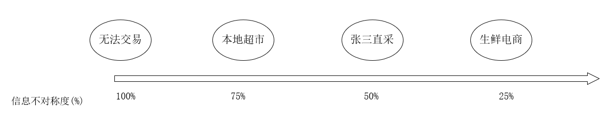
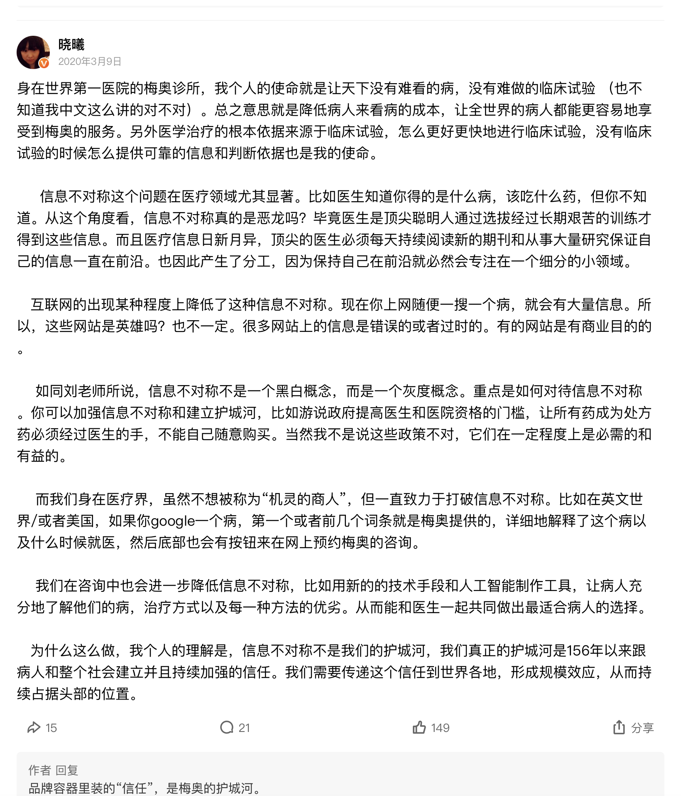

# 模块一：商业到底是什么？

## 00 发刊词

### 一、前言

​	许多创业者经常有这样的问题：“我做的这件事有前途么？值得做么？”。其实这些问题全都问错了。正确的问法不是“我有辉煌的前途么？”，而是**“在那个注定辉煌的前途里，有我么？”**

​	这句话背后是什么意思？答案是，**商业毫不关心你的方向，而你，必须关心商业的方向。**

​	顺应了方向，一路呼啸着奔腾入海。但若没有顺应，你就会成为逆水而上的鱼，费劲所有力气，依然原地不动。

​	企业，就是一条鱼。商业，就是环绕着鱼的水。对于水，你要先知道，再看到，然后顺应流向。

### 二、结论

- **用一次触点，换无限触点**。
- 商业进化的方向是**网络密度越来越高，交易成本越来越低。**

案例：

​	2019年，我有一次去长沙出差。在酒店饿了，就去楼下找吃的。进了一个购物中心，偶遇美妆品牌“完美日记”的门店。

​	门店很漂亮，东西很便宜，很多人在里面逛。

​	一个小姑娘走过来，对我说，随便看，随便看，今天扫二维码加微信，还送一个化妆棉呢。

​	哦，这个有趣。

​	**到门店来买一次口红，也就是一次“交易”。但是消费者一年来不了几次。那怎么办？加微信好友。加微信，就是用一次触点，换无限触点。**

​	我立刻上网搜，看看他们这么做的效果如何。你猜，他们就这样加了多少微信好友呢？

​	几百万个。

​	对完美日记来说，开店的核心，不是卖东西，而是加微信。

​	完美日记，通过加微信的方式，**把自己这个生产节点，和消费节点产生直接连接，绕开了购物中心，从而降低交易成本，把一支300元的口红卖到60元**，最终只花了三年时间，就生生把自己从零做成一个年收入30亿的大品牌。

​	而某些传统大牌，几十年也没有做到30亿。	

---

## 02 阻力：为什么“让天下没有难做的生意”这么难？

### 一、前言

​	这世间万事万物相生相克。有好就有坏，有黑就有白，有英雄就有恶龙。

​	而在商业世界，既然有英雄（**货币和商人**）在促进交易，就一定有恶龙在阻碍交易。

​	而本节要讲的两条恶龙是：**信息不对称**和**信用不传递**。

### 二、信息不对称

> 即，我知道一些你不知道的事情。
>
> 但值得注意的是，信息不对称不是一个黑白的概念，而是一个灰度的概念。

​	比如，1斤大米5元。

​	本地超市卖40元，张三直采卖20元，生鲜电商10元就买到了。

​	最后看出，本地超市是英雄，挑战无法交易这条恶龙，并大获全胜；但是过去的英雄，一旦成功，就长出了既得利益的鳞片，变成恶龙。然后，张三你出现了。张三是英雄，挑战本地超市这条恶龙；可是张三一旦成功后，也长出了鳞片，**守护基于信息不对称的既得利益**，变成恶龙。再然后，生鲜电商出现了，挑战张三这条恶龙。

​	这是一个无休无止的英雄与恶龙的故事。

​	真正的那条恶龙，不是本地超市，不是张三，也不是未来的生鲜电商，而是**“魔戒”一样诱惑人心的“信息不对称”**。

> 机灵的商人把“信息不对称”当成朋友，伟大的商人把“信息不对称”当作对手。
>
> 利用“构建”信息不对称赚钱，是一种重要的、短期获利办法；利用“打破”信息不对称赚钱，才是一种更重要的、长期获利办法。
>
> 商业文明每向信息更对称的方向推进一个百分点，就会有一群“机灵”的商人倒下，一批“伟大”的商人崛起。

### 三、信用不传递

> 即，离我越远的人我越不信任。

### 四、总结

​	信息不对称和信用不传递，都给交易带来了阻力。小的阻力，叫做摩擦，中的阻力，叫做障碍，大的阻力，叫做隔绝。

​	在整个商业史上，我们几乎所看到的每一次伟大的商业创新，都是英雄对恶龙的宣战，都是商人创造性地、更好地解决信息不对称和信用不传递的问题。

​	而商人为了克服这两个问题所付出的代价叫什么呢？也就是下一节的“**交易成本**”。

### 五、评论启发

#### 	关于“信息不对称”：

- 单次博弈**靠信息不对称**，来获取超额利润。所以容易出现宰客的现象。这是**利己的心态，做的一锤子买卖**。
- 重复博弈**靠消灭信息不对称**，来提高商品的转化率，实现薄利多销赚取利润。所以对消费者态度比较好，这是**利他的心态，做的一辈子买卖。**

## 03 交易成本（购前）：没有点评网站，我会吃什么？

### 一、前言

​	商人们为了战胜”信息不对称”和“信用不传递“，必须付出的代价：**交易成本**。

### 二、概念

#### 交易成本

> 指的是，为达成一笔交易所需要花费的全部**时间和货币**成本。而它更是为了克服交易阻力而付出的代价。

#### 三类七项

> 后来，根据买家的决策流程，把交易成本分成**三类七项**：
>
> ​		第一类”购前“：搜寻成本、比较成本、测试成本；
>
> ​		第二类”购中“：协商成本、付款成本；
>
> ​		第三类”购后“：运输成本、售后成本。

### 三、购前的交易成本之一

#### 搜索成本

淘宝等网购平台

#### 比较成本

”连锁加盟“的商业模式，使得店家的信息快速和消费者对称，降低了消费者的”比较成本“，从而促成了交易。

但随着时代的发展，点评网站进一步降低了促成交易的代价。

#### 测试成本

## 04 交易成本（购中）：谈判为什么总是要拖很久？

> 协商成本，有关**法律条款**；付款成本，有关**财务条款**。

### 一、协商成本

比如两家公司为了签订一份协议，而进行一场商务谈判，花费了大量的时间甚至是金钱的投入，这些都是”协商成本“。

#### (1) 对于社会

> 整个社会（遵守社会契约）**降低协商成本**的方法，是**”事后惩罚“**的**社会信用体系**。

​	初去美国的人，会发现美国人很“蠢”，你拿餐厅服务员手写的“收条”，就能到公司报销。那我自己手写一张去报销不就行了吗？这个漏洞也太大了吧？

​	初去德国的人，会发现德国人也很“蠢”，自己买地铁票，自己进地铁站，没有人工检票，也没有自动闸机。没票其实也能进，这个漏洞也太大了吧？

​	但是，你会发现，美国的公司有审计，德国的地铁有督查。一旦发现你做假账、逃车票，就会面临巨额罚款，甚至被列为“失信人员”，以后诸事不顺，找工作、办贷款都很难，说不定信用卡都申请不下来。

​	相反，复杂的发票体系，昂贵的检票系统，其实本质上都是要求你遵守契约的“协商成本”。而“事后惩罚”的社会信用体系，就可以降低事前的协商成本。

#### (2) 对于个体

> 对于单个机构，降低**协商成本**的方法，是**”品牌和声誉“**。

​	当你用声誉赢得客户时，就可以不用支付任何售前沟通类的“协商成本”。这时候你就会明白，为什么很多人那么在乎公司的品牌、个人的声誉？

​	因为品牌和声誉能降低协商成本。

​	你问一下自己，如果有一天因为公司资金周转问题，需要打电话向朋友借钱。你觉得你能在不抵押资产，甚至不打借条的情况下，借到多少钱？

​	这些钱就是你声誉的价值。免去的抵押、借条、借款合同，就是节省掉的“协商成本”。

> ​	所以正如刘润老师所说，”不能被消费者优先选择的，就不叫品牌，只能叫商标“。品牌的本质是**利用信用机制**，**降低协商成本和战胜信用不传递**。

### 二、付款成本

> 简单来说，该成本就是担心”钱和货“。

​	而为了降低**”付款成本“**的代价从而促成交易，2004年”支付宝“出现了。而它的工作逻辑就是**”担保交易“**。

​	什么是”担保交易“？

​	你在淘宝上下单付款，钱并没有直接打给卖家，而是打到了支付宝的临时账户。支付宝通知卖家，钱已经在我这里了，你可以发货了。于是卖家可以放心地发货了。买家收到货之后，一检查没问题，也放心了，于是点击“确认收货”。这时，钱才会自动转给卖家。

## 05 交易成本（购后）：中国的物流真的比美国更快吗？

### 一、运输成本

​	大家可能都觉得中国的物流效率要比美国高。但这其实是一个误解。

​	要看一个国家物流行业的效率，一个关键的指标是**“社会物流总成本”**在GDP中的占比，该占比意味着：每创造10k元的社会财富，需要1k元还是100元，才能到消费者的手中。事实上，美国的数字是8%，中国大约是15%，将近美国的2倍。

​	（当然这个数字也和一个国家的**GDP结构**有关系。比如制造业大国，几乎一定比服务业大国的物流负担重。但这个占比在很大程度上仍然反映了一个国家物流行业的效率水平。）

> 关于中国物流成本高，和我们的日常感知不同。
>
> 因为我们只看到了C端物流的发达，没有看到背后“仓干配”（仓库+主干线+配送）的复杂。

### 二、售后成本

## 06 模式创新：所有伟大的机会，都源于巨大的交易结构的改变

### 一、商业到底是什么？

​	答案只有三句话：

- 商业的本质，是“交易”；
- 商业的阻力，是“信息不对称”和“信息不传递”；
- 商业的进步，是降低“交易成本”。

> 理解了这三句话，我们就能在心中勾勒出一个由“交易，阻力和交易成本”编制的，动态变化的，不断进步的商业世界。

### 二、商业模式

> 一种商业模式的创新，可以将“是否降低了交易成本”为评价标准，来检测是否是一个真正有价值的创新。

#### 2.1 什么是商业模式？

> 商业模式，就是 利益相关者的交易结构。
>
> 商业模式创新，就是 构建交易成本更低的交易结构。
>
> （交易成本更低的结构，就是更好的交易结构，就是更好的商业模式。）

#### 2.2 滴滴打车如何重构交易结构？

滴滴打车借助互联网，重构了打车的交易结构（购前和购中）：

- 降低“搜索成本”（双方）
  - 通过app的匹配，最大提高了司机和乘客找到彼此的效率，降低了双方空驶和空等的成本
- 降低“比较成本”
  - 提前计算好各种车型的价格
- 降低"测试成本"
  - 滴滴为每个司机建立了档案，并公示他们的资料（接单次数、用户评分等）
- 降低“协商成本”
  - 系统通过大数据实现”忙时贵、闲时便宜、忙时车多、闲时车少“的”协商“
  - 滴滴平台做”担保“
- 降低“付款成本"
  - 网络支付

#### 2.3 启示

​	高效的商业模式之间，当然会有竞争。比如滴滴打车和美团打车。

​	但是高效和低效的商业模式之间，不会有竞争，只会有”逐步取代“。差别在于，取代的速度多快、程度多深。

