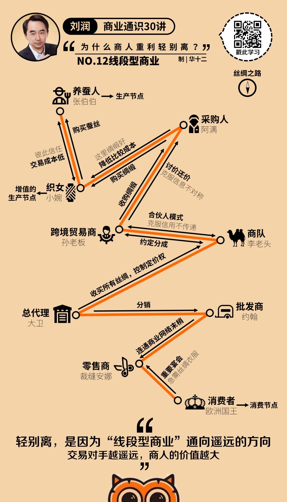
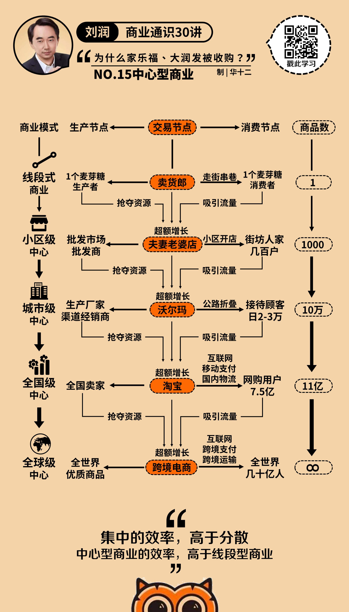

# 模块三：商业从哪里来？

## 12 线段型商业：为什么商人轻别**离？**

> **什么是 线段型商业？**

### （一）概念

> 线段型商业，是一种由”一个个首尾相连的连接，一次次承上启下的交易“构成的交易结构。
>
> 它是商业世界的第一次进化。因为从它开始，出现了一群既不是生产者也不是消费者的人群：商人。

### （二）丝绸之路的例子

### （三）精彩评论

- 线段型商业，就是 **M2S2B2b2C** （D--设计，M--制造，S--供应链，B--大商户，b--小商户，C--消费者）

  每一次短路经济，都是一次机遇。

- 还有一种特殊的商业模式符合了**“凡勃仑效应”**，也就是购买者认为花的钱越多，产品越贵，东西越稀缺，获取越难，买到的人会觉得越有面子，这种模式可以为供应链参与者提供更加可观的利润空间。**人为制造独特性稀缺性和信息不对称，也许是反方向的一个商业机会。**没办法，人的需求层次是多元的。

- 拼多多有C2B模式，通过**”社交“**收集海量C端的需求，再向大B团购商品。

## 13 信息博弈：

> **线段型商业 如何对抗 信息不对称**

### （一）方式

> **讨价还价**、**跟随出价**和**货比三家**。这些都是买家，通过**“信息博弈”**的方式来对**抗信息不对称**的方法。

##### 1.1讨价还价

> 讨价还价的本质，就是通过“信息博弈”的方式，对抗信息不对称。

​		经过博弈，我们最终会在最低价300（卖家的最低心理价位）和最高价600（买家的最高心理价位）之间，找到一个双方认可的成交价，并完成交易。

​		而具体在哪个点成交，就涉及到两个经济学的概念：**生产者剩余**和**消费者剩余**。

​		如果这件羽绒服是550元成交的，那么我就拿走了（600元–550元=）50元的消费者剩余，而她拿走了（550元–300元=）250元的生产者剩余。这说明，她的“**讨价**”的能力更强。

​		假如最后我们是320元成交，那么我的消费者剩余是（600元–320元=）280元，她的生产者剩余就是（320元–300元=）20元。这说明，我的“**还价**”的能力更强。

##### 1.2 跟随出价

​		那就是：跟着一个老人家下单。为什么？因为老人家“讨价还价”、信息博弈的能力，常常比我高好几个数量级。

​		老人家和卖家唇枪舌剑，你来我往，非常精彩。最后，卖家说：算了算了，怕了你了，就187块吧。这时候我会说：给我也来一个……

​		而这还不是最高境界。

​		那么高手中的高手是怎么操作的呢？他们是跟在大妈后面，看大妈和老板砍价僵持不下的时候，再加入，帮着大妈对老板说：你便宜点，我也来两斤。这就由单点变成了团购，虽然客单价利润薄了一些，但是量大了还是有得赚，所以老板可能就答应了。你和大妈都拿到了一个本来拿不下来的价格。

​		所以，跟人的技巧，不是搭顺风车，而是在关键时刻，让自己加入，成为决定性的力量，

##### 1.3 货比三家

## 14 信用中介：把自己的信用借给双方，促成交易

> **线段型商业 如何对抗 信用不传递**

- 黑市中间人
- 德高望重的乡绅

## 15 中心型商业：为什么家乐福、大润发纷纷被收购？

> 什么是 中心型商业

#### （一）概念

当越来越多的“交易线段”纵横交错，商业世界开始出现一些100条线段、1000条线段同时交错的“超级节点”。比如，“条条大路通罗马”的罗马和“九省通衢”的武汉。

#### （二）发展过程

> 卖货郎 ——> 小区级中心（夫妻老婆店） ——> 城市级中心（沃尔玛） ——> 全国级中心（淘宝等电商平台 ） ——> 全球级中心（亚马逊、阿里巴巴等跨境电商）

## 16 超级节点：让人成为信息、商品和一切的中心

> 中心型商业克服 信息不对称 ：“超级节点”

### （一）信息的超级节点

搜索引擎

### （二）商品的超级节点

电商平台

### （三）人的超级节点

即时通信

## 17 信用中心：信用的中心，就是财富的中心

> 中心性商业模式客服 信用不对称 ：信用中心

### （一）银行

> 资金的信用中心

##### 补充：

“A向B借钱”这件事情，拆接下来，其实是两个动作：

- A要这笔钱，叫“借”
- B给这笔钱，叫“贷”

A借入了钱，B贷出了钱。

> 所以，贷款的定义是指银行或其他金融机构按照一定的利率和必须归还等条件**出借**货币资金的一种信用活动形式。（与口语中的“贷款”进行区分；贷款==出借）

### （二）保险

> 风险的信用中心

​	比如，包红包凑份子钱。其本质就是保险，就是“同质风险承担”，就是把那种发生概率特别小，但发生后的影响非常大的风险，找一群人来分担掉。

​	所以，结婚就是一种“发生概率特别小”（一辈子可能就结一次婚），但”发生之后影响非常大“（摆30桌酒席）的“风险”。

​	其他还比如，癌症和航空意外。

### （三）证券公司

> 权益的信用中心
