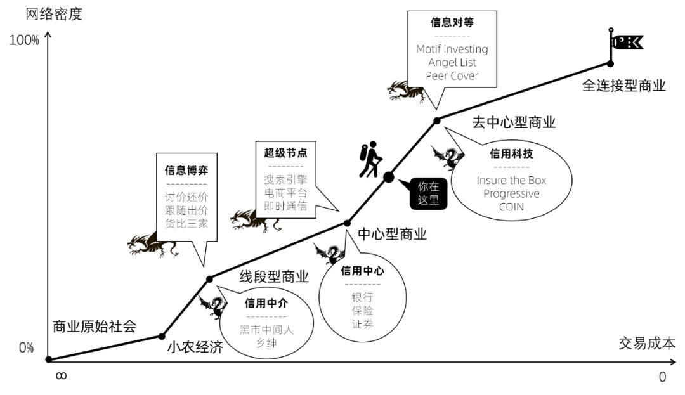

# 模块二：商业为什么能进步？

## 07 连接：为什么”要想富，先修路“？

### （一）前言

> ”想要富，先修路。少生孩子，多种树。“  该句中”修路“的商业理解：
>
> ​		修路的本质，就是”连接“。**而”连接“的价值，就是把更多的”交易节点“（生产节点、中间节点和消费节点），连接到商业世界巨大的交易网络中来，并参与交易。甚至因此，短路那些低效的连接（短路经济--见附），重新分配生态位，改变交易结构。**

### （二）举例

​	在大城市边上有个一般的酒厂，酒的口感也一般。但它的生意还不错，因为离大城市还算近，周围也没有其他酒厂。但同时，在一个很偏远的小乡村里有个小酒厂，酿的酒是真好，十里飘香，但这个村子很小，飘不出去。所以，只有本村人才能喝上这么好的酒。

​	然后中国开始”想要富，先修路“了。

​	因为修路，小乡村里的这个偏远的**生产节点**，连接到全国的交易网络中，并通过无数**中间节点**，快速触达海量的**消费节点**。

​	由于优质的生产节点的接入，中国整个商业网络的交易结构，开始悄悄地、不可逆转的发生变化。小酒厂的酒越卖越好，而那些一般的酒厂，生意越来越差。

​	**推动这一切变化的元动力，就是”连接“。**

​	而最后，那些一般的酒厂会比较纳闷，但可能都会说出这样的一句话——”公路，正在摧毁中国的实体经济！“。这句话是不是很耳熟？”互联网，正在摧毁中国的实体经济！“

​	其实，互联网和公路一样，从来都不会摧毁实体经济。它们本身，也是实体经济。因为公路从来都不会酿出一瓶酒，互联网也不会生产出一双袜子。这些，还是由工厂来生产。

​	**公路和互联网一样，它们所做的事情，是帮助更好的生产节点，用最有效的办法，”连接“最需要的消费节点，从而改变交易结构，短路低效的连接，降低交易成本，提高商业效率，创造更多的财富。**

### （三）热评

​	现在因为网络，信息的互相关联，信息不对称在慢慢消失，我们也进入信息大爆炸的时代。没有人在能赚信息差的钱。而因为信息太多，出现了新的信息差，就是认知的势能差。同样一堆信息，所有人的认知是不一样的，所以就会出现赚认知差的钱，比如得到，在赚知识上的认知差。团购网，在赚价格上的认知差。不是知识没有了，也不是抵扣券没有了，而是多到你不知道怎么选择了。

### （四）附

- 什么是”短路经济“？

  ​	短路经济就是俗称的**去中间化**。**短路经济**与**数据赋能**、**坪效革命**并称**新零售三大核心逻辑**。

  ​	以前产品到消费者手里要经过总代、省市级代理、经销、批发和门店，每多一个环节成本就会增加，这样显然无法与互联网企业竞争。如果产品直连门店或者消费者，不仅产品价格具有竞争力，用互联网思维改造门店效率也会提高，产品通过平台到门店再到消费者就是S2b2c模式。

  ​	而传统互联网电商天猫和京东通过对**信息流**、**资金流**和**物流**的重构，实现了对低效经济的短路，提高了商业效率。

  ​	同时，**社交电商**又通过人与人的传播短路了**传统电商**。

- 什么是**”社交电商“**？

  ​	社交电商是指，通过社交网络平台或者电商平台中的社交功能，将关注、分享、讨论和沟通互动等社交化的元素应用到电子商务的购买服务中，以更好地完成交易。

  ​	对于消费者，体现在购买过程中与店铺间的交流与互动和购买后的评价与分享。

  ​	对于品牌商，促进了品牌推广和品牌销售。

  ​	对于电商平台，增加了用户粘性，丰富了用户的参与感。

> **社交电商的本质，是依托社交链条的裂变式效应来扩大用户规模和转化机会**（用户转化率）

​	**例子：**

​		比如，拼多多历经短短2年时间就在美国纳斯达克正式上市。而这个成绩，淘宝用了10年，京东用了5年。拼多多的崛起，让我们重新看到了社交电商的机会。

## 08和09 空间折叠和时间坍缩（连接的方式）

> “连接”改变世界的方式有两个：
>
> ​		空间折叠 和 时间坍缩。
>
> ​		空间折叠：因为连接的进步，两个远隔天涯的节点，站在彼此面前。
>
> ​		时间坍缩：因为连接的进步，两个先后出现的节点，跨越时间握手。

#### （一）空间折叠

08这一节就是讲了**空间折叠**的三个案例

- 第一个，是因为**铁路的出现**，折叠了全国疆域，**西尔斯邮购**崛起的故事；

- 第二个，是因为**公路的出现**，折叠了毛细血管，小镇青年**沃尔玛**逆袭的故事；

- 第三个，是因为**集装箱**折叠了海洋，全球经济一体化以及中国崛起的故事。（主人公是一个卡车司机）
  	

  这个世界，随着连接的进化，空间会被不断折叠，因此天堑变通途，交易越来越简单。

​		铁路、公路、集装箱，都是越来越高效的物理连接，所以能导致“空间折叠”。那么，什么样的连接，会导致“时间坍缩”呢？

#### （二）时间坍缩

09这一节讲了时间坍缩的三个案例

- 第一个，是**摩尔斯发明了电报**，并用“摩尔斯电码”进行编码。
- 第二个，是**互联网**的崛起，涌现了许多“信息交易平台”——阿里、百度、腾讯、美团和得到等等。
- 第三个，是互联网带来的**万物互联**。

> 关于“万物互联”，比如洗衣机上网：
>
> ​		我今天把一件白衬衫丢到洗衣机里，又把一件红外套放进去。如果洗衣机能上网，它就会告诉我，如果红色外套掉色，就会让我的白衬衫染色。
>
> ​		好，那我把白衬衫拿出来，先洗红色外套。这时候，它有说“这件红外套已经洗了十几次了，最近同款的外套正在促销”，然后推送了外套的链接。（**服装业、零售业**）
>
> ​		然后我再洗我的西装，它告诉我“西装不能用水洗”，附近有个干洗店，洗一次39块钱，你点一下确认，店员就会取件上门。（**服务业**）
>
> 
>
> 这就是万物互联，让家电业、服务业、零售业和服务业之间，**没有时差地传递**。

#### （三）总结

**所以，连接的进步，就是通过空间折叠和时间坍缩，把两个远隔天涯和穿越岁月的人，放在彼此面前，握手交易。**

**讲空间折叠和时间坍缩，不是为了给你讲一个尘封的、与你无关的历史。因为不管空间和时间折叠和坍缩成什么样，它依然有进一步折叠坍缩的机会。我是希望	你能站在这个维度上思考，我们这一代人，还有什么可以做的。这正是我们这代人的使命和机会。**

## 10 不能顺应连接，不进则退

#### （一）360的启示

​	你知道，过去杀毒软件是怎么卖的吗？订阅。

​	什么意思？就是：杀毒软件免费，但每月收10元的订阅费。病毒是杀不完的，每月都有新病毒出现，这10元钱就是订阅杀新病毒的能力。

​	这是一种很有效的商业模式。很多杀毒软件公司因此赚钱，赚很多钱，成为行业领先者。

​	但是，一位叫周鸿祎的互联网创业者想，杀毒软件为什么一定要收订阅费呢？互联网是**连接**跨时代的进步，它不但连接了我和用户，还连接了我和广告主啊。**我可以杀毒软件对用户免费，但向广告主收费啊。**

​	360推出了免费的杀毒软件。

> 什么是360的三级火箭？

360的第一级火箭是免费杀毒工具， 利用这级火箭打破了持续10年的杀毒软件市场三国鼎立的局面，成为用户量最大的安全工具。

360的第二级火箭是从免费杀毒工具变为安全网络平台， 进而推出360安全浏览器和360安全网址导航。

360的第三级火箭就是它最终承载的商业闭环， 从安全浏览器和网址导航的广告收入，获得企业的经营利润。

#### （二）精彩评论

​		刘润老师，今天的课程其实值得人深深地思考，很多时候我们总看不到别人为什么会成功，为什么杀毒软件要免费，为什么马斯克会考虑火箭回收，为什么码头工人会无力反抗，无数的为什么都告诉我们，社会就是逆水行舟不进则退。其实自己观察这些商业模式就会发现，**杀毒软件收费被免费打败了，而知识付费却打败了免费知识，为什么有的免费打败了战胜了收费，有的收费战胜了免费**。就是因为大家发现**连接的效率永远都是提升的**。看看杀毒软件的发展就会发现，中国的互联网是从蛮荒发展起来的，基本上全是盗版软件，这个时候杀毒软件就成为了关键。**可是当社会不断的发展，在效率的推动下越来越多的正版软件被接受，对于杀毒软件的需求越来越小，收费的杀毒软件也是会慢慢萎缩的。在这个趋势下免费杀毒收广告费，就成为了未来的趋势**，因为大家更在意服务，更在意连接。这个时候就需要思维折叠，把费用向商家收取，让用户来成为资源，**这才让免费杀毒战胜了收费杀毒**。**当互联网海量的免费知识到来的时候才发现，知识是需要筛选和系统的，零散的知识点很难起到作用，毕竟大家要明白一件事情做99%和100%是完全两种概念，这个时候就需要有老师或者导师来梳理知识，让知识形成系统，形成价值。****最终让获得知识的效率提高，才让知识付费战争了免费知识**。

​		所以这个世界连接永远都是进步的，**只要能够提高效率，免费还是收费都只是手段，效率才是目的**。这也是为什么提高效率的事情可以收费，而那些不能提高效率的事物只能慢慢的消失。想要在这个时代获得成功，**就必须了解什么是手段，什么是目的**，需要明白商业的本质，**因为背后的逻辑永远也不会改变，改变的只是形式**。

#### （三）总结

​	**当你突然想撕心裂肺地呼喊，惊心动魄地反抗时，历史按下了静音键，然后继续前行。**

​	**所以，选择，比努力更重要。鱼，一定要知道水的方向。顺应了方向，一路呼啸着奔腾入海。没有顺应，就只能逆水而上，不进则退，更可能费劲了所有力气，依然原地不动。**

​	**但有人会问，“连接的进步有极限么？”。一张纸对折多次以后，每一次的对折都会越来越困难。空间折叠和时间坍缩也会有极限。**

## 11 网络密度

> 网络密度 = 实际连接数 / 可能连接数

### （一）商业的进化史（四大商业类型）

**线段型商业——>中心型商业——>去中心型商业——>全连接型商业**

