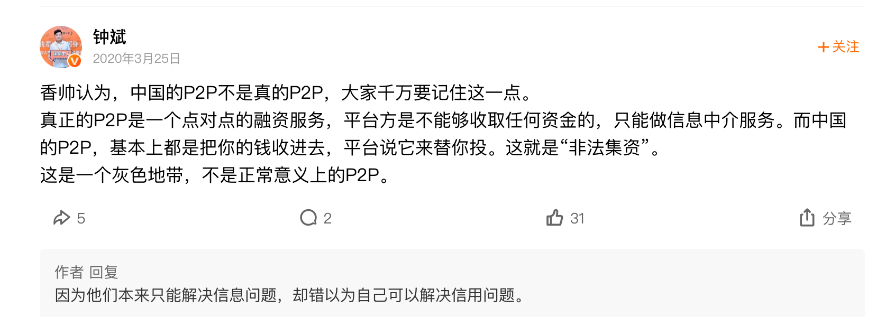
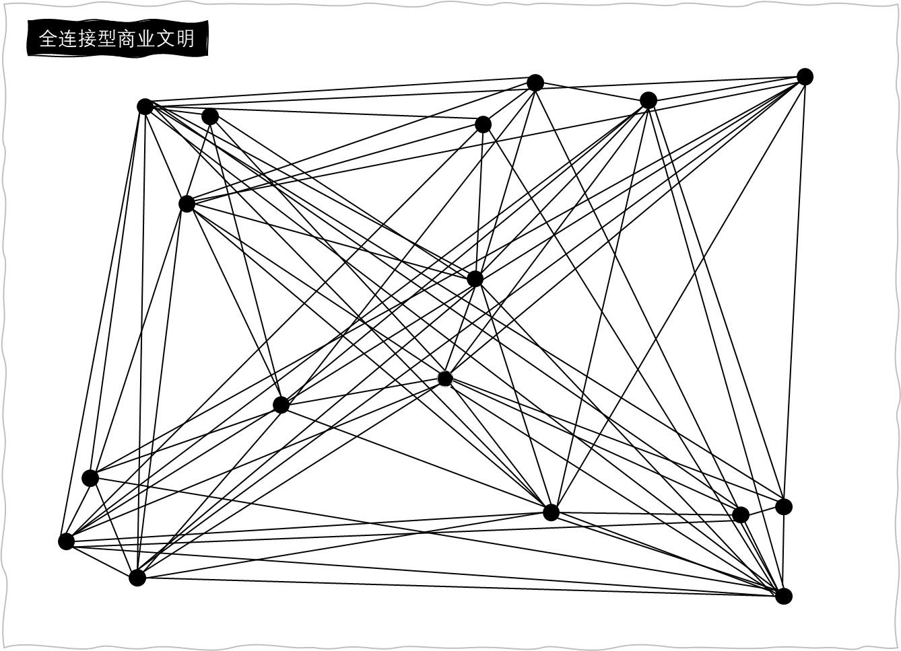

#  模块四：商业到哪里去？

## 18 去中心型商业模式：天下大势，分久必合，合久必分

> 什么是 去中心型商业模式？

### （一）概念

> 去中心性商业模式就是：我在我的小圈子里自娱自乐，你在你的小圈子里如痴如醉。我们不再必须围绕同一个超级节点而完成交易。

### （二）案例

#### 2.1 迅雷的p2p下载

> P2P是“peer to peer”，意思是“平级对平级”，又称对等网络。
>
> 而P2P的实质，就是去中心化。

#### 2.2 阿里巴巴的“相护宝”

> 去中心化的互助保险

特点：（相比于保险公司）

- 赔付率高
- 管理费用低

而问题是，难道阿里不就是隐藏在相护宝这个“去中心”背后的“中心”嘛？

是的。就像中心性商业，其实也是建立在无数的线段之上一样。去中心型商业，也是建立在很多被“基础设施化”的中心之上。

比如，阿里百度腾讯都是超级中心。但是他们的背后其实有更大的中心，那就是中国移动。中国移动曾经无比耀眼夺目，因为它太重要、太不可或缺了，已经慢慢从大树，变成了土壤，被基础设施化了。

### （三）总结

1. 网络密度的增加，带来了中心；网络密度进一步增加，就会消灭中心。

## 19 信息对等：每个人都是时代的中心

> 去中心型商业模式克服 信息不对称 的方式是 信息对等。

### （一）案例：Peer Cover公司（基于P2P对等网络的万物可保）

> 2015年，新西兰成立了一家P2P保险公司。
>
> Peer Cover邀请用户成为“联合创始人”。联合创始人可以根据Peer Cover上的现有产品（比如手机险、葬礼险、车险等），创建自己的“赔偿团体”。每个人都能成为联合创始人，并且编写这个“赔偿团体”的条款，只要其他加入者同意。
>
> 比如，我这个赔偿团体，只保障手机掉到浴缸里的情况。这样，Peer Cover上就出现了很多各不相同的小小的保险产品。这个赔偿团体，就成为独立于保险公司这个超级节点的一个“P2P对等网络”。
>
> 一个会员填写了索赔单，说自己的手机掉到浴缸里了，不是泳池，是浴缸，并上传了照片。这时，只要赔偿团队确认，并同意了这位会员的索赔，系统根据他们自己约定的条款进行支付。
>
> 更有趣的是，用户还可以随时加入和随时退出赔偿团队。如果退出时，这个“P2P对等网络”还没有发生索赔，甚至可以拿回全额。
>
> 这就是基于“P2P对等网络”的万物可保。只要有足够的人想投保同样的东西，不管是什么东西，甚至猫猫狗狗都是可以的。
>
> 你闭上眼睛想一想，当全球想投保“哈士奇”的人通过“P2P对等网络”聚在一起互助的时候，还有保险公司什么事。

​		可以看出，去中心型商业时代的机遇，就是不羡慕一个太阳的光芒，而去收集满天繁星的智慧；就是不神话那个英雄，而把武器交给每个普通人；就是不强求自上而下的秩序，而鼓励自下而上的涌现。

### （二）精彩评论

## 20 信用科技：大数据人工智能搭建的信用基础设施

> 去中心型商业模式克服 信用不传递 的方式是 信用科技。

（也是讲了三家公司的例子...都是保险方面的）

### （一）给个性化大数据赋能的两家保险公司

##### **第一家：InsuretheBox**

​		请问：车险应该怎么买才合理？

​		一辆车几乎不开，每年要交几千块钱保险费，你觉得合理吗？我觉得不合理。

​		保险的本质，是“同质风险分担”。我的车几乎不开，和每天开30公里上下班，所遇到的不是“同质风险”。

​		那车险应该怎么买呢？

​		现在的车险，是按照年来买的。这不合理。一年中，每个人上路的次数显然不同。不按年来买，那按天来买吗？也不合理，因为每天每个人上路的次数、时间长短也不一样。

​		那应该按什么买呢？按公里数来买。开车距离多的人，就应该多交保费。所以，未来的车险，可能不是在电话里买，而是在加油站买：

​		**师傅，给我加200公里的油，顺便加200公里的保险。**

​		问题来了，这个做法听上去很开脑洞，**但我怎么知道每个人每天开多少公里呢？这就要依靠大数据了。**

---

​		英国有家保险公司叫InsuretheBox。购买它家的保险，它就会在你的车里装一个OBD设备（On Board Diagnostic Device，车载诊断系统），**检测你的行车数据，其中包括开了多少公里。**

​		然后，InsuretheBox就可以这样卖保险了：这3000公里先充给你，拿去用，用完了再来充。如果你的行车记录非常好，每个季度我再送你一点里程作奖励。

​		**可是为什么传统的保险公司不这么做呢？因为它们只掌握“社会统计数据”。上海每年会出多少起交通事故？65岁以上的老人得老年痴呆症的概率是多少？这就是社会统计数据。再厉害的精算师，基于社会统计数据，也得不出针对个人的最优保险定价。**

​		可是，按公里数付费，也不合理吧？那些把车开到四叉路口，打着左转向灯却向右转的人，就应该多交钱吧？

​		没错。按照公里数付费还不够，每公里按照开车习惯定价，才是最合理的。

​		**这就是“个性化的大数据”赋能的UBI车险（Usage Based Insurance，基于用量的保险）。**

​		有一天，我买车的原厂打电话给我：您的车险要到期了，在别人那里每年7000元的保险费，在我这里，2000元就够了。

​		为什么啊？**因为我们原厂拥有数据**。根据数据显示，您的开车习惯特别好，而且基本不开。

​		我一听特别高兴。赶快打电话给我一个朋友，他和我同一天在同一家4S店提的同一款车。我朋友听完后，也立刻打电话给车厂的客服，说我要买保险，就是刘润那个，2000元的那个。

​		客服小姑娘一查，说：对不起，您买的话有点贵，要1.2万元。

​		我朋友听完，一口鲜血喷在屏幕上：为什么啊？

​		她说：因为你经常漂移。

​		我朋友非常生气，说：那我不买还不行嘛。于是他继续在原来的保险公司买。

​		然后，渐渐地，那些开车习惯好，又不怎么开车的车主，会越来越多地被拥有**“个性化大数据”**的原厂拉走。那原来的保险公司呢？因为好用户都走了，它们只好提高保费，慢慢失去竞争力。

---

##### 第二家：Progressive

​		美国有家保险公司叫Progressive，它早已开始“每公里定价”。它的定价，基于**三个数据**。

​		**第一，你平常与前车保持的距离。**

​		这个数据，通过车载雷达和OBD设备可以记录。后车如果追尾前车，不管什么原因，后车全责。所以如果你习惯离前车太近，那保费必须要高一些。

​		**第二，你每月踩急刹车的次数。**

​		一个人什么时候才会踩急刹车？一定是遇到险情的时候。这次是刹住了，那下次呢？一个经常急刹车的人，嗯，保费也必须高一些。

​		**第三，你每月凌晨4点开车的次数。**

​		这是为什么呢？因为一个人一天中什么时候最疲劳？凌晨3～4点。不管你是蹦迪回来，还是去上早班，这时候都特别容易出事故。所以，经常凌晨4点开车的，保费也必须再贵一些。

​		Progressive公司用三个简单的数据，为每个人的保险做了**差异化定价**。

​		信用，就是对风险的承诺。**用个性化大数据这种“信用科技”，进行更加精准的风险定价，帮助优质节点降低交易成本。**

​		当你有了“大数据”这项信用科技的新式武器后，去中心型商业，终于可以摆脱依赖社会统计数据的“信用中心”，散成满天星。

（人工智能的公司没整理...）

### （二）精彩评论

​		《百万富豪求翻身》讲了一个富豪用100美金怎么在90天内创建100万美金的公司的故事。看完后有个很深的感悟：人是成本，更是价值的创造者，这取决于这个团队是什么样的。

​		作为创业团队，团队几乎每个人都在尽力处理随时发生的各种问题，而且在没有任何物质激励的条件下，带着绝对的激情，向同一个目标出发。

​		这个团队这些人，一定全部都是价值的创造者，而不是成本；很多时候人是企业巨大的成本的原因在大部分人，以及我们日常生活中的大部分时间，都是靠习惯来支撑的，从企业角度来看，简单重复的劳动的消耗成本太大了。

​		推荐大家看看这个篇子，反正我是看到热泪盈眶，好像是我的创业梦实现了一样哈哈哈哈。

## 21 区块链：从黄金，到账户，到区块链

### （一）区块链的概念

> 区块链，简单来说，就是一套**“加密的分布式记账技术”**

加密--数学，分布式--网络，记账--金融。所以，理解区块链，必须要懂三个学科——数学、网络和金融。

线段型商业时代，人们用现金交易（黄金、白银和铜钱）。

中心型商业时代，人们用银行账户交易。

但是，中心化的账户也会有两个问题：

- 如果“信用中心”出现技术问题，比如黑客攻击或者硬件故障，导致数据库损坏或者被篡改，将导致整个信用中心的崩溃。
- 如果“信用中心”出现道德风险，比如银行职员利用职权盗用储户资金，那么客户的权益也会受到侵害。

### （二）区块链的应用

#### 区块链合约（智能合约）：

​		在过去，我们签合同，至少是一式三份。为什么？因为你我各一份之外，还有一份留在公证处。

​		有一天我拿着合同去找你，说这是我应该付给你的100万元。你拿出你那份合同说，不对啊，你应该付我700万元。

​		我大吃一惊，一看，你的合同上果然是700万元。我这明明是100万元，一定是你篡改了合同。我们吵得不可开交，谁也说服不了谁。

​		这时候，我们想起来公证处还有一份合同。公证处就是“中心型商业”时代的“信用中心”，我们都相信它。

​		于是，齐天大圣和六耳猕猴，来到如来佛祖这里。

​		如来佛祖拿出第三份合同一看，果然是100万元。这下你没话说了吧。我的钱保住了。但是，因此我们要付一笔钱给公证处。这就是公证费。

​		这笔公证费，就是中心型商业时代的交易成本。

​		现在呢？

​		现在，我们把合同封装在不可篡改的区块链里，一旦达到指定条件，就自动执行。因此，我们两个交易节点之间的信任问题，就可以被一种无人参与的，不可篡改的技术保障，而不是一个第三方的公证处了。

​		这份信用更牢固，更便宜。这就是所谓的**智能合约**。

## 22 去中心化家族：一场区块链本人的家族演讲

### （一）家族史

#### 父辈：

- 爸爸：“去中心化”
- 妈妈：“互联网”

> ​	去中心化（爸爸）是人类的一个信仰，比较哲学化。而互联网（妈妈）正是可以让爸爸去实现的真爱，因为互联网是一个没有理论中心的网络结构。每一个节点都是同等重要的存在。

#### 子辈：

- **大哥：“P2P下载“**

> ​	实质：硬盘的对等网络，如，迅雷。
>
> （如果你想下载电影，迅雷就会找到那些有这个电影文件的电脑，同时从这些电脑上下载一个个碎片，然后在你的电脑上拼成完整的电影文件）

- **二哥：“CDN（内容分发网络）”**

> 你在上海通过视频网站看一部电影，但电影是存在北京的服务器上，就会感觉很慢，如果在深圳看，就更慢。
>
> 那怎么办？把这部电影存在不同地区的很多服务器上，看电影时找最近的服务器，这就是CDN。这就是**分布式的带宽**。

- **三哥：”分布式计算“**

> 过去我们破译密码需要用超级计算机，它的运算速度比普通计算机快几万倍。但这是中心化计算。
>
> 但如果将大块的计算工作（如破译密码）切割成无数的小块，扔给全世界无数普通的计算机，比如你家的电脑。这就是分布式计算。
>
> 当全世界上百万台普通电脑的CPU同时计算时，速度会比超级计算机要快。
>
> 一些以前人类解决不了的问题，比如需要大量计算的基因学、密码学问题，在三哥面前被轻而易举地解决。

- **四姐：”社交媒体“**

> 过去媒体是中心化的，在全世界范围之内，发言权都是集中在少数人手上的。
>
> 四姐出生后，她让每个人都有了发言的机会，每个声音都能被听到，整个世界就立刻变得非常感性。
>
> 在美国我们特别要感谢Facebook、Twitter，在中国我们特别感谢新浪微博和腾讯，是它们共同把四姐接生下来。
>
> 四姐是互联网世界人人喜爱的一朵花。

- **五哥：”P2P借贷“**

> 在美国，你到银行存钱，利率是0.25%。可是你刷信用卡借钱，利率是17%。凭什么我把钱借给你是0.25%，你把钱借给我就是17%呢？这太没道理了！
>
> 雷纳德创立了LendingClub，用去中心化的方式，让大家可以直接把钱借给彼此。
>
> 五哥是一个非常叛逆的孩子，他和传统金融发生了很大的抗争。他做了很多风险很大的事，但也帮不少人借到了钱。
>
> 五哥之后，我父母很快生下了六哥，他叫众筹。帮他接生的是一个美国公司，叫AngelList。
>
> 过去我们融资都是去找风险投资，或者上市，这些都是中心化融资的方法。
>
> 为什么不能让项目和钱在对等网络里直接匹配，而必须通过中心化机构呢？
>
> 但是，这个想法很危险。在中国，向超过200个非特定公众筹集资金，就涉嫌“非法集资”。
>
> 那我们能不能在200人之内，找到对风险有识别能力和承受能力的人，帮助他们投资，而不需要通过中间机构呢？

- **六哥：”众筹“**

> 与五哥相比，六哥会显得稍微沉稳。但依然会让全世界头疼，还是因为涉及金融风险。不过，我非常喜欢六哥，他在少年时就是一个英才，做出了伟大的成就。

- **我：“区块链”**

> 我是我们家族的第七个孩子，我叫区块链。帮我接生的人叫中本聪。
>
> 我知道，大家已经在上一讲了解过我。这里，我只想强调一点：我不完美，我有很多缺陷。
>
> 分布式记账，意味着过去一个银行要记的账本，现在需要存储在全网的每个节点上。而在每台电脑上存储，会造成极大的资源浪费。你们可能没有意识到，但我自己其实深受其苦。
>
> 所以我只能在数据量特别小的领域来做分布式记账，数据量特别大的领域我干不了。比如把文件在全网分享。

- **儿子：“比特币”**

> 在我出生后不久，中本聪也帮我接生了一个孩子，所以我是家族里面最年轻、最早有孩子的第二代。
>
> 我的孩子叫作“比特币”，是基于分布式记账技术的一种数字现金。比特币是模拟黄金来发行的，2100万枚的总量，每4年开采量就会减半。
>
> 我的父母特别期待他们的孙子——这个去中心化的，让全世界不需要任何中央银行的数字现金体系，能够把全世界的金融体系，变得更加透明。
>
> 当然，我更希望我的孩子能够健康成长，不要因为大家对他过高的期望，让他陷入自我膨胀。他需要健康成长。

- **侄子：“ICO”**

> 我有了孩子后，我的六哥众筹娶了一个太太叫代币，生了个儿子，叫ICO。这是我们整个家族里面的第二个孙子辈小孩。
> 家家都有本难念的经，我们家族最难念的经，可能就是我的侄子ICO了。
>
> ICO给我们家族和全世界造成了特别大的困扰。他年纪很小，也没有受过很好的教育，就出来闯荡社会。他能够在没有任何实际项目执行的情况下，很快就融到一大笔比特币、以太币，或者其他代币。
>
> 所以我们希望人类能够帮助我们，把他纳入到金融的监管体系里来，让他能在约束下健康成长，学会风险管理，让好的项目浮现出来。

- **八弟：“DAO”**

> 我还有一个弟弟，正在母亲腹中，我们全家都在期待这个弟弟的降临，他的名字叫Decentralized Autonomous Organization，简称DAO，就是“去中心化的组织”，或者叫“自组织”。
>
> 过去，人类的组织形态都是有管理者的层级组织。比如一个公司有CEO，再往下是高层、中层，一直到员工。这个组织形态，其实很好用，但是也有问题，就是它的沟通效率很低。
>
> 如果能通过我的八弟，让每个组织里面不再有一个所谓的管理层，而是自我沟通，通过高效率的方式直接连接，就很有可能会提高全人类的组织效率。

### （二）启示

**未来已来，只是尚未流行。我们敬畏现在，更要敬畏未来。**

## 23 全连接型商业：商人的最终归宿，就是不再需要商人

> 全连接型商业：
>
> ​		所有交易节点两两相连，高效连接 ——> 网络密度达到100%
>
> ​		信息完全对称，信用完全传递 ——> 交易成本降到0%
>
> 它理论上存在，但我们只能逼近，无法到达。

### （一）概念

一句话来概括就是：连接一切网络节点，消灭一切交易成本。就像是一个**“玻璃上的商业社会”**。

### （二）研究的意义

​		既然无法到达，那研究的意义是什么？

​		**可以不断接近，这给了商人们可以看得到的远方。永远无法到达，这给了商人们始终还有机会领跑的希望。**

### （三）精彩评论

#### 3.1 一个解释理想情况无法到达的例子

​		想到一个故事：

​		学生问教授：世界上的石油资源什么时候会枯竭用完？教授说：世界上的石油是永远不会被用完的。

​		学生很疑惑，教授解释道：

​		在一个大仓库里，装满了花生，你可以随意地地花生。但有个前提，你需要把花生皮再放回仓库。**所以在前期，找花生很容易，但到了后面，花生皮越来越多，搜寻花生的边际成本越来越高，大家逐渐会放弃这个渠道。花生虽然越用越少，但市场永远不会让它消失。**	

（把花生壳放回的象征着开采成本）

​		全连接型商业的形成过程也是这样。越到最后，把交易成本削减为0的边际成本越大，所以全连接性商业社会永远达不到。

#### 3.2 一点担忧

​		传统市场慢慢消失，没有了讨价还价，没有了商店闲逛……存活早就不是问题，怎么能活得有意思才是一个真正的问题。

## 24 左脚右脚：如何一步步走向商业理想国

> 生产效率是左脚，交易效率是右脚。
>
> 左脚右脚，不断交替，才能一路狂奔。

（本节讲了三次工业革命，并预想了第四次工业革命）

### （一）关于脑机互联

​		人的细胞是由碳组成，是碳基世界；而芯片是由硅组成的，是硅基世界。如果出现一种设备，就像人体器官一样，把化学能转化为电能，把人体电信号翻译成信息，和计算机沟通，然后传播出去，那么这个世界会是什么样子呢？

​		我正在写书，一边写一边想：好像有点饿了。然后叮咚，有人敲门。打开一看，物流机器人送来了麻辣小龙虾！

### （二）精彩评论

#### 2.1 联想到个人

做教师个人成长能力，而右脚是我们连接社会网络的能力。

