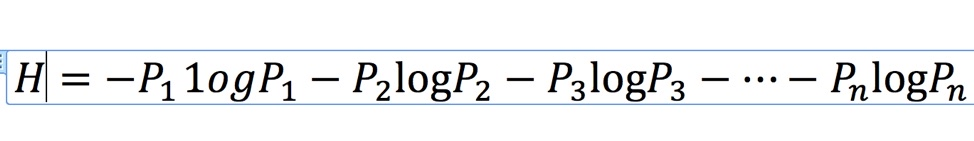
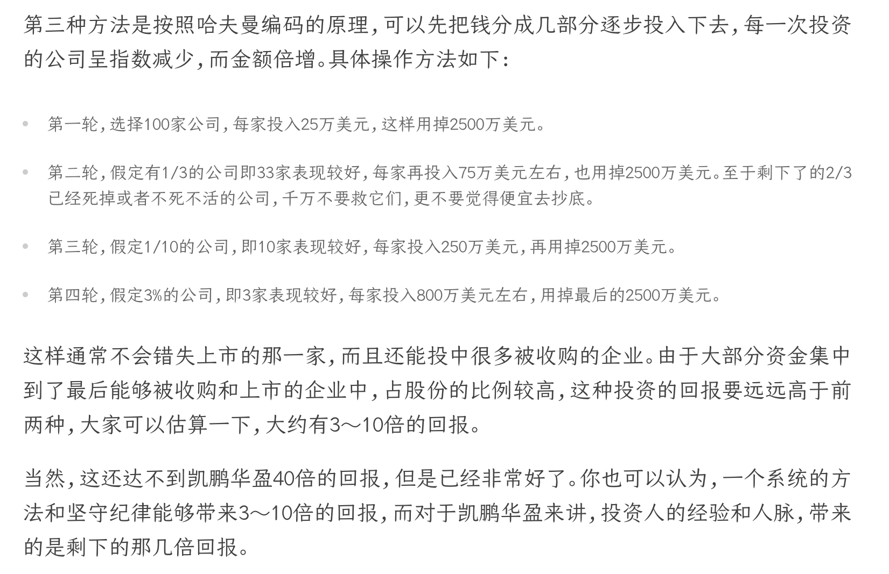
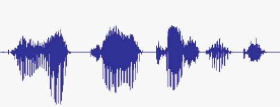
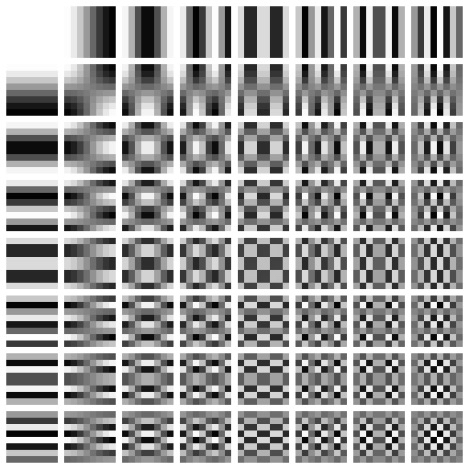

# 二、信息产生（16讲）

## 04 信息度量：世界上有稳赚不赔的生意吗？

### （1）要点

- 信息可以被衡量/度量，但不是用重要性，而是用**信息量**，单位是“**比特**”。
- 几个概念：“信息源”、“信息熵”、“信息”、“信息量”
- 很多复杂交易的背后其实都用到了信息的可度量性
- 信息量的大小不在于长短，而在于开创了多少新知

下面对着几个要点进行一一的解释...

### （2）香农提出的对信息进行量化度量，度量单位为比特

##### 2.1 比特的定义

> 如果一个黑盒子中有A和B两种可能性，他们出现的概率相同，那么要搞清到底是A还是B，所需要的信息量就是1比特。

如果我们对这个黑盒子有一点知识，知道A的概率比B大，那么解密他们所需要的信息就不到1比特。比如，抛一枚非均匀材质的硬币，需要去欸的那个那面朝下的信息量就小于1。

同理，选择题四选一需要**2比特**，32个球队猜冠军需要**5比特**。

> 而有同学会问为什么选择题不是4比特？因为最有效的提问方式不是一个个问，而是是否在AB(CD)中，类似二分地问。

### （3）几个概念

- 信息源：充满不确定的黑盒子

- 信息熵：黑盒子里面的不确定性。熵，是一个热力学概念。

  - 还有计算信息熵公式：（Pi是发生各事件的概率，取负的原因是小数的对数是负数）

  

（例：若有100个数，从中挑出一个，不确定性就是100选1，代表的信息熵为log100=6.65。即，若我们有6.65比特的信息，就可以确定100个数中的一个数。）

- 信息：用来消除这些不确定性的（信息熵）
- 信息量：数值上就等于“信息熵”

### （4）计算信息熵公式的应用

##### 4.1 赌球

​		大家都知道赌球的庄家总是稳赚不赔，就觉得里面猫腻很多，这次我带你从信息论的角度来看清这个问题。你会发现其实很多类似的复杂难题都是信息熵的计算问题。

​		假如，我们能提前确定各个球队获得世界杯冠军的概率，设定它们分别是P1，P2，……，P32。那么我们套用上面的公式，就可以算出这件事需要多少信息，或者说这个问题的信息熵。

​		我们假定为3.4比特，或者说对应于3.4块钱。如果有一个人提一次问题支付一块钱，从理论上讲，所有参加赌局的人只要平均支付3.4块钱就能得到谁是冠军这个信息。

​		但是如果设定赌局的人将收费标准略微提高，提高到一个人平均4元。这里面的盈余就被设赌局的人拿走了。

​		那你会说，我们不可能提前知道概率，那每个球队得冠军的概率是如何预估的？其实这是我们这些下注的人告诉设赌局的人的。

​		如果大家都往德国队身上下注，结果预测德国获冠军的概率就很高，所以押注的多少其实就是大家给出的概率。

​		而开赌局的，只要收费比信息实际的价值高，都是稳赚不赔的。这里面的细节大家不用太在意，总之记住一点，就是开赌局的从来不是拿自家的钱和你对赌，而是让你们彼此互相赌，他通过变相多收费盈利。

### （5）悟

- 永远不要听那些正确率总是50%的专家的建议，因为那相当于什么都没说，没有提供能够减少“信息熵”的“信息量”。
- 

## 05 信息编码：数字和文字是如何诞生的？

## 06 有效编码：10个手指能表示多少个数字？

> 本节讨论了“如何设计一个好的编码系统，以及背后的本质是什么”

### （1）信息编码的两大原则

- 易辨识
- 有效性（短时间内传递大量的信息）

### （2）举例

##### 2.1 用十根手指头能表达多少个数字？

- level 1：10个
- level 2：100个（0--99）

但这两种都是十进制编码，都不是最有效的。可以考虑二进制编码：

- 从左手小拇指到右手小拇指分别代表0--9，每个指头都有伸出和收起两种状态。即，十个指头对应十位二进制，也就是1024个数。

当然有人会说，如果每个手指头有三个状态（伸开、半开、收缩），能表示3\^10种。但它并不好，因为过分强调有效性，忽视了易辨识的愿意，过犹不及。

## 07 最短编码：如何利用哈夫曼编码原理投资？

### （1）前提知识

- 本课程默认log函数的底数都是2，即二进制0或1在每一位上的两种可能。
- 如果对26个英文字母采用**等长度编码**的方法，比如二进制编码，需要log26，即5bit信息。
- 处处都有的二八定律

### （2）哈夫曼编码

> **a. 从本质上讲：**
>
> ​		将最宝贵的资源（最短的编码）分配给出现概率最大的信息。
>
> **b. 如何分配呢？**
>
> ​		一条信息的编码长度和其出现概率的对数成正比。
>
> ​		注：
>
> 		1. 比如第一条消息出现的概率为1/2，我们知道1/2（以二为底）的对数等于-1，因此它的编码长度就是1（即码0）。最后两条消息出现的概率为1/2^31次方，取对数后等于-31，因此它们的编码长度就是31。
> 		2. 如果所有信息出现的概率相同再采用哈夫曼编码，每一条信息的码长都一样，哈夫曼编码就失去了意义。
>
> **c. 怎么优化分配呢？**
>
> ​		在现实生活中，很多信息的组合的概率分布差异更大。因此对他们使用哈夫曼编码进行信息压缩，压缩比会更高。比如，在中文中，如果对汉字的频率进行统计，然后压缩，一篇文章通常能压缩掉50%以上，但是如果按照词进行频率统计，再用哈夫曼编码压缩，可以压缩掉70%以上。

### （3）思想应用

##### 3.1长途电话区位码的设计

考虑城市和其电话机的数量，中国北京、上海等重要城市是**2位**，小城市就是**3位或4位**。这么做的目的是为了**减少平均的编码长度**。

##### 3.2 凯鹏华盈的基金风险投资

##### 3.3 个人发展的启发

​	这个道理对个人来讲也是适用的。美国有名的私立学校哈克学校的前校长尼克诺夫博士讲，在孩子小时候，要让他们尝试各种兴趣爱好，但是最终他们要在一个点上实现突破，他将这比做用圆规画圆，一方面有一个扎得很深的中心，另一方面有足够广的很浅的覆盖面。

##### 3.4 其他奇妙的应用

自助餐、直梯的哪个按键用的最多

## 08 矢量化

### （1）定义

​		矢量化：通过不同维度的规则来压缩一套编码中的信息量，从而使一套编码能够表达，传递更多的信息，更便于应用。

### （2）应用（矢量化的原理）

- 通过高考成绩录取大学生，或者通过身高选拔篮球运动员（将所有人映射到了一维的空间中）

> ​		这种做法给工作带来了极大的便利性，但是显然没有全面的考察每一个人，或者说有信息的损失。
>
> ​		生活中有很多矢量化的例子，他们让问题变得简单，但是会丢失信息。而**平衡便利性和信息的完整性，就成为了艺术。**

### （3）延申

- 图片格式
  - BMP（BITMAP）：位图，不采用任何压缩
  - JPG（JPEG）：有损压缩的标准方法
  - PNG：无损数据压缩
  
  所以，大小比较为 BMP > PNG > JPEG

而压缩的意义到底在哪里？后面会学到。

## 09 冗余度：《史记》和《圣经》那个信息量大？

## 10 等价性：信息是如何压缩的？

### （1）引入

> 很多时候，我们直接得到一种信息或者原封不动地保留一条信息并不容易，但是却可以从等价的信息中导出所要的信息。而让原有信息和等价信息一一对应的这个“桥梁”就是**傅里叶变换**。

### （2）数学知识

- 傅立叶是十九世纪法国的数学家，他发现任何周期性的函数（信号）都等同于一些三角函数的线性组合。
- **傅立叶变换**：19世纪初，法国数学家傅立叶发现所有的周期性信号都可以用频率和振幅不同的正弦函数叠加而成，也就是说周期性信号里面所包含的信息和若干正弦函数的频率、振幅信息完全等价，这种变换被称为**傅立叶变换**。

> 如果利用傅立叶变换，可以将100年里温度变化的信息用大致20根频率和振幅不同的正弦曲线叠加而成。也就是说，100年里3万多个温度样点里的信息，基本上就等价于20个频率数据和20个振幅数据，这样一来信息就被压缩了近百倍。

今天的**音频**和**图像**就也是利用的这个原理。

### （3）应用

- **音频：（利用 傅里叶变换）**

​        今天我们见到的各种音频信号，包括我们的语音、音乐等等，在较短的时间内，都有相对稳定的周期性，比如下图就是一段语音，你可以看出它有一定的周期性。利用傅立叶变换，可以对语音进行压缩编码，然后传输，这样可以将语音信息压缩10倍左右，当然这样可能会有很少的信息损失，这一点我们后面再讲。但不管怎样，这样的信息压缩是非常合算的，比如用微信语音打电话，如果不进行信息压缩，可能要多用十倍的数据流量。

- **图像（利用 “离散余弦变换 DCT”）**

​        那么图像又是怎么压缩的呢？它们看上去不像是有周期性振动的波形啊。这其实只是我们在宏观上看一幅图，但是如果我们用放大镜把图放得特别大，看到的就是一个个像素，而且相邻的像素之间颜色和灰度的变化会是相对连续的。利用这个特性，人们发明了一种被称为“离散余弦变换”的数学工具，也称为DCT。

​        DCT可以被认为是傅立叶变换的延伸，只不过它没有使用正弦波，而是采用了下面图中所示的64个基本灰度模板，任何照片都可以用这些模板组合而成。当然，对于彩色图片需要用带有红绿蓝三原色的彩色模板。这样一幅图片，就变成了一组数字，这些数字是模板中相应的模块的权重。我们经常使用的 JPEG 格式的图像，就是这么生成的。

- **先转换成等价信息，再压缩的情况**

​        通过上述语音和图像的压缩，我们介绍了信息等价性的应用。很多时候，一种原始的信息，它们虽然里面有很多冗余成分，但是很难直接压缩掉。但我们可以将它们转化为容易压缩的等价的信息，再进行压缩，然后进行存储和传输。在使用和接收到被压缩的等价信息后，我们先解压，再恢复回原来的信息。

### （4）结语

​		我们通过**信息压缩**来说明了**等价信息**的最重要性，而这个原则的应用远不止**信息压缩**。

## 11 信息增量：信息压缩中的”保守主义原则“

### （1）引言

> 上节中讲了通过“**信息的等价性**”原理来对“**音频**”和“**图像**”进行压缩，而如何对“**视频**”进行压缩呢？
>
> 我们在生活中有明显的体会，视频的压缩要远比图片高很多。这其实是正确的，他们通常会相差两个数量级，即JPEG图片能压缩10倍看不出损失，而MPEG视频能压缩1000倍看不出损失。
>
> 那么有人就问了，能否用视频的压缩方式压缩图片，达到上千倍压缩的效果呢？
>
> 简单的答案是不能，因为视频压缩时，利用了“**信息的相关性**”，能够采用所谓的“**增量编码**”，而单一一张图片中，不具有太多的相关性可以利用。
>
> 简单来说就是如果两个信息“长得很像”，只要保留一个，对另一个，只要保留它们的差异，然后进行微调就行了。

### （2）举例

​	如果我们要对这样一组数：

​	3210，3208，3206，3211，3220，3212……进行编码，需要多少比特（或者多少字节）呢？

​	我们首先观察到，这些数字毫无规律可言，不存在哪一个出现的概率更大，哪个更小的问题，因此无法利用哈夫曼编码的方法，将比较短的码分配给出现概率高的数字，我们只好将它们一一编码。

​	由于这组数字都是三千多，**方法一：**我们可以用12位2进制表示每一个数字（0~4095）

​	但是，我们还注意到一个现象，那就是各个数字变化不大，**它们的动态范围不超过16**。因此，我们可以利用这个特性进行**压缩编码**了，具体的做法是这样：

​	对第一个数字使用12bit的编码（这个我们没有办法做得更精简）
​	**对第二个及以后的各个数字，我们将它和上一个数字相比较，发现它相比前一个数字，动态变化的范围在正负16以内**。因此，我们只需要对差异（也被称为**增量**）进行增量编码，就可以了。

​	 对于这些增量，如果不考虑符号的话，我们用4个比特就够了，因为**log以2为底16的对数等于4**。

​	当然，增量可以是正，也可以是负，我们再加一个比特的信息表示符号，于是从第二个数字开始，我们**采用5个比特**就可以表示它和前一个数字的区别了。

​	于是我们可以将上面一组数字做如下的编码：

​	3210 【-2】【-2】【5】【9】【-8】……于是除了第一个数字还需要12比特之外，剩下的只需要5个比特即可（4个比特表示变化范围的区间是16，1个比特表示加或者是减），相比原先每个数字12字节的编码，压缩比大约是2.4:1（12:5）。

### （3）总结

​	**在解码时，我们先解出第一个，然后解出后面的增量，再根据上一个的数值和当前的增量，恢复出一个个原来的信息。**

​	**今天对于视频的压缩，用的就是上述原理。**我们知道一般的视频一秒钟有30帧，高清的是60帧，4K的是120帧（甚至240帧）。每一帧视频之间的差距其实极小。

​	**我们对第一帧视频（也被称为主帧）进行全画面编码，对于这一帧的压缩比，其实不会太高。**

​	**但是对后面每一帧的视频，只要针对它们和上一帧的差异进行编码即可，这样除了主帧外，后面的每一帧的视频，其实编码的长度非常短，视频文件就显得比较小。**

### （4）启示

​	当然，凡事有一利就有一弊。正如我们前几天所讲，**当我们把信息冗余都挤掉后，编码长度非常短时，容错的性能就会下降。**

​	你过去看影碟可能有这样的体会，当光盘被划了一道，它就经常跳盘，这就是因为视频的压缩是前后相关的，中间坏了一点，很多帧的视频就都看不了了。

​	为了防止这样编码造成的累积误差，也为了防止中间有一点点信息损失，后面的视频统统打不开，所以，当然，凡事有一利就有一弊。正如我们前几天所讲，当我们把信息冗余都挤掉后，编码长度非常短时，容错的性能就会下降。

你过去看影碟可能有这样的体会，当光盘被划了一道，它就经常跳盘，这就是因为视频的压缩是前后相关的，中间坏了一点，很多帧的视频就都看不了了。

为了防止这样编码造成的累积误差，也为了防止中间有一点点信息损失，后面的视频统统打不开。**所以，每过若干帧，我们就要重新产生一个主帧，以免错误会传递太远。**

**信息的前后相关性，其实是信息本身固有的特征**。或者说，绝大多数时候，**我们这个世界的变化是渐进的，而不是完全随机的。不仅在信息的世界如此，在我们的生活中也是如此。**

我在过去的专栏里讲了**保守主义**的做事态度，**它的好处其实是由我们这个世界渐变的特征决定的**。因此，**在绝大多数时候，我们不需要推倒重来，只需要对变化进行一些修补就好了。**

有些人看不起总在修修补补的做法，觉得缺乏**革命性**，但是从信息论的角度讲，**保守主义的做法成本最低**。

## 12 压缩比和失真率：如何在信息取舍之间做平衡？

### （1）前言：

> 上两节，我们谈论了图片音频和视频如何压缩，介绍了他们背后的两个原理：信息的等价性转换和利用信息的相关性进而增量编码。
>
> 而这一节会学到，信息压缩是要考虑失真率的。

### （2）知识：

1. 香农第一定律：

​		任何编码的长度都不会小于信息熵，最理想的是等于。所以如果编码长度太短，小于了信息熵，就会出现信息损失的现象。

举例：

​		如果一张图片里面有10K的信息，你再怎么压，也不会比它小，否则就会损失信息。

2. 图像中的高频信息和低频信息：

   高频指的是，小范围的细节比较丰富的信息。

   低频指的是，大范围大尺度的信息，也就是细节比较少，如大的背景。

   

​		（但是事实上我们今天对于音频、图像和视频的压缩，绝大多数情况都是**有损的压缩**。而有损压缩最关键的是要清楚**如何保证因为压缩而丢失的信息不影响我们对信息的理解**呢？这就需要**平衡压缩比和信息失真度**之间的关系。）

### （3）信息压缩：

- 信息压缩的重要原则之一是：**关注应用场景**

  ​	以语音压缩为例，在语音通话时，牺牲一定的讲话人的口音，问题不大，因为它的目的是传递话音中的信息。

  ​	但是，在进行声纹识别时，情况就正好相反，那个人说了一句什么话不重要，重要的是知道他是谁。

  ​	因此在后一种应用中，需要保留的是说话人本身的信息，反倒是他说的内容无关紧要。也正是因为应用的场景不同，才有了各种压缩算法。

- 高比例的信息压缩到底是压缩掉了什么信息？

  ​	简单地讲，就是压缩掉了高频信息。进一步说，人通常能够听到20赫兹到2万赫兹的声音，但是人发音的范围只有300赫兹到4000赫兹左右，因此任何高于4000赫兹的语音信号，就被过滤了。

  ​	对于图像也是如此，你可能注意到这样一个现象，如果你以蓝天为背景拍了一张照片，照片上有只很小的鸟，你如果用JPEG算法进行图像压缩，小鸟可能就被过滤掉了，而且蓝天的细节就没有了。这就是因为有损的图像压缩算法都是先过滤高频信息的。

### （4）总结：

- **信息的压缩分为有损的和无损的两种。对于无损的压缩，原先的信息能够完全复原，但是通常压缩比不会太高，因为它存在一个极限，就是香农第一定律给的信息熵的极限。对于有损的压缩，信息复原后，会出现一定程度的失真。**
- **通常失真率和压缩比直接相关，压缩比越大，失真率越高。采用什么样的压缩方法，压缩到何种程度，通常要看具体的应用场景。在信息处理这个领域，常常不存在所谓的标准答案和最佳答案，只有针对某个场景的好的答案，而一切都是妥协的结果。**
- **信息压缩看似是信息处理专业的问题，但是它的思想可以用到很多地方。我们有时强调要把知识学通，就是这个道理。**

## 13 信息正交性：在信息很多的情况下如何做决策？

> 寻找能够彼此互不信息的重要性——信息的正交关系。

## 14 互信息：相关不是因果，那相关是什么？

> 世界上大多数联系都是**相关联系**，而非因果联系。相关的联系可以强，可以弱，我们需要寻找和利用的是强相关性。
>
> 互信息就是判断信息相关程度大小的工具。

### （1）精彩评论

​	为了方便大家再次理解相关与因果的区别，我再举一个容易记的例子：在数据挖掘领域中有个模块叫做”关联规则“ 又叫做”购物篮分析“，著名的啤酒与尿布”的故事就是典型的案例。 它讲的是美国某超市经过分析大量顾客的购买记录，发现啤酒与尿布这种购买组合出现的特别频繁。 因此他们认为二者具有较高的相关性， 后来他们在陈列上对二者的布局做了调整，从而提升了销售业绩。

​	我们不能说购买啤酒 -> 购买尿布这样的因果性结论。 

## 15 条件熵和信息增益：你提供的信息到底值多少钱？

## 16 置信度：马斯克犯了什么数学错误？

> 置信度：衡量一个信息是否可靠。
>
> 提高置信度的方式：增加所统计的样本的数量，不断地重复检验。

### （1）前言：

​	2016年，特斯拉汽车出现了第一起因为使用它的辅助驾驶功能而导致的撞车死亡事件。一时间媒体就开始对该公司的技术质疑，舆论大多认为特斯拉公司该负责任。

​	为了摆脱公关危机，作为提供辅助驾驶技术的特斯拉公司先是解释，说那起交通死亡事故责任主要是开车的人长时间不扶方向盘。

​	但是媒体讲，你既然提供了辅助驾驶的功能，司机使用了出了事，说明你的技术不过关。

​	技术过关不过关这件事解释不清楚，特斯拉公司的CEO马斯克于是讲，特斯拉这起致命车祸出在自动驾驶功能使用了1.3亿英里之后，而美国平均行车0.93亿英里就出一次死亡事故。因此特斯拉的事故概率低于平均水平。

​	这个声明一出来，就惹出了一些科学家们的嘲笑，说马斯克数学没学好，因为他完全没有统计中的置信度的概念。

​	**那他到底错在哪里呢？**

​	要知道，出重大车祸是随机性事件，你并不清楚下一次什么时候发生，只有当统计的数据量足够大的时候，从结果上判定一种车比另一种安全才有意义。

​	否则，按照马斯克的说法，如果很快特斯拉又出一次车祸，事故率不就一下子又翻了一番吗？

​	**所以，至于马斯克通过一个样点给出的数据，完全没有置信度可言，也就是说那一条信息的可靠性可以忽略不计。要想证明辅助驾驶功能比人开车安全，大约要等到积累近百个致死事故才能得到解决，这样他们推导出是需要100亿英里的总行驶里程。**

### （2）启示

​		但是很多事情并不会重复或者完全重复，它们的发生就有很大的偶然性，几乎每一件历史上的事件，社会学上和经济学上的事情都是如此，甚至很多医学上的奇迹也是如此。

​		虽然人们总能找到合理的解释，用一种理论证实很多事情，但是换一种理论也能做到这一点。**因此，严肃的学者们才感到证伪比证实更重要。**

​		在上述研究领域，常常不存在绝对正确的理论，因为每一种理论其实**置信度**都非常低。这也让学术界必须认可**百家争鸣**。

​		世界上有很多道理其实都很难验证，大到历史事件，由于**很难重复多次**，总结经验其实是很难的。

​		中到某些企业的成功经验，其实都是**事后总结出的一套自圆其说的理论**，让它们稍微换一个环境甚至不换环境再来一遍，都很难获得同样的成功。

​		小到个人，做成一件事也有**很多偶然的因素**，下一次同样的方法是否可行，也要看情况而定。

## 17 交叉熵：如何避免制定出与事实相反的计划？

> 库尔贝勒交叉熵：讨论信息误判时的损失。

### （1）五点原则

#### 1.1 如果你的猜测和真实情况完全一致，你不损失任何东西，但是只要猜测和真实情况不一致，就会或多或少有损失。

#### 1.2 你的猜测和真实情况相差越大，损失越大。

小概率的事发生了，即黑天鹅事件。所以要避免孤注一掷，向“all in”say no。

#### 1.3 自大的人非常容易遗漏很多原本应该考虑的事情，赵括如此，后来的马谡也是如此。

#### 1.4 过分防范各种情况，患得患失，是否有损失呢？

#### 1.5 在信息论中，任何硬性的决定（hard decision）都要损失信息。

