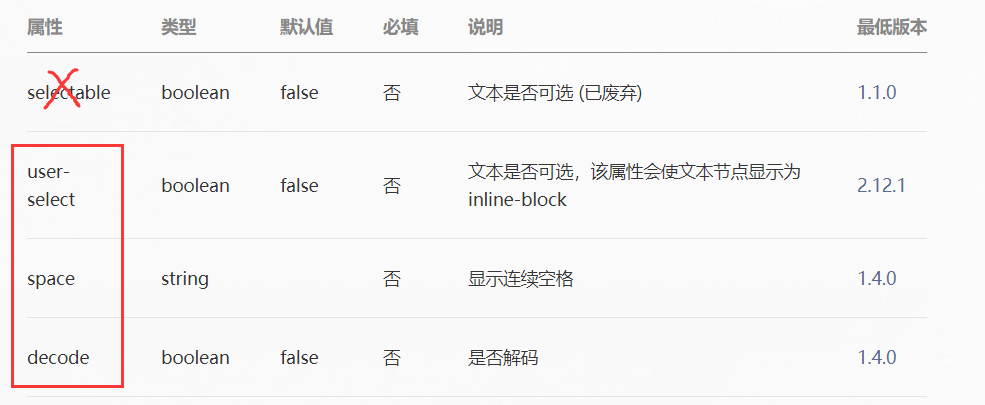

# 基础布局容器

- view
- text


## view


注意：

1. hover-class是String类型，所以可以通过 wxss 来设置其样式。
2. hover-stop-propagation是boolean类型，所以可以直接写属性名称来表示true的默认含义。
3. 因为当点击子元素时，会发生冒泡效果——父元素也会被认为是被点击，所以可以将hover-stop-propagation属性添加至子元素。
4. 剩下两个属性保持默认即可。


## text



注意：

1. 因为在html中，连续的空格会被显示为一个空格，所以space属性是为了显示连续的空格


## 代码

index.wxml：

```wxml
<view class="box1" hover-class="box1Hover">

  <view class="box2" hover-class="box2Hover" hover-stop-propagation></view>

</view>

<text decode>这是一个 &nbsp; 吗 \n</text>
<text decode>这是一个 &lt; 吗 \n</text>
<text decode>这是一个 &gt; 吗 \n</text>
<text decode>这是一个 &amp; 吗 \n</text>
<text user-select>
  这是我的第一节课这是我的第一节课这是我的第一节课这是我的第一节课这是我的第一节课这是我的第一节课
  这是我的第一节课这是我的第一节课这是我的第一节课这是我的第一节课这是我的第一节课
  这是我的第一节课这是我的第一节课这是我的第一节课这是我的第一节课这是我的第一节课这是我的第一节课v这是我的第一节课
  这是我的第一节课这是我的第一节课这是我的第一节课这是我的第一节课这是我的第一节课
</text>
```


index.wxss：

```wxss
.box1{
  width: 100px;
  height: 100px;
  background-color: red;
}
.box1Hover{
  background-color: yellow;
}

.box2{
  width: 50px;
  height: 50px;
  background-color: green;
}
.box2Hover{
  background-color: pink;
}
```

