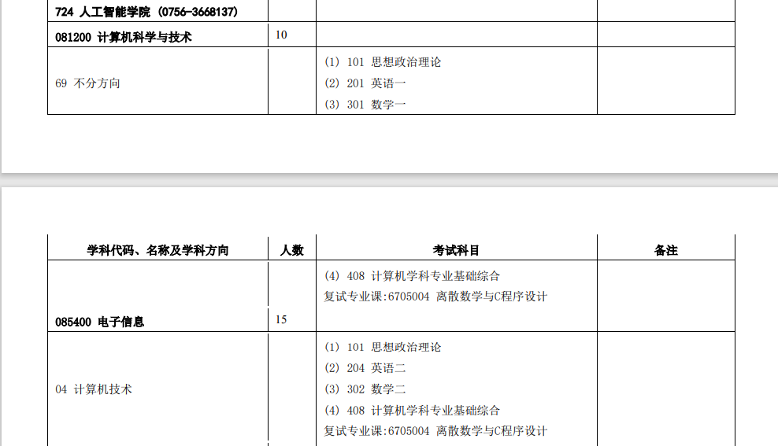

# 研校对比

## 一、广东省

- 第一档：
  - 中大
  - 华工
  - 南方科技大学
- 第二档：
  - 华师
  - 暨大
  - 广工


### 1.1 中大

##### 1.1.1 [《2021年初试考试范围或参考书目》](http://graduate.sysu.edu.cn/zsw/sites/admission.prod.dpcms4.sysu.edu.cn/files/2020-09/%E4%B8%AD%E5%B1%B1%E5%A4%A7%E5%AD%A62021%E5%B9%B4%E7%A1%95%E5%A3%AB%E7%A0%94%E7%A9%B6%E7%94%9F%E6%8B%9B%E7%94%9F%E8%80%83%E8%AF%95%E7%A7%91%E7%9B%AE%E7%9A%84%E8%80%83%E8%AF%95%E8%8C%83%E5%9B%B4%E6%88%96%E5%8F%82%E8%80%83%E4%B9%A6%E7%9B%AE_0.pdf) [《招生计划》](http://graduate.sysu.edu.cn/zsw/sites/admission.prod.dpcms4.sysu.edu.cn/files/2020-10/%E4%B8%AD%E5%B1%B1%E5%A4%A7%E5%AD%A62021%E5%B9%B4%E6%A0%A1%E5%86%85%E5%90%84%E6%8B%9B%E7%94%9F%E5%8D%95%E4%BD%8D%E8%80%83%E8%AF%95%E6%8B%9B%E6%94%B6%E7%A1%95%E5%A3%AB%E7%A0%94%E7%A9%B6%E7%94%9F%E6%8B%9B%E7%94%9F%E8%AE%A1%E5%88%92.pdf)

```
1705025 视觉传播及交互设计综合知识 主要考核学生的视觉素养及对视觉理论的掌握，并考察学生对 于新媒体交互设计之理论、方法和流程的掌握，包括如何调查和分析用户需求，并将用户体验纳入设计 之过程等，建议学生多使用案例分析。

2005006 高级程序设计基础(C++语言) 本科目主要涵盖：基本概念(面向对象的方法，面向对象的开发，
信息表示与存储，程序开发的基本概念)；C++程序设计基础知识(基本语句，数据类型，控制结构)；函数
的概念(包括函数定义和使用方法)；面向对象程序设计的基本思想，类与对象，主要包括抽象，类封装，
继承和多态等概念；用 UML 语言描述类的性质；类的继承与派生及类的多态性；以及面向对象的程序设
计实现。
```

##### 1.1.2 《2021年招生学科专业目录》[]()

###### （1）数据科学与计算机学院


###### （2）人工智能学院




###### （3）软件工程学院


### 1.2 华工

###### 1.2.1 [专业目录](https://yanzhao.scut.edu.cn/open/Master/Zsml_view.aspx)

###### （1）计算机科学与工程学院


###### （2）软件工程学院


##### 1.2.2 [2020年录取名单](http://admission.scut.edu.cn/_upload/article/files/2c/88/fc7c5bb4412ba24cf8d358df6bb3/8414c09c-6422-4141-9a8c-637b1393e798.pdf)（2020.07才公布）


### 

---


### 2.1 华师


### 2.2 暨大

### 2.3 广工