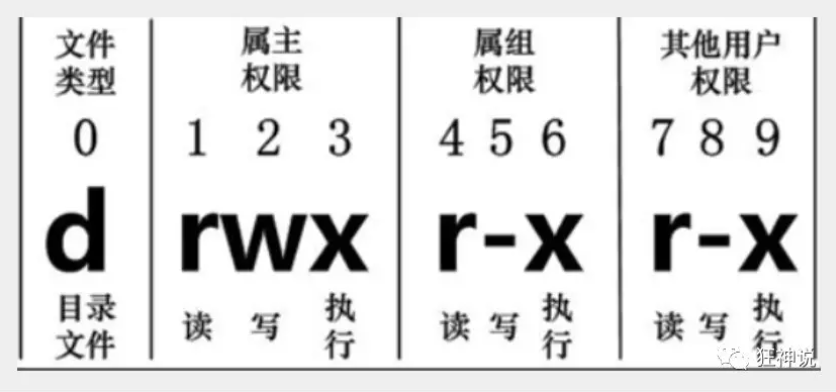

# 常用的基本命令

## 一、目录管理

### （一）绝对路径和相对路径

Linux的目录结构为**树状结构**，文件系统的根目录为/。

其他目录可以通过挂载添加到树中，通过解除挂载可以移除它们。

##### 绝对路径：

由根目录 / 写起，如：/usr/share/doc

##### 相对路径：

不是由 / 写起，如：从/usr/share/doc要到usr/share/man下，则写成：cd../man

### （二）处理目录的常用命令

- ls：列出目录
- cd：切换目录
- pwd：显示当前目录
- mkdir：创建一个新的目录
- rmdir：删除一个空的目录
- cp：复制文件或目录
- rm：移除文件或目录
- mv：移动文件或目录

##### 

##### 1. ls：

- ls -a：连同隐藏文件一起列出来
- ls -l：长数据串列出，包含文件的属性与权限等数据

---

##### 2. cd：

- cd [相对路径或绝对路径]：直接切换
- cd .. ：返回上一级
- cd / ：回到根目录

---

##### 3. pwd：

pwd是Print Working Directory的缩写，用来**显示当前工作目录**。

---

##### 4. mkdir：

- mkdir [单层目录]

- mkdir -p [多层目录]   ： 用来递归创建目录

---

##### 5. rmdir：

仅能删除 **空的目录**。

- rmdir [目录名称]
- rmdir -p [目录名称]  ：  用于递归删除空的目录

---

##### 6. cp：

用于 **复制文件或目录**。

---

##### 7. rm：

删除**文件或目录**。

- rm -f [文件或目录]  ： 强制删除
- rm -r [文件或目录]  ： 递归删除
- rm -i [文件或目录]   ： 互动模式

---

##### 8. mv：

用于 **移动文件与目录或修改名称**。

---

## 二、基本属性

### （一）认识文件的属性

> 使用 ==ls -l== 来显示文件的属性

一共10个字符，第1个字符代表这个文件是目录、文件还是超链接：

- d：目录
- -：文件
- l：超链接

接下来的字符，以三个为一组，且均为[rwx]的三个参数的组合。其中r表示read，w表示write，x表示execute，并且若没有该权限，则用 - 代替。

### （二）修改文件属性

- chgrp：**更改文件数组**

> chgrp 属组名 文件名

- chown：**更改文件属主，同时也可以更改文件属组**

> chown 属主名 文件名
>
> chown 属主名：属组名 文件名

- chmod：**更改文件的9个属性**

> chomod 777 文件名

注意：r=4，w=2，x=1

## 三、文件内容查看

> 网络配置目录：  /etc/sysconfig/network-scripts/

- cat 【文件名】：由第一行开始显示文件内容
- tac：从最后一行开始显示
- nl：显示的时候，输出行号（常用）

> 长文件：/etc/man_db.conf

- more：一页页地显示文件内容（空格代表翻页，enter一行一行地显示，:f显示当前行号）
- ==less：往前翻页（空格代表翻页，上下键代表滚动页面，退出是q，/[要查询的字符串] 来进行向下查找，？[要查询的字符串] 来进行向上查询，n继续搜寻下一个，N向上寻找）==
- head -n [数字] 文件名 ：看前n行
- tail -n [数字] 文件名：看后n行

## 四、Linux链接的概念（了解）

